# UML Diagrams — TourGuideAPP + TourGuideWeb
**Cập nhật:** Tháng 4, 2026

---

## 1. ER DIAGRAM — Toàn bộ Database (Supabase / PostgreSQL)

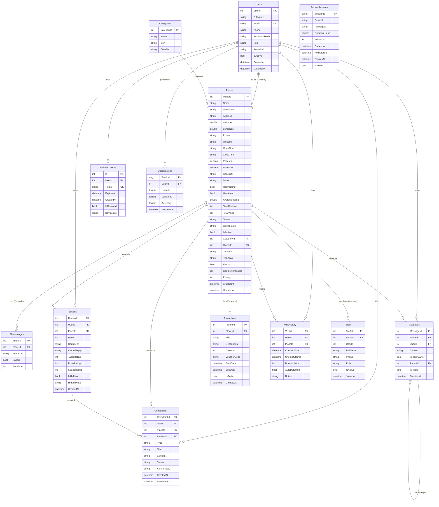
```mermaid
erDiagram
    Users {
        int UserId PK
        string FullName
        string Email UK
        string Phone
        string PasswordHash
        string Role
        string AvatarUrl
        bool IsActive
        datetime CreatedAt
        datetime LastLoginAt
    }

    Categories {
        int CategoryId PK
        string Name
        string Icon
        string ColorHex
    }

    Places {
        int PlaceId PK
        string Name
        string Description
        string Address
        double Latitude
        double Longitude
        string Phone
        string Website
        string OpenTime
        string CloseTime
        decimal PriceMin
        decimal PriceMax
        string Specialty
        string District
        bool HasParking
        bool HasAircon
        double AverageRating
        int TotalReviews
        int TotalVisits
        string Status
        string OpenStatus
        bool IsActive
        int CategoryId FK
        int OwnerId FK
        string TtsScript
        string TtsLocale
        float Radius
        int CooldownMinutes
        int Priority
        datetime CreatedAt
        datetime UpdatedAt
    }

    PlaceImages {
        int ImageId PK
        int PlaceId FK
        string ImageUrl
        bool IsMain
        int SortOrder
    }

    Reviews {
        int ReviewId PK
        int UserId FK
        int PlaceId FK
        int Rating
        string Comment
        string OwnerReply
        int TasteRating
        int PriceRating
        int SpaceRating
        bool IsHidden
        string HiddenNote
        datetime CreatedAt
    }

    RefreshTokens {
        int Id PK
        int UserId FK
        string Token UK
        datetime ExpiresAt
        datetime CreatedAt
        bool IsRevoked
        string DeviceInfo
    }

    Messages {
        int MessageId PK
        int PlaceId FK
        int UserId FK
        string Content
        bool IsFromOwner
        int ParentId FK
        bool IsPublic
        datetime CreatedAt
    }

    Complaints {
        int ComplaintId PK
        int UserId FK
        int PlaceId FK
        int ReviewId FK
        string Type
        string Title
        string Content
        string Status
        string AdminReply
        datetime CreatedAt
        datetime ResolvedAt
    }

    Promotions {
        int PromoId PK
        int PlaceId FK
        string Title
        string Description
        int Discount
        string VoucherCode
        datetime StartDate
        datetime EndDate
        bool IsActive
        datetime CreatedAt
    }

    UserTracking {
        long TrackId PK
        int UserId FK
        double Latitude
        double Longitude
        double Accuracy
        datetime RecordedAt
    }

    VisitHistory {
        int VisitId PK
        int UserId FK
        int PlaceId FK
        datetime CheckInTime
        datetime CheckOutTime
        int DurationMins
        bool AutoDetected
        string Notes
    }

    Staff {
        int StaffId PK
        int PlaceId FK
        int UserId
        string FullName
        string Phone
        string Role
        bool IsActive
        datetime JoinedAt
    }

    AccessSessions {
        string SessionId PK
        string DeviceId
        string PackageId
        double DurationHours
        int PriceVnd
        datetime CreatedAt
        datetime ActivatedAt
        datetime ExpiresAt
        bool IsActive
    }

    Users ||--o{ Places : "owns (OwnerId)"
    Users ||--o{ Reviews : "writes"
    Users ||--o{ RefreshTokens : "has"
    Users ||--o{ UserTracking : "generates"
    Users ||--o{ VisitHistory : "has"
    Users ||--o{ Messages : "sends"
    Users ||--o{ Complaints : "files"
    Categories ||--o{ Places : "classifies"
    Places ||--o{ PlaceImages : "has (Cascade)"
    Places ||--o{ Reviews : "receives"
    Places ||--o{ VisitHistory : "tracks"
    Places ||--o{ Messages : "receives"
    Places ||--o{ Promotions : "has (Cascade)"
    Places ||--o{ Staff : "employs (Cascade)"
    Places ||--o{ Complaints : "involved in"
    Messages ||--o{ Messages : "parent-reply"
    Reviews ||--o{ Complaints : "reported in"
```

---

## 2. CLASS DIAGRAM — Mobile App (TourGuideAPP)

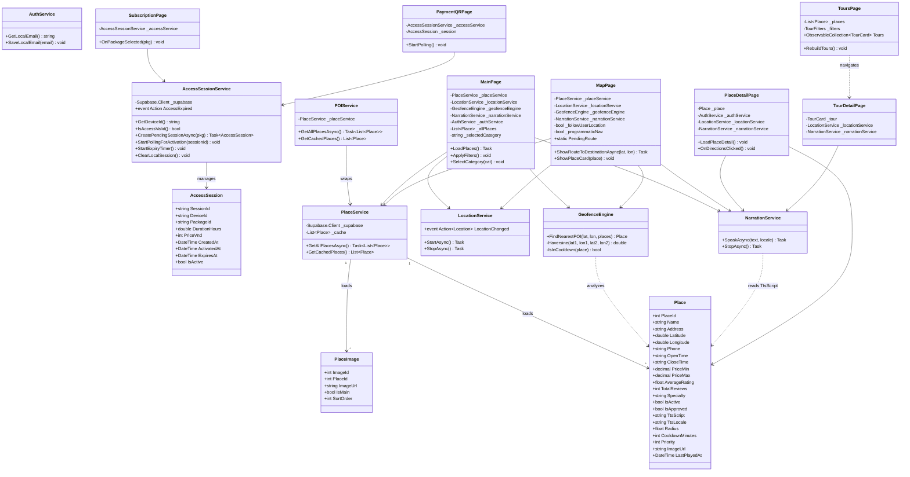
```mermaid
classDiagram
    class Place {
        +int PlaceId
        +string Name
        +string Address
        +double Latitude
        +double Longitude
        +string Phone
        +string OpenTime
        +string CloseTime
        +decimal PriceMin
        +decimal PriceMax
        +float AverageRating
        +int TotalReviews
        +string Specialty
        +bool IsActive
        +bool IsApproved
        +string TtsScript
        +string TtsLocale
        +float Radius
        +int CooldownMinutes
        +int Priority
        +string ImageUrl
        +DateTime LastPlayedAt
    }

    class PlaceImage {
        +int ImageId
        +int PlaceId
        +string ImageUrl
        +bool IsMain
        +int SortOrder
    }

    class AccessSession {
        +string SessionId
        +string DeviceId
        +string PackageId
        +double DurationHours
        +int PriceVnd
        +DateTime CreatedAt
        +DateTime ActivatedAt
        +DateTime ExpiresAt
        +bool IsActive
    }

    class PlaceService {
        -Supabase.Client _supabase
        -List~Place~ _cache
        +GetAllPlacesAsync() Task~List~Place~~
        +GetCachedPlaces() List~Place~
    }

    class LocationService {
        +event Action~Location~ LocationChanged
        +StartAsync() Task
        +StopAsync() Task
    }

    class GeofenceEngine {
        +FindNearestPOI(lat, lon, places) Place
        -Haversine(lat1, lon1, lat2, lon2) double
        -IsInCooldown(place) bool
    }

    class NarrationService {
        +SpeakAsync(text, locale) Task
        +StopAsync() Task
    }

    class AccessSessionService {
        -Supabase.Client _supabase
        +GetDeviceId() string
        +IsAccessValid() bool
        +CreatePendingSessionAsync(pkg) Task~AccessSession~
        +StartPollingForActivation(sessionId) void
        +StartExpiryTimer() void
        +ClearLocalSession() void
        +event Action AccessExpired
    }

    class AuthService {
        +GetLocalEmail() string
        +SaveLocalEmail(email) void
    }

    class POIService {
        -PlaceService _placeService
        +GetAllPlacesAsync() Task~List~Place~~
        +GetCachedPlaces() List~Place~
    }

    class MainPage {
        -PlaceService _placeService
        -LocationService _locationService
        -GeofenceEngine _geofenceEngine
        -NarrationService _narrationService
        -AuthService _authService
        -List~Place~ _allPlaces
        -string _selectedCategory
        +LoadPlaces() Task
        +ApplyFilters() void
        +SelectCategory(cat) void
    }

    class MapPage {
        -PlaceService _placeService
        -LocationService _locationService
        -GeofenceEngine _geofenceEngine
        -NarrationService _narrationService
        -bool _followUserLocation
        -bool _programmaticNav
        +static PendingRoute
        +ShowRouteToDestinationAsync(lat, lon) Task
        +ShowPlaceCard(place) void
    }

    class PlaceDetailPage {
        -Place _place
        -AuthService _authService
        -LocationService _locationService
        -NarrationService _narrationService
        +LoadPlaceDetail() void
        +OnDirectionsClicked() void
    }

    class ToursPage {
        -List~Place~ _places
        -TourFilters _filters
        +ObservableCollection~TourCard~ Tours
        +RebuildTours() void
    }

    class TourDetailPage {
        -TourCard _tour
        -LocationService _locationService
        -NarrationService _narrationService
    }

    class SubscriptionPage {
        -AccessSessionService _accessService
        +OnPackageSelected(pkg) void
    }

    class PaymentQRPage {
        -AccessSessionService _accessService
        -AccessSession _session
        +StartPolling() void
    }

    PlaceService "1" --> "*" Place : loads
    PlaceService "1" --> "*" PlaceImage : loads
    POIService --> PlaceService : wraps
    GeofenceEngine ..> Place : analyzes
    NarrationService ..> Place : reads TtsScript
    AccessSessionService --> AccessSession : manages
    MainPage --> PlaceService
    MainPage --> LocationService
    MainPage --> GeofenceEngine
    MainPage --> NarrationService
    MapPage --> PlaceService
    MapPage --> LocationService
    MapPage --> GeofenceEngine
    MapPage --> NarrationService
    PlaceDetailPage --> NarrationService
    PlaceDetailPage --> Place
    ToursPage ..> TourDetailPage : navigates
    TourDetailPage --> NarrationService
    SubscriptionPage --> AccessSessionService
    PaymentQRPage --> AccessSessionService
```

---

## 3. CLASS DIAGRAM — Web API (TourGuideAPI)

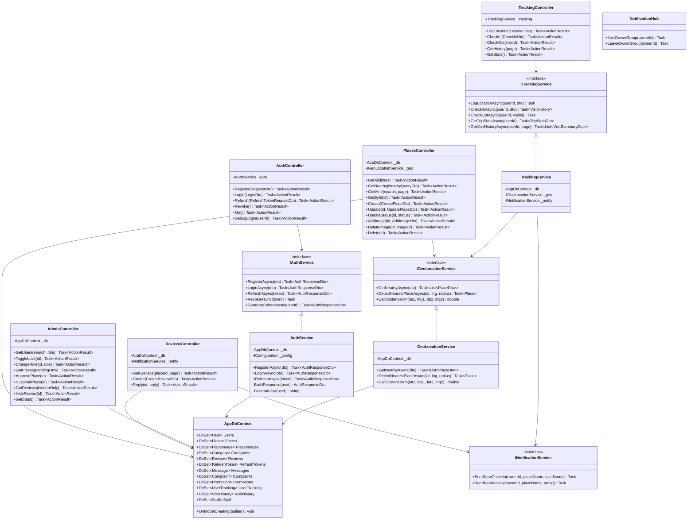
```mermaid
classDiagram
    class AuthController {
        -IAuthService _auth
        +Register(RegisterDto) Task~ActionResult~
        +Login(LoginDto) Task~ActionResult~
        +Refresh(RefreshTokenRequestDto) Task~ActionResult~
        +Revoke() Task~ActionResult~
        +Me() Task~ActionResult~
        +DebugLogin(userId) Task~ActionResult~
    }

    class PlacesController {
        -AppDbContext _db
        -IGeoLocationService _geo
        +GetAll(filters) Task~ActionResult~
        +GetNearby(NearbyQueryDto) Task~ActionResult~
        +GetMine(search, page) Task~ActionResult~
        +GetById(id) Task~ActionResult~
        +Create(CreatePlaceDto) Task~ActionResult~
        +Update(id, UpdatePlaceDto) Task~ActionResult~
        +UpdateStatus(id, status) Task~ActionResult~
        +AddImage(id, AddImageDto) Task~ActionResult~
        +DeleteImage(id, imageId) Task~ActionResult~
        +Delete(id) Task~ActionResult~
    }

    class ReviewsController {
        -AppDbContext _db
        -INotificationService _notify
        +GetByPlace(placeId, page) Task~ActionResult~
        +Create(CreateReviewDto) Task~ActionResult~
        +Reply(id, reply) Task~ActionResult~
    }

    class TrackingController {
        -ITrackingService _tracking
        +LogLocation(LocationDto) Task~ActionResult~
        +CheckIn(CheckInDto) Task~ActionResult~
        +CheckOut(visitId) Task~ActionResult~
        +GetHistory(page) Task~ActionResult~
        +GetStats() Task~ActionResult~
    }

    class AdminController {
        -AppDbContext _db
        +GetUsers(search, role) Task~ActionResult~
        +ToggleLock(id) Task~ActionResult~
        +ChangeRole(id, role) Task~ActionResult~
        +GetPlaces(pendingOnly) Task~ActionResult~
        +ApprovePlace(id) Task~ActionResult~
        +SuspendPlace(id) Task~ActionResult~
        +GetReviews(hiddenOnly) Task~ActionResult~
        +HideReview(id) Task~ActionResult~
        +GetStats() Task~ActionResult~
    }

    class IAuthService {
        <<interface>>
        +RegisterAsync(dto) Task~AuthResponseDto~
        +LoginAsync(dto) Task~AuthResponseDto~
        +RefreshAsync(token) Task~AuthResponseDto~
        +RevokeAsync(token) Task
        +GenerateTokenAsync(userId) Task~AuthResponseDto~
    }

    class AuthService {
        -AppDbContext _db
        -IConfiguration _config
        +RegisterAsync(dto) Task~AuthResponseDto~
        +LoginAsync(dto) Task~AuthResponseDto~
        +RefreshAsync(token) Task~AuthResponseDto~
        -BuildResponse(user) AuthResponseDto
        -GenerateJwt(user) string
    }

    class IGeoLocationService {
        <<interface>>
        +GetNearbyAsync(dto) Task~List~PlaceDto~~
        +DetectNearestPlaceAsync(lat, lng, radius) Task~Place~
        +CalcDistanceKm(lat1, lng1, lat2, lng2) double
    }

    class GeoLocationService {
        -AppDbContext _db
        +GetNearbyAsync(dto) Task~List~PlaceDto~~
        +DetectNearestPlaceAsync(lat, lng, radius) Task~Place~
        +CalcDistanceKm(lat1, lng1, lat2, lng2) double
    }

    class ITrackingService {
        <<interface>>
        +LogLocationAsync(userId, dto) Task
        +CheckInAsync(userId, dto) Task~VisitHistory~
        +CheckOutAsync(userId, visitId) Task
        +GetTripStatsAsync(userId) Task~TripStatsDto~
        +GetVisitHistoryAsync(userId, page) Task~List~VisitSummaryDto~~
    }

    class TrackingService {
        -AppDbContext _db
        -IGeoLocationService _geo
        -INotificationService _notify
    }

    class INotificationService {
        <<interface>>
        +SendNewCheckIn(ownerId, placeName, userName) Task
        +SendNewReview(ownerId, placeName, rating) Task
    }

    class NotificationHub {
        +JoinOwnerGroup(ownerId) Task
        +LeaveOwnerGroup(ownerId) Task
    }

    class AppDbContext {
        +DbSet~User~ Users
        +DbSet~Place~ Places
        +DbSet~PlaceImage~ PlaceImages
        +DbSet~Category~ Categories
        +DbSet~Review~ Reviews
        +DbSet~RefreshToken~ RefreshTokens
        +DbSet~Message~ Messages
        +DbSet~Complaint~ Complaints
        +DbSet~Promotion~ Promotions
        +DbSet~UserTracking~ UserTracking
        +DbSet~VisitHistory~ VisitHistory
        +DbSet~Staff~ Staff
        +OnModelCreating(builder) void
    }

    AuthController --> IAuthService
    PlacesController --> AppDbContext
    PlacesController --> IGeoLocationService
    ReviewsController --> AppDbContext
    ReviewsController --> INotificationService
    TrackingController --> ITrackingService
    AdminController --> AppDbContext
    IAuthService <|.. AuthService
    IGeoLocationService <|.. GeoLocationService
    ITrackingService <|.. TrackingService
    TrackingService --> IGeoLocationService
    TrackingService --> INotificationService
    AuthService --> AppDbContext
    GeoLocationService --> AppDbContext
```

---

## 4. SEQUENCE DIAGRAMS — Mobile App

### 4.1 Mở app và kiểm tra session

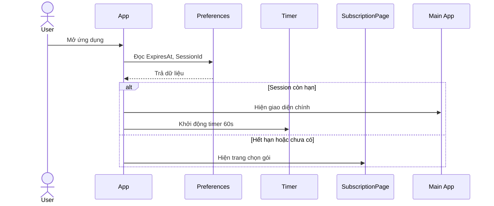
```mermaid
sequenceDiagram
    actor User
    participant App
    participant Preferences
    participant Timer
    participant SubscriptionPage
    participant AppShell as Main App

    User->>App: Mở ứng dụng
    App->>Preferences: Đọc ExpiresAt, SessionId
    Preferences-->>App: Trả dữ liệu

    alt Session còn hạn
        App->>AppShell: Hiện giao diện chính
        App->>Timer: Khởi động timer 60s
    else Hết hạn hoặc chưa có
        App->>SubscriptionPage: Hiện trang chọn gói
    end
```

### 4.2 Chọn gói và tạo session

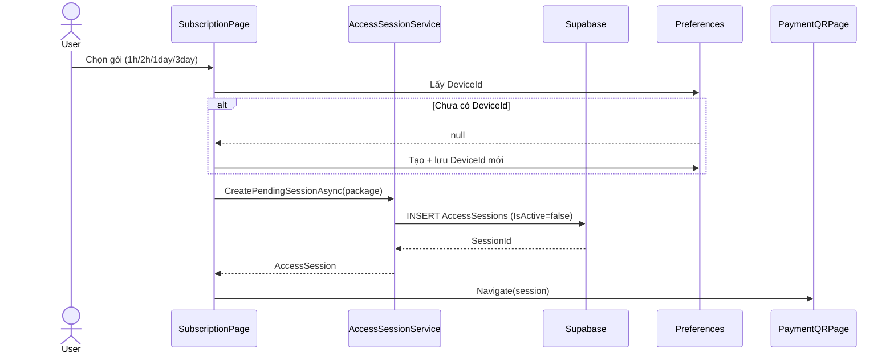
```mermaid
sequenceDiagram
    actor User
    participant SubscriptionPage
    participant AccessSessionService
    participant Supabase
    participant Preferences
    participant PaymentQRPage

    User->>SubscriptionPage: Chọn gói (1h/2h/1day/3day)
    SubscriptionPage->>Preferences: Lấy DeviceId
    alt Chưa có DeviceId
        Preferences-->>SubscriptionPage: null
        SubscriptionPage->>Preferences: Tạo + lưu DeviceId mới
    end
    SubscriptionPage->>AccessSessionService: CreatePendingSessionAsync(package)
    AccessSessionService->>Supabase: INSERT AccessSessions (IsActive=false)
    Supabase-->>AccessSessionService: SessionId
    AccessSessionService-->>SubscriptionPage: AccessSession
    SubscriptionPage->>PaymentQRPage: Navigate(session)
```

### 4.3 Polling kích hoạt và vào app

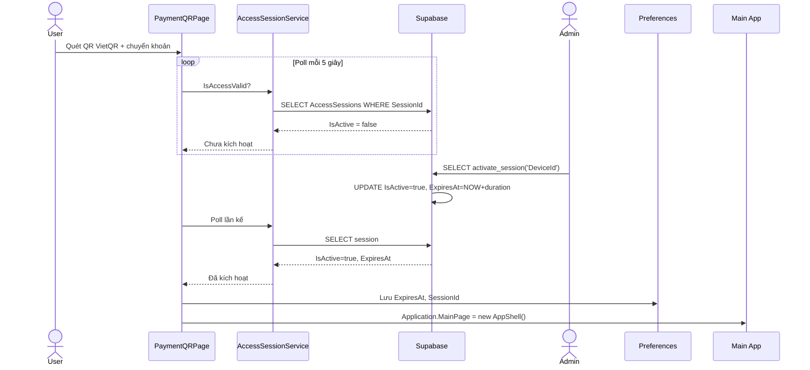
```mermaid
sequenceDiagram
    actor User
    participant PaymentQRPage
    participant AccessSessionService
    participant Supabase
    actor Admin
    participant Preferences
    participant AppShell as Main App

    User->>PaymentQRPage: Quét QR VietQR + chuyển khoản
    loop Poll mỗi 5 giây
        PaymentQRPage->>AccessSessionService: IsAccessValid?
        AccessSessionService->>Supabase: SELECT AccessSessions WHERE SessionId
        Supabase-->>AccessSessionService: IsActive = false
        AccessSessionService-->>PaymentQRPage: Chưa kích hoạt
    end

    Admin->>Supabase: SELECT activate_session('DeviceId')
    Supabase->>Supabase: UPDATE IsActive=true, ExpiresAt=NOW+duration

    PaymentQRPage->>AccessSessionService: Poll lần kế
    AccessSessionService->>Supabase: SELECT session
    Supabase-->>AccessSessionService: IsActive=true, ExpiresAt
    AccessSessionService-->>PaymentQRPage: Đã kích hoạt
    PaymentQRPage->>Preferences: Lưu ExpiresAt, SessionId
    PaymentQRPage->>AppShell: Application.MainPage = new AppShell()
```

### 4.4 Timer hết hạn gói

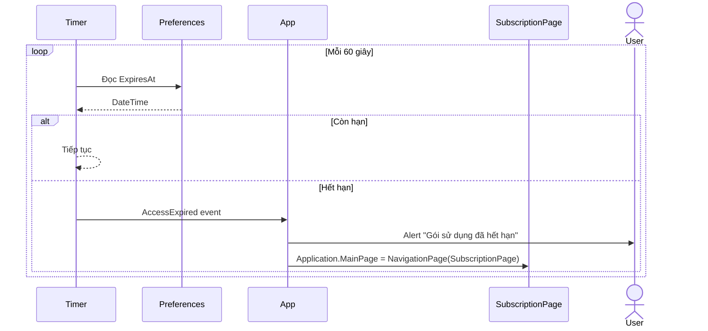
```mermaid
sequenceDiagram
    participant Timer
    participant Preferences
    participant App
    participant SubscriptionPage
    actor User

    loop Mỗi 60 giây
        Timer->>Preferences: Đọc ExpiresAt
        Preferences-->>Timer: DateTime
        alt Còn hạn
            Timer-->>Timer: Tiếp tục
        else Hết hạn
            Timer->>App: AccessExpired event
            App->>User: Alert "Gói sử dụng đã hết hạn"
            App->>SubscriptionPage: Application.MainPage = NavigationPage(SubscriptionPage)
        end
    end
```

### 4.5 Tải Places + cache

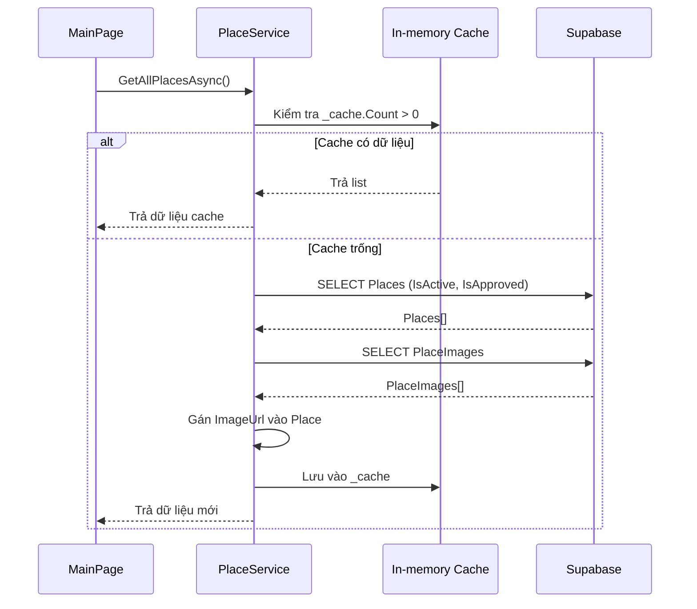
```mermaid
sequenceDiagram
    participant MainPage
    participant PlaceService
    participant Cache as In-memory Cache
    participant Supabase

    MainPage->>PlaceService: GetAllPlacesAsync()
    PlaceService->>Cache: Kiểm tra _cache.Count > 0

    alt Cache có dữ liệu
        Cache-->>PlaceService: Trả list
        PlaceService-->>MainPage: Trả dữ liệu cache
    else Cache trống
        PlaceService->>Supabase: SELECT Places (IsActive, IsApproved)
        Supabase-->>PlaceService: Places[]
        PlaceService->>Supabase: SELECT PlaceImages
        Supabase-->>PlaceService: PlaceImages[]
        PlaceService->>PlaceService: Gán ImageUrl vào Place
        PlaceService->>Cache: Lưu vào _cache
        PlaceService-->>MainPage: Trả dữ liệu mới
    end
```

### 4.6 Bản đồ — hiển thị và tap marker

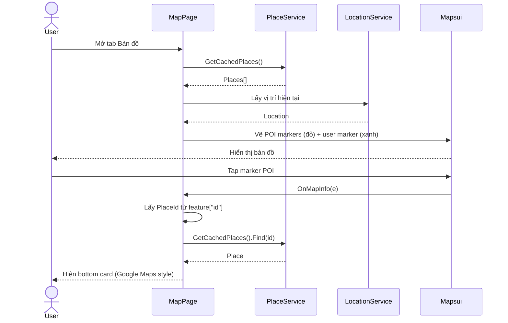
```mermaid
sequenceDiagram
    actor User
    participant MapPage
    participant PlaceService
    participant LocationService
    participant Mapsui

    User->>MapPage: Mở tab Bản đồ
    MapPage->>PlaceService: GetCachedPlaces()
    PlaceService-->>MapPage: Places[]
    MapPage->>LocationService: Lấy vị trí hiện tại
    LocationService-->>MapPage: Location
    MapPage->>Mapsui: Vẽ POI markers (đỏ) + user marker (xanh)
    Mapsui-->>User: Hiển thị bản đồ

    User->>Mapsui: Tap marker POI
    Mapsui->>MapPage: OnMapInfo(e)
    MapPage->>MapPage: Lấy PlaceId từ feature["id"]
    MapPage->>PlaceService: GetCachedPlaces().Find(id)
    PlaceService-->>MapPage: Place
    MapPage-->>User: Hiện bottom card (Google Maps style)
```

### 4.7 Chỉ đường OSRM

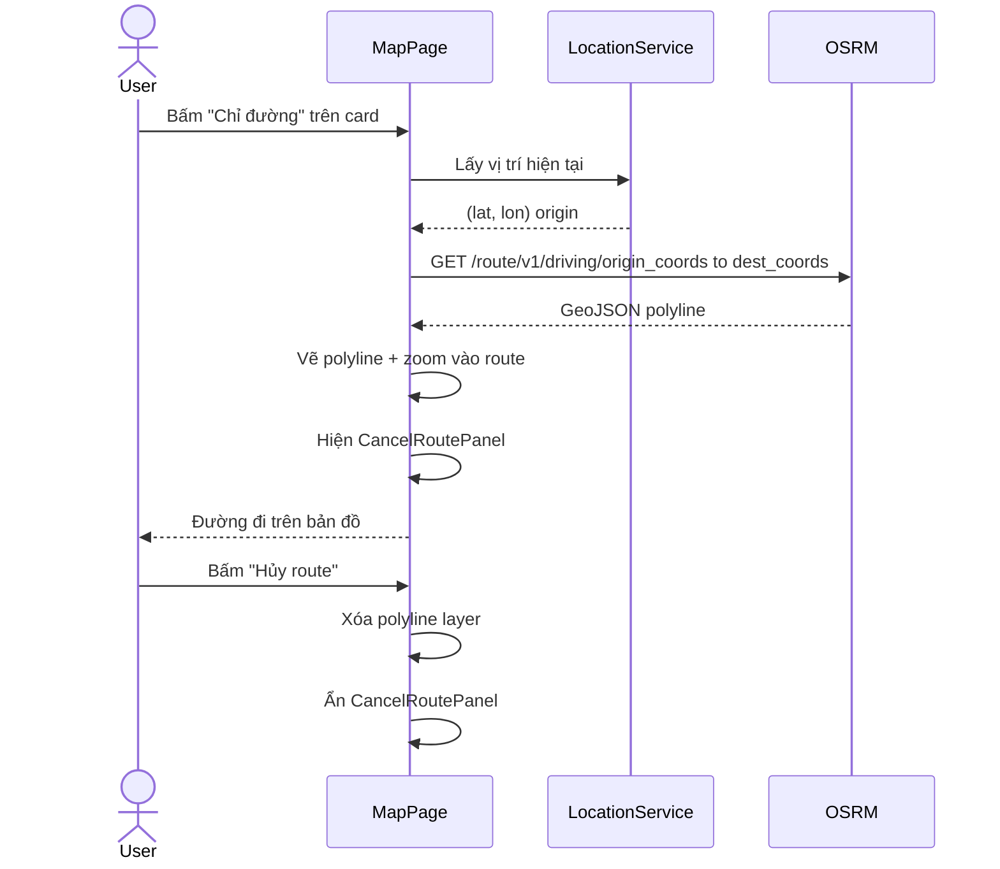
```mermaid
sequenceDiagram
    actor User
    participant MapPage
    participant LocationService
    participant OSRM

    User->>MapPage: Bấm "Chỉ đường" trên card
    MapPage->>LocationService: Lấy vị trí hiện tại
    LocationService-->>MapPage: (lat, lon) origin
    MapPage->>OSRM: GET /route/v1/driving/origin_coords to dest_coords
    OSRM-->>MapPage: GeoJSON polyline
    MapPage->>MapPage: Vẽ polyline + zoom vào route
    MapPage->>MapPage: Hiện CancelRoutePanel
    MapPage-->>User: Đường đi trên bản đồ

    User->>MapPage: Bấm "Hủy route"
    MapPage->>MapPage: Xóa polyline layer
    MapPage->>MapPage: Ẩn CancelRoutePanel
```

### 4.8 Chỉ đường từ PlaceDetailPage

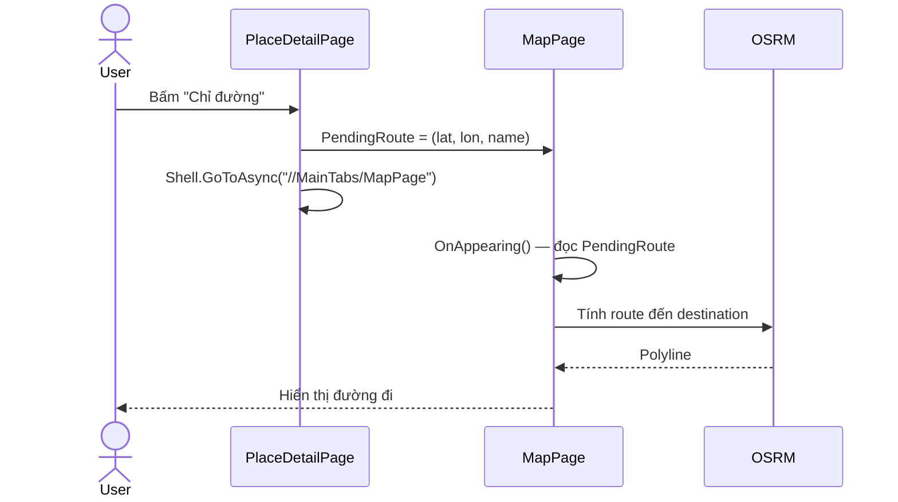
```mermaid
sequenceDiagram
    actor User
    participant PlaceDetailPage
    participant MapPage
    participant OSRM

    User->>PlaceDetailPage: Bấm "Chỉ đường"
    PlaceDetailPage->>MapPage: PendingRoute = (lat, lon, name)
    PlaceDetailPage->>PlaceDetailPage: Shell.GoToAsync("//MainTabs/MapPage")
    MapPage->>MapPage: OnAppearing() — đọc PendingRoute
    MapPage->>OSRM: Tính route đến destination
    OSRM-->>MapPage: Polyline
    MapPage-->>User: Hiển thị đường đi
```

### 4.9 GPS + Geofence + TTS tự động

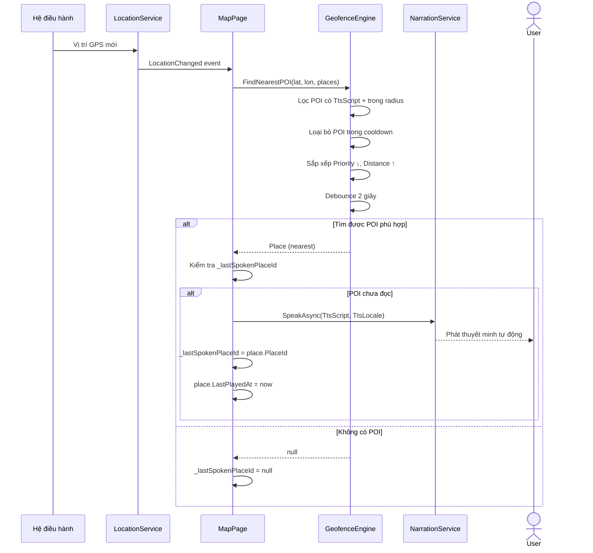
```mermaid
sequenceDiagram
    participant OS as Hệ điều hành
    participant LocationService
    participant MapPage
    participant GeofenceEngine
    participant NarrationService
    actor User

    OS->>LocationService: Vị trí GPS mới
    LocationService->>MapPage: LocationChanged event
    MapPage->>GeofenceEngine: FindNearestPOI(lat, lon, places)
    GeofenceEngine->>GeofenceEngine: Lọc POI có TtsScript + trong radius
    GeofenceEngine->>GeofenceEngine: Loại bỏ POI trong cooldown
    GeofenceEngine->>GeofenceEngine: Sắp xếp Priority ↓, Distance ↑
    GeofenceEngine->>GeofenceEngine: Debounce 2 giây

    alt Tìm được POI phù hợp
        GeofenceEngine-->>MapPage: Place (nearest)
        MapPage->>MapPage: Kiểm tra _lastSpokenPlaceId
        alt POI chưa đọc
            MapPage->>NarrationService: SpeakAsync(TtsScript, TtsLocale)
            NarrationService-->>User: Phát thuyết minh tự động
            MapPage->>MapPage: _lastSpokenPlaceId = place.PlaceId
            MapPage->>MapPage: place.LastPlayedAt = now
        end
    else Không có POI
        GeofenceEngine-->>MapPage: null
        MapPage->>MapPage: _lastSpokenPlaceId = null
    end
```

### 4.10 Tour — duyệt và theo tour

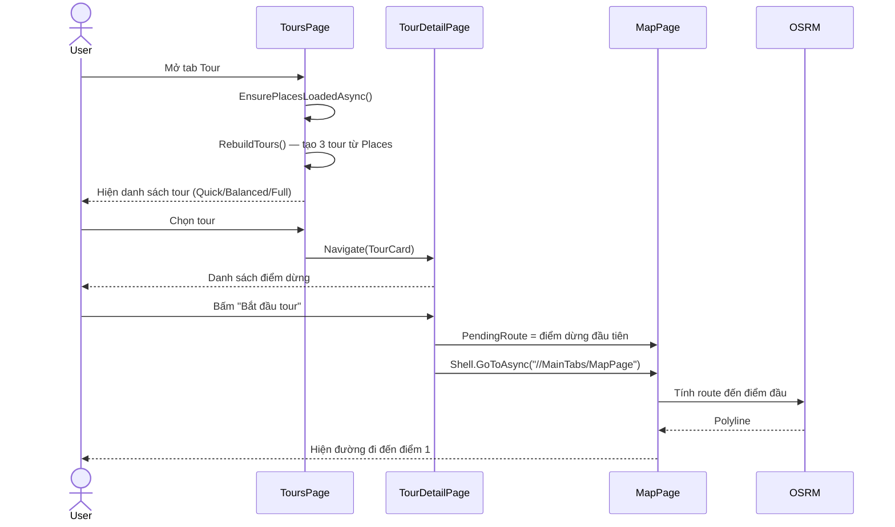
```mermaid
sequenceDiagram
    actor User
    participant ToursPage
    participant TourDetailPage
    participant MapPage
    participant OSRM

    User->>ToursPage: Mở tab Tour
    ToursPage->>ToursPage: EnsurePlacesLoadedAsync()
    ToursPage->>ToursPage: RebuildTours() — tạo 3 tour từ Places
    ToursPage-->>User: Hiện danh sách tour (Quick/Balanced/Full)

    User->>ToursPage: Chọn tour
    ToursPage->>TourDetailPage: Navigate(TourCard)
    TourDetailPage-->>User: Danh sách điểm dừng

    User->>TourDetailPage: Bấm "Bắt đầu tour"
    TourDetailPage->>MapPage: PendingRoute = điểm dừng đầu tiên
    TourDetailPage->>MapPage: Shell.GoToAsync("//MainTabs/MapPage")
    MapPage->>OSRM: Tính route đến điểm đầu
    OSRM-->>MapPage: Polyline
    MapPage-->>User: Hiện đường đi đến điểm 1
```

---

## 5. SEQUENCE DIAGRAMS — Web API

### 5.1 Đăng ký và đăng nhập

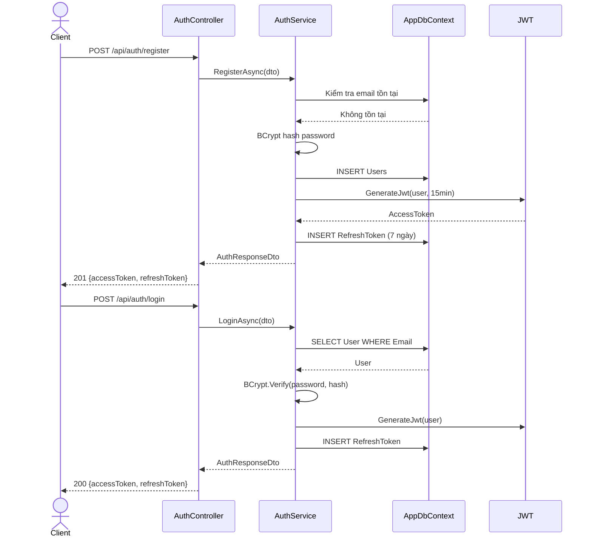
```mermaid
sequenceDiagram
    actor Client
    participant AuthController
    participant AuthService
    participant AppDbContext
    participant JWT

    Client->>AuthController: POST /api/auth/register
    AuthController->>AuthService: RegisterAsync(dto)
    AuthService->>AppDbContext: Kiểm tra email tồn tại
    AppDbContext-->>AuthService: Không tồn tại
    AuthService->>AuthService: BCrypt hash password
    AuthService->>AppDbContext: INSERT Users
    AuthService->>JWT: GenerateJwt(user, 15min)
    JWT-->>AuthService: AccessToken
    AuthService->>AppDbContext: INSERT RefreshToken (7 ngày)
    AuthService-->>AuthController: AuthResponseDto
    AuthController-->>Client: 201 {accessToken, refreshToken}

    Client->>AuthController: POST /api/auth/login
    AuthController->>AuthService: LoginAsync(dto)
    AuthService->>AppDbContext: SELECT User WHERE Email
    AppDbContext-->>AuthService: User
    AuthService->>AuthService: BCrypt.Verify(password, hash)
    AuthService->>JWT: GenerateJwt(user)
    AuthService->>AppDbContext: INSERT RefreshToken
    AuthService-->>AuthController: AuthResponseDto
    AuthController-->>Client: 200 {accessToken, refreshToken}
```

### 5.2 Refresh token và rotation

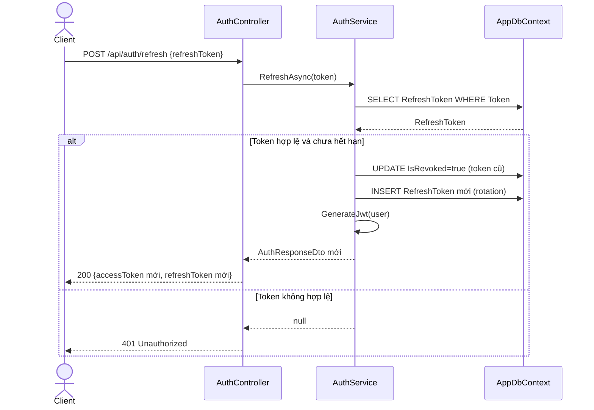
```mermaid
sequenceDiagram
    actor Client
    participant AuthController
    participant AuthService
    participant AppDbContext

    Client->>AuthController: POST /api/auth/refresh {refreshToken}
    AuthController->>AuthService: RefreshAsync(token)
    AuthService->>AppDbContext: SELECT RefreshToken WHERE Token
    AppDbContext-->>AuthService: RefreshToken

    alt Token hợp lệ và chưa hết hạn
        AuthService->>AppDbContext: UPDATE IsRevoked=true (token cũ)
        AuthService->>AppDbContext: INSERT RefreshToken mới (rotation)
        AuthService->>AuthService: GenerateJwt(user)
        AuthService-->>AuthController: AuthResponseDto mới
        AuthController-->>Client: 200 {accessToken mới, refreshToken mới}
    else Token không hợp lệ
        AuthService-->>AuthController: null
        AuthController-->>Client: 401 Unauthorized
    end
```

### 5.3 Tạo và duyệt địa điểm

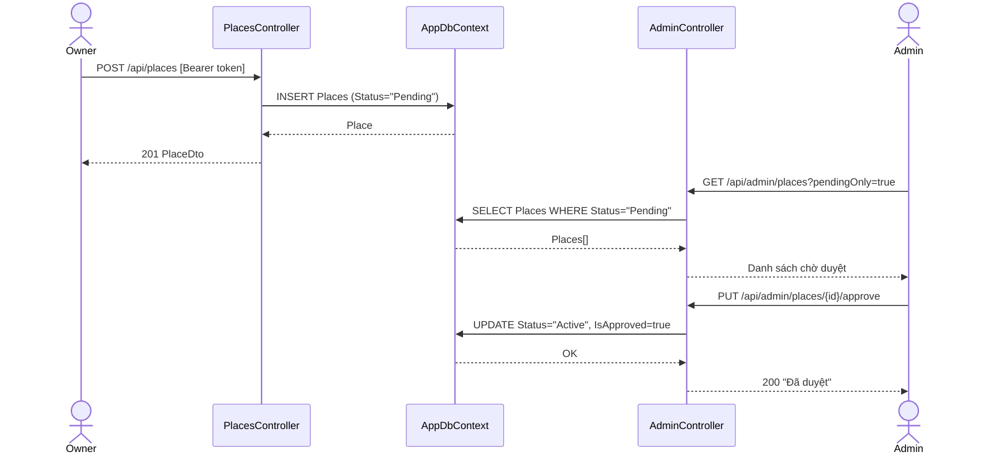
```mermaid
sequenceDiagram
    actor Owner
    participant PlacesController
    participant AppDbContext
    participant AdminController
    actor Admin

    Owner->>PlacesController: POST /api/places [Bearer token]
    PlacesController->>AppDbContext: INSERT Places (Status="Pending")
    AppDbContext-->>PlacesController: Place
    PlacesController-->>Owner: 201 PlaceDto

    Admin->>AdminController: GET /api/admin/places?pendingOnly=true
    AdminController->>AppDbContext: SELECT Places WHERE Status="Pending"
    AppDbContext-->>AdminController: Places[]
    AdminController-->>Admin: Danh sách chờ duyệt

    Admin->>AdminController: PUT /api/admin/places/{id}/approve
    AdminController->>AppDbContext: UPDATE Status="Active", IsApproved=true
    AppDbContext-->>AdminController: OK
    AdminController-->>Admin: 200 "Đã duyệt"
```

### 5.4 Viết review + thông báo SignalR

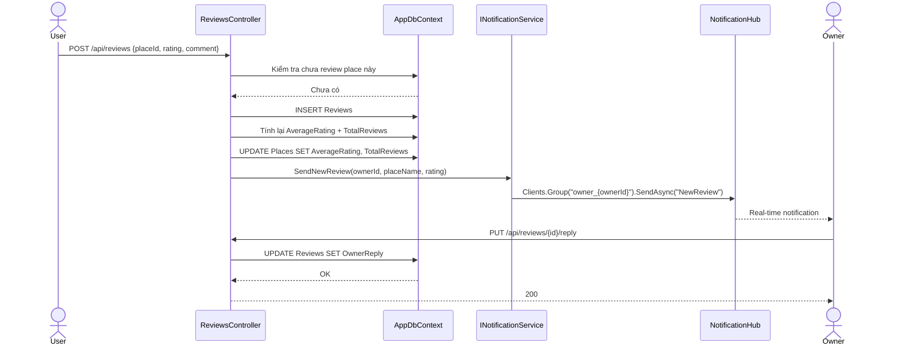
```mermaid
sequenceDiagram
    actor User
    participant ReviewsController
    participant AppDbContext
    participant INotificationService
    participant NotificationHub
    actor Owner

    User->>ReviewsController: POST /api/reviews {placeId, rating, comment}
    ReviewsController->>AppDbContext: Kiểm tra chưa review place này
    AppDbContext-->>ReviewsController: Chưa có
    ReviewsController->>AppDbContext: INSERT Reviews
    ReviewsController->>AppDbContext: Tính lại AverageRating + TotalReviews
    ReviewsController->>AppDbContext: UPDATE Places SET AverageRating, TotalReviews
    ReviewsController->>INotificationService: SendNewReview(ownerId, placeName, rating)
    INotificationService->>NotificationHub: Clients.Group("owner_{ownerId}").SendAsync("NewReview")
    NotificationHub-->>Owner: Real-time notification

    Owner->>ReviewsController: PUT /api/reviews/{id}/reply
    ReviewsController->>AppDbContext: UPDATE Reviews SET OwnerReply
    AppDbContext-->>ReviewsController: OK
    ReviewsController-->>Owner: 200
```

### 5.5 Theo dõi vị trí và auto check-in

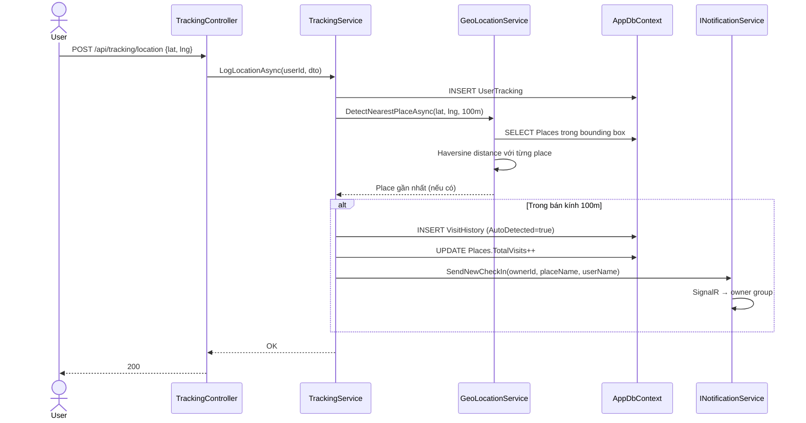
```mermaid
sequenceDiagram
    actor User
    participant TrackingController
    participant TrackingService
    participant GeoLocationService
    participant AppDbContext
    participant INotificationService

    User->>TrackingController: POST /api/tracking/location {lat, lng}
    TrackingController->>TrackingService: LogLocationAsync(userId, dto)
    TrackingService->>AppDbContext: INSERT UserTracking
    TrackingService->>GeoLocationService: DetectNearestPlaceAsync(lat, lng, 100m)
    GeoLocationService->>AppDbContext: SELECT Places trong bounding box
    GeoLocationService->>GeoLocationService: Haversine distance với từng place
    GeoLocationService-->>TrackingService: Place gần nhất (nếu có)

    alt Trong bán kính 100m
        TrackingService->>AppDbContext: INSERT VisitHistory (AutoDetected=true)
        TrackingService->>AppDbContext: UPDATE Places.TotalVisits++
        TrackingService->>INotificationService: SendNewCheckIn(ownerId, placeName, userName)
        INotificationService->>INotificationService: SignalR → owner group
    end

    TrackingService-->>TrackingController: OK
    TrackingController-->>User: 200
```

### 5.6 Khiếu nại và xử lý

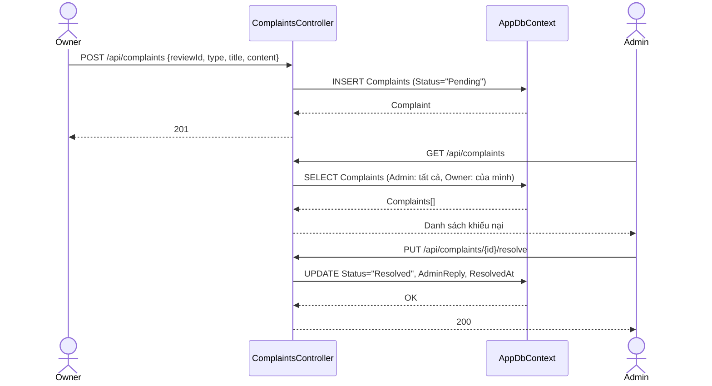
```mermaid
sequenceDiagram
    actor Owner
    participant ComplaintsController
    participant AppDbContext
    actor Admin

    Owner->>ComplaintsController: POST /api/complaints {reviewId, type, title, content}
    ComplaintsController->>AppDbContext: INSERT Complaints (Status="Pending")
    AppDbContext-->>ComplaintsController: Complaint
    ComplaintsController-->>Owner: 201

    Admin->>ComplaintsController: GET /api/complaints
    ComplaintsController->>AppDbContext: SELECT Complaints (Admin: tất cả, Owner: của mình)
    AppDbContext-->>ComplaintsController: Complaints[]
    ComplaintsController-->>Admin: Danh sách khiếu nại

    Admin->>ComplaintsController: PUT /api/complaints/{id}/resolve
    ComplaintsController->>AppDbContext: UPDATE Status="Resolved", AdminReply, ResolvedAt
    AppDbContext-->>ComplaintsController: OK
    ComplaintsController-->>Admin: 200
```

---

## 6. ACTIVITY DIAGRAMS

### 6.1 Luồng khởi động app (Mobile)

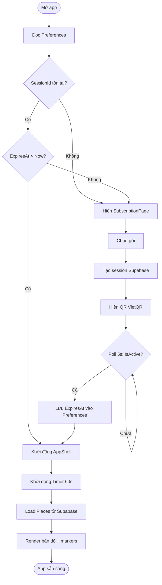
```mermaid
flowchart TD
    A([Mở app]) --> B[Đọc Preferences]
    B --> C{SessionId tồn tại?}
    C -->|Không| D[Hiện SubscriptionPage]
    C -->|Có| E{ExpiresAt > Now?}
    E -->|Không| D
    E -->|Có| F[Khởi động AppShell]
    F --> G[Khởi động Timer 60s]
    G --> H[Load Places từ Supabase]
    H --> I[Render bản đồ + markers]
    I --> J([App sẵn sàng])

    D --> K[Chọn gói]
    K --> L[Tạo session Supabase]
    L --> M[Hiện QR VietQR]
    M --> N{Poll 5s: IsActive?}
    N -->|Chưa| N
    N -->|Có| O[Lưu ExpiresAt vào Preferences]
    O --> F
```

### 6.2 Luồng Geofence + TTS (Mobile)

```mermaid
flowchart TD
    A([GPS update]) --> B[LocationService.LocationChanged]
    B --> C[GeofenceEngine.FindNearestPOI]
    C --> D{Có POI trong radius?}
    D -->|Không| E[_lastSpokenPlaceId = null]
    E --> Z([Kết thúc])
    D -->|Có| F{POI trong cooldown?}
    F -->|Có| G[Bỏ qua POI này]
    G --> D
    F -->|Không| H[Sắp xếp theo Priority + Distance]
    H --> I{POI == _lastSpokenPlaceId?}
    I -->|Có| Z
    I -->|Không| J[Debounce 2 giây]
    J --> K[NarrationService.SpeakAsync]
    K --> L[Cập nhật _lastSpokenPlaceId]
    L --> M[Cập nhật LastPlayedAt]
    M --> Z
```

### 6.3 Luồng duyệt địa điểm (Web)

```mermaid
flowchart TD
    A([Owner tạo Place]) --> B[Status = Pending]
    B --> C{Admin vào /admin/places}
    C --> D[Xem danh sách chờ duyệt]
    D --> E{Quyết định}
    E -->|Duyệt| F[PUT /approve → Status=Active]
    E -->|Từ chối| G[PUT /suspend → Status=Suspended]
    F --> H[Place hiện trên app mobile]
    G --> I[Place bị ẩn]
    H --> J{Owner cập nhật thông tin?}
    J -->|Có| K[PUT /api/places/id]
    K --> H
```

### 6.4 Luồng thanh toán và kích hoạt (Mobile + Admin)

```mermaid
flowchart TD
    A([User mở app lần đầu]) --> B[SubscriptionPage]
    B --> C[Chọn gói thời gian]
    C --> D[Tạo AccessSession - IsActive=false]
    D --> E[Hiện QR VietQR + DeviceId]
    E --> F[User chuyển khoản ngân hàng]
    F --> G[App polling Supabase mỗi 5s]
    G --> H{Admin thấy tiền}
    H -->|Chưa| G
    H -->|Có| I[Admin: activate_session DeviceId]
    I --> J[Supabase: IsActive=true, ExpiresAt=Now+duration]
    J --> K[App poll nhận IsActive=true]
    K --> L[Lưu ExpiresAt vào Preferences]
    L --> M[Application.MainPage = AppShell]
    M --> N([Dùng app bình thường])
    N --> O{Timer 60s kiểm tra}
    O -->|Còn hạn| O
    O -->|Hết hạn| P[Alert hết hạn]
    P --> B
```

### 6.5 Luồng đăng nhập Web MVC

```mermaid
flowchart TD
    A([Truy cập trang có Auth]) --> B{Session có token?}
    B -->|Không| C[Redirect /Auth/Login]
    B -->|Có| D{Role đủ quyền?}
    D -->|Không| E[Redirect /Auth/AccessDenied]
    D -->|Có| F[Tiếp tục request]
    C --> G[Nhập email + password]
    G --> H[POST /Auth/Login]
    H --> I{Credentials hợp lệ?}
    I -->|Không| J[Hiện lỗi]
    J --> G
    I -->|Có| K[Lưu token vào Session]
    K --> L{Role?}
    L -->|Admin| M[Redirect /Admin]
    L -->|Owner| N[Redirect /Dashboard]
    L -->|User| O[Redirect /Dashboard]
```

---

## 7. TỔNG KẾT SỐ LƯỢNG

| Loại diagram | Số lượng |
|---|---|
| ER Diagram | 1 (toàn bộ 13 bảng) |
| Class Diagram | 2 (Mobile + Web API) |
| Sequence Diagram | 10 (Mobile) + 6 (Web) = 16 |
| Activity Diagram | 5 |
| **Tổng** | **24 diagrams** |

> Render bằng: **VS Code** (extension *Markdown Preview Mermaid Support*) hoặc **GitHub** (tự render)
