# Product Requirements Document (PRD)
## TourGuideAPP — Ứng dụng Hướng dẫn Du lịch Thông minh TP.HCM

**Phiên bản:** 2.4  
**Ngày cập nhật:** Tháng 4, 2026  
**Trạng thái:** Đang phát triển  

---

## 1. Tổng quan

**TourGuideAPP** là ứng dụng hướng dẫn du lịch thông minh dành cho TP. Hồ Chí Minh, xây dựng trên nền tảng .NET MAUI. Ứng dụng kết hợp GPS, Geofencing và Text-to-Speech để tự động phát thuyết minh khi người dùng tiến đến gần địa điểm du lịch, mang lại trải nghiệm như có hướng dẫn viên cá nhân.

### Vấn đề cần giải quyết
- Khách du lịch không có hướng dẫn viên riêng thường bỏ lỡ thông tin thú vị về địa điểm
- Thuê hướng dẫn viên tốn kém và phụ thuộc lịch trình cố định
- Các app hiện có (Google Maps, TripAdvisor) chỉ cung cấp thông tin tĩnh, không chủ động

### Giải pháp
Tự động phát thuyết minh đúng lúc — khi người dùng đi đến gần địa điểm — không cần bấm nút, không cần đọc, chỉ cần đi và lắng nghe.

---

## 2. Đối tượng người dùng

### 2.1 Khách du lịch nội địa & quốc tế
| | Chi tiết |
|---|---|
| **Đặc điểm** | Đến TP.HCM 1–3 ngày, không quen đường, muốn trải nghiệm nhiều nhất |
| **Nhu cầu** | Biết mình đang đứng gần địa điểm gì, nghe giới thiệu ngắn gọn, tìm đường nhanh |
| **Pain point** | Phải tự tra cứu từng nơi, dễ bỏ lỡ điểm thú vị vì không biết |
| **Kỳ vọng** | App hoạt động tự động, không cần thao tác nhiều khi đang đi |

### 2.2 Sinh viên & người trẻ địa phương
| | Chi tiết |
|---|---|
| **Đặc điểm** | Sống tại TP.HCM nhưng chưa khám phá hết, thích trải nghiệm mới |
| **Nhu cầu** | Khám phá địa điểm theo chủ đề (cà phê, ẩm thực, lịch sử) |
| **Pain point** | Không biết bắt đầu từ đâu, thiếu thông tin chiều sâu về từng nơi |
| **Kỳ vọng** | Gợi ý tour theo danh mục, thông tin phong phú, dễ tìm đường |

### 2.3 Admin (Người quản trị hệ thống)
| | Chi tiết |
|---|---|
| **Đặc điểm** | Nhân viên vận hành, quản lý nội dung địa điểm và gói dịch vụ |
| **Nhu cầu** | Kích hoạt/hủy gói cho khách sau khi nhận thanh toán, chỉnh giá gói, xem thống kê thiết bị |
| **Công cụ** | Web Admin UI (`/Admin/Sessions`, `/Admin/Packages`, `/Admin/Devices`) |

---

## 3. Phạm vi tính năng (Use Case)

### Actor & Use Case

| Actor | Use Case |
|---|---|
| **Khách du lịch** | Chọn ngôn ngữ giao diện |
| | Chọn gói & thanh toán QR |
| | Xem bản đồ & POI markers |
| | Chỉ đường đến địa điểm |
| | Nghe thuyết minh tự động (TTS) |
| | Tìm kiếm & lọc địa điểm |
| | Xem chi tiết địa điểm |
| | Xem & theo tour có sẵn |
| | Xem lịch sử ghé thăm |
| | Chọn ngôn ngữ TTS |
| **Owner** | Đăng nhập / Đăng ký |
| | Xem dashboard tổng quan |
| | Quản lý địa điểm (thêm, sửa, xóa) |
| | Quản lý ảnh địa điểm |
| | Cập nhật & dịch TTS script |
| | Xem / sửa profile & đổi mật khẩu |
| | Đăng ký & xem lịch sử subscription |
| **Admin** | Xem thống kê & bản đồ hệ thống |
| | Quản lý user (khóa/mở, đổi role) |
| | Duyệt / suspend địa điểm |
| | Kích hoạt / thu hồi / hủy session thanh toán |
| | Chỉnh giá & cấu hình gói truy cập |
| | Xem danh sách thiết bị đã cài app |
| | Xem lịch sử POI visit theo thiết bị |
| **Hệ thống** | Đăng ký thiết bị tự động |
| | Polling xác nhận thanh toán |
| | Tự động khóa session khi hết hạn |
| | Phát TTS theo GPS (geofence + debounce) |
| | Ghi nhận lượt ghé POI |

### Use Case Diagram

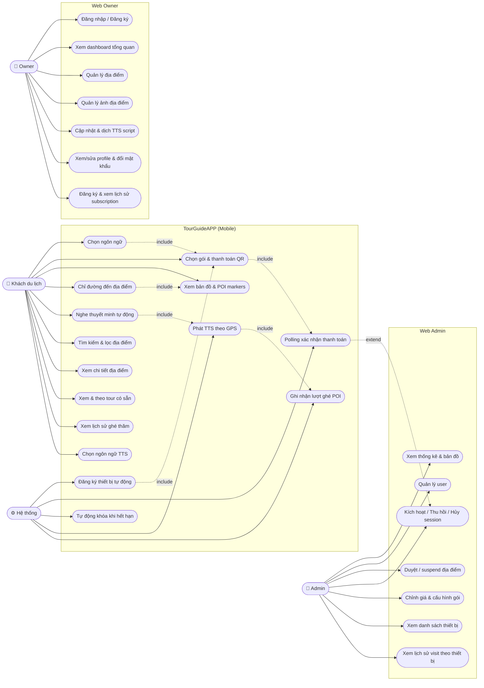
```mermaid
graph LR
    Tourist(["👤 Khách du lịch"])
    Owner(["👤 Owner"])
    Admin(["👤 Admin"])
    System(["⚙️ Hệ thống"])

    subgraph APP["  TourGuideAPP (Mobile)  "]
        UC1(["Chọn ngôn ngữ"])
        UC2(["Chọn gói & thanh toán QR"])
        UC3(["Xem bản đồ & POI markers"])
        UC4(["Chỉ đường đến địa điểm"])
        UC5(["Nghe thuyết minh tự động"])
        UC6(["Tìm kiếm & lọc địa điểm"])
        UC7(["Xem chi tiết địa điểm"])
        UC8(["Xem & theo tour có sẵn"])
        UC9(["Xem lịch sử ghé thăm"])
        UC10(["Chọn ngôn ngữ TTS"])
        UC11(["Đăng ký thiết bị tự động"])
        UC12(["Polling xác nhận thanh toán"])
        UC13(["Tự động khóa khi hết hạn"])
        UC14(["Phát TTS theo GPS"])
        UC15(["Ghi nhận lượt ghé POI"])
    end

    subgraph WEB_OWNER["  Web Owner  "]
        UC16(["Đăng nhập / Đăng ký"])
        UC17(["Xem dashboard tổng quan"])
        UC18(["Quản lý địa điểm"])
        UC19(["Quản lý ảnh địa điểm"])
        UC20(["Cập nhật & dịch TTS script"])
        UC21(["Xem/sửa profile & đổi mật khẩu"])
        UC22(["Đăng ký & xem lịch sử subscription"])
    end

    subgraph WEB_ADMIN["  Web Admin  "]
        UC23(["Xem thống kê & bản đồ"])
        UC24(["Quản lý user"])
        UC25(["Duyệt / suspend địa điểm"])
        UC26(["Kích hoạt / Thu hồi / Hủy session"])
        UC27(["Chỉnh giá & cấu hình gói"])
        UC28(["Xem danh sách thiết bị"])
        UC29(["Xem lịch sử visit theo thiết bị"])
    end

    Tourist --> UC1
    Tourist --> UC2
    Tourist --> UC3
    Tourist --> UC4
    Tourist --> UC5
    Tourist --> UC6
    Tourist --> UC7
    Tourist --> UC8
    Tourist --> UC9
    Tourist --> UC10

    Owner --> UC16
    Owner --> UC17
    Owner --> UC18
    Owner --> UC19
    Owner --> UC20
    Owner --> UC21
    Owner --> UC22

    Admin --> UC23
    Admin --> UC24
    Admin --> UC25
    Admin --> UC26
    Admin --> UC27
    Admin --> UC28
    Admin --> UC29

    System --> UC11
    System --> UC12
    System --> UC13
    System --> UC14
    System --> UC15

    UC1 -. include .-> UC2
    UC2 -. include .-> UC12
    UC4 -. include .-> UC3
    UC5 -. include .-> UC14
    UC14 -. include .-> UC15
    UC11 -. include .-> UC2
    UC12 -. extend .-> UC26
```

---

## 4. Kiến trúc hệ thống

### Mobile Application
- **Framework:** .NET MAUI 10.0
- **Target chính:** Android (API 21+), iOS (15+)
- **Pattern:** Layered Architecture + Code-behind (không dùng MVVM)
- **Dependency Injection:** Microsoft.Extensions.DependencyInjection — Services là Singleton, Pages là Transient

### Backend & Database (Mobile)
- **Database:** PostgreSQL qua Supabase
- **Client:** postgrest-csharp — map C# model sang Supabase table qua `[Column]` / `[Table]` attribute
- **Local storage:** MAUI Preferences — lưu ExpiresAt, DeviceId, SessionId, TTS locale

### Web Admin
- **Framework:** ASP.NET Core MVC + Web API (cùng project)
- **ORM:** Entity Framework Core + Npgsql (kết nối cùng Supabase PostgreSQL)
- **Auth:** JWT Bearer (API) + Cookie Session (MVC)
- **UI:** Razor Views + Tailwind CSS + Material Symbols icons

### Thư viện bên thứ ba (Mobile)
| Thư viện | Mục đích |
|---|---|
| Mapsui 5.x | Bản đồ tương tác (CartoDB Voyager tiles) |
| BruTile | Tile source provider cho Mapsui |
| OSRM public API | Tính toán & vẽ tuyến đường |
| MAUI TextToSpeech | Text-to-Speech đa ngôn ngữ (built-in) |
| SkiaSharp | Render marker POI tùy chỉnh |
| postgrest-csharp | ORM giao tiếp Supabase |
| ZXing.Net.MAUI | Quét mã QR (QRScanPage) |

---

## 5. Tính năng chi tiết

### 5.1 Kiểm soát truy cập theo gói thời gian
**Mục tiêu:** Monetize app — người dùng phải thanh toán trước khi sử dụng

**Luồng hoạt động:**
```
Mở app
  → RegisterDeviceAsync() [fire-and-forget] → UPSERT DeviceRegistrations
  → IsAccessValid() kiểm tra Preferences
    ├── Còn hạn → AppShell + StartExpiryTimer()
    └── Hết hạn → LanguageSelectionPage → SubscriptionPage

SubscriptionPage.OnAppearing()
  → GetPackagesAsync() → SELECT AccessPackages (IsActive=true, ORDER SortOrder)
  → Fallback về giá hardcode nếu lỗi DB
  → Hiện 4 gói với giá từ DB

Chọn gói → PaymentQRPage
  → CreatePendingSessionAsync(packageId, durationHours, priceVnd)
  → INSERT AccessSessions (IsActive=false) → trả về SessionId (string)
  → Hiện QR VietQR (bank VIB, 310822005, nội dung = DeviceId)
  → StartPollingForActivation(sessionId, onActivated) — poll Supabase mỗi 5s

Admin kích hoạt trên /Admin/Sessions
  → Poll detect IsActive=true → lưu ExpiresAt Preferences
  → StartExpiryTimer() → AppShell (vào app)

Timer background (mỗi 60 giây):
  → IsAccessValid() → hết hạn → ClearLocalSession() → AccessExpired event
  → App.OnAccessExpired() → LanguageSelectionPage
```

**Gói sử dụng (bảng `AccessPackages`, Admin có thể chỉnh):**
| PackageId | DurationHours | Giá mặc định |
|---|---|---|
| 1h | 1 | 10.000đ |
| 2h | 2 | 18.000đ |
| 1day | 24 | 50.000đ |
| 3day | 72 | 120.000đ |

---

### 5.2 GPS & Định vị thời gian thực
- **Android:** Foreground Service (`LocationForegroundService`) — GPS chạy khi app background, bắn `LocationUpdated` static event → `LocationService.OnBackgroundLocationUpdated()`
- **iOS:** Polling `Geolocation.GetLocationAsync()` mỗi 3 giây
- `LocationService.LocationChanged` event — subscriber chính là `MapPage.StartGPS()` (chỉ đăng ký 1 lần nhờ `_gpsStarted` flag)
- Reverse geocoding: `GetAddressAsync()` — cache 15s / dưới 30m không gọi lại

---

### 5.3 Geofence & Thuyết minh tự động (TTS)
**Thuật toán `GeofenceEngine.FindNearestPOI()`:**
```
1. Lọc candidates:
   - GetDistance(user, place) <= (place.Radius ?? 50m)
   - (DateTime.Now - place.LastPlayedAt) >= (place.CooldownMinutes ?? 30) phút
   (không filter theo HasTtsScript — mọi place đều đủ điều kiện)

2. Nếu candidates rỗng → reset _pendingPlaceId, _pendingFirstSeenAt → return null

3. Lấy top = candidates[0] (sort: Priority DESC → Distance ASC → PlaceId ASC)
   - Priority DESC: POI có priority cao hơn → ưu tiên trước
   - Distance ASC: cùng priority → POI gần hơn → ưu tiên trước
   - PlaceId ASC: tiebreaker deterministic khi khoảng cách bằng nhau chính xác

4. Debounce:
   - Nếu top.PlaceId != _pendingPlaceId → gán _pendingPlaceId = topId, _pendingFirstSeenAt = now → return null
   - Nếu (now - _pendingFirstSeenAt) < 2000ms → return null
   - Đủ debounce → return top (KHÔNG reset _pendingPlaceId)
```

**Luồng trong `MapPage.StartGPS()` callback:**
```
GPS update → GeofenceEngine.FindNearestPOI()

nearest != null:
  → Cập nhật NearestPOILabel
  → Nếu nearest.PlaceId != _lastSpokenPlaceId:
      _lastSpokenPlaceId = nearestId
      _lastSpokenPlace = nearest
      nearest.LastPlayedAt = DateTime.Now
      NarrationService.SpeakFromGpsAsync(nearest.GetScriptForLocale(locale))
        [SpeakFromGpsAsync: nếu (now - _lastGpsTtsAt) < 60s → return; không đọc]
      UserProfileService.AddHistoryByGpsAsync(nearest)
        → AddHistoryAsync(place, "GPS") [lưu local Preferences]
        → RecordDevicePoiVisitAsync(place, "GPS") [INSERT DevicePoiVisits Supabase]

nearest == null:
  → NearestPOILabel = "Không có địa điểm gần"
  → Nếu _lastSpokenPlace != null:
      distToLast = GetDistance(user, _lastSpokenPlace)
      Nếu distToLast > (_lastSpokenPlace.Radius ?? 50):
        _lastSpokenPlaceId = null
        _lastSpokenPlace = null
      (Nếu còn trong bán kính → giữ nguyên _lastSpokenPlaceId, cooldown đang active)

Khi CancelRoutePanel.IsVisible == true → early return (không ghi đè label)
```

---

### 5.4 Bản đồ tương tác
**Map layers (thứ tự add):**
- `"BaseMap"` — CartoDB Voyager tiles (https://{s}.basemaps.cartocdn.com/rastertiles/voyager/{z}/{x}/{y}.png)
- `"POIsGlow"` — vòng glow đỏ mờ (ARGB 45,233,69,96), chỉ visual
- `"POIs"` — chấm đặc đỏ (ARGB 255,233,69,96) + viền trắng, dùng cho hit-test `OnMapInfo`
- `"UserLocationGlow"` — vòng glow xanh mờ (ARGB 45,0,140,255)
- `"UserLocationDot"` — chấm xanh đặc (ARGB 255,30,144,255) + viền trắng
- `"Route"` — LineString OSRM (#E94560) — chỉ khi đang chỉ đường
- `"Destination"` — marker điểm đến — chỉ khi đang chỉ đường

**Map center mặc định:** lon=106.6820, lat=10.7600, zoom=14

**Bottom card:**
- Tap marker → `OnMapInfo` → `GetCachedPlaces().FirstOrDefault(p => p.PlaceId == id)` → `ShowPlaceCard(place)`
- 4 nút: BtnDirections (gold, primary), BtnNarrate, BtnCall, BtnDetail (secondary)
- Hover: `PointerGestureRecognizer` + `ReferenceEquals(btn, BtnDirections)` để phân biệt primary/secondary

---

### 5.5 Danh sách địa điểm nổi bật
- Card: ảnh (ImageUrl từ PlaceImages.IsMain), tên, rating sao, khoảng giá, giờ mở cửa
- Tìm kiếm realtime theo Name / Address / Specialty
- Lọc nhanh theo chip danh mục
- Cache in-memory (`PlaceService._cachedPlaces`) — không reload khi chuyển tab

---

### 5.6 Chi tiết địa điểm
- Gallery ảnh cuộn ngang từ `PlaceImages`
- Hiển thị: địa chỉ, giờ mở/đóng, trạng thái mở-đóng realtime, giá, số điện thoại, website
- TTS script: dùng `place.GetScriptForLocale(locale)` (không phải `place.TtsScript` trực tiếp)
- **Chỉ đường:** `MapPage.PendingRoute = (lat, lon, name)` → `Shell.GoToAsync("//MainTabs/MapPage")`

---

### 5.7 Tour có sẵn
- `ToursPage.RebuildTours()`: tạo 3 TourCard từ cùng 1 pool places (IsActive && IsApproved)
  - tour-quick: 2 stops, tour-balanced: 3 stops, tour-full: 4 stops
- Filters: query text, budget slider (k), duration picker, low-walking toggle
- Bắt đầu tour: `MapPage.PendingRoute = first stop` → `GoToAsync MapPage`

---

### 5.8 Web Admin — Quản lý thanh toán (Sessions)
- Route: `/Admin/Sessions` | API: `GET|POST /api/admin/sessions`
- Stats: Chờ kích hoạt / Đang active / Tổng / Doanh thu (chỉ tính sessions IsActive=true)
- Filter tabs: pending / active / expired / all
- Tìm kiếm theo Device ID
- **Kích hoạt:** `POST /api/admin/sessions/{id}/activate` → IsActive=true, ActivatedAt=now, ExpiresAt=now+DurationHours
- **Hủy (pending):** `POST /Admin/Sessions/Cancel` → `DELETE /api/admin/sessions/{id}` (chỉ session chưa IsActive)
- **Thu hồi (active):** `POST /Admin/Sessions/Deactivate` → IsActive=false, ExpiresAt=now
- Phân trang 20 items/trang

---

### 5.9 Web Admin — Quản lý gói truy cập (Packages)
- Route: `/Admin/Packages` | API: `GET /api/access-packages`, `PUT /api/access-packages/{id}`
- 4 card gói với form chỉnh: PriceVnd, DurationHours, SortOrder, IsActive
- App tự load giá mới khi user mở `SubscriptionPage.OnAppearing()`

---

### 5.10 Web Admin — Theo dõi thiết bị (Devices)
- Route: `/Admin/Devices` | API: `GET /api/admin/devices`, `GET /api/admin/devices/{id}/visits`
- Nguồn: `DeviceRegistrations` (tất cả device đã mở app) LEFT JOIN `DevicePoiVisits`, `AccessSessions`
- Mỗi row: DeviceId, Platform, FirstSeenAt, VisitCount, PoiCount, LastPackage, **Kết nối**, **Gói hiện tại**
- Chi tiết: `/Admin/Devices/{deviceId}` → lịch sử 50 visits gần nhất

**Trạng thái kết nối realtime:**
- App gửi heartbeat lên `DeviceRegistrations.LastSeenAt` mỗi **5 giây** khi đang foreground
- `OnSleep()` → dừng heartbeat; `OnResume()` → cập nhật ngay + khởi động lại heartbeat
- Web kiểm tra: `(UtcNow - LastSeenAt) ≤ 15 giây` → badge **"Đang dùng"** (xanh nhấp nháy)
- Ngoài ngưỡng: hiện **"X phút/giờ trước"** với tooltip thời gian chính xác
- Trang tự reload mỗi **15 giây** (`<meta http-equiv="refresh" content="15">`) — không cần F5
- Thời gian tối đa để phát hiện offline sau khi app tắt: **~30 giây** (15s threshold + 15s reload)

---

## 6. Cấu trúc dữ liệu

### Bảng `Places`
| Cột | Kiểu | Ghi chú |
|---|---|---|
| PlaceId | int PK | |
| Name | text | |
| Description | text? | |
| Address | text? | |
| Latitude / Longitude | double | WGS84 |
| Phone / Website | text? | |
| OpenTime / CloseTime | text? | Format "HH:mm" |
| PriceMin / PriceMax | decimal? | VND |
| AverageRating | float? | 0–5 |
| TotalReviews | int? | |
| TotalVisits | int | Auto-increment qua Supabase trigger |
| Specialty | text? | Tags, phân cách dấu phẩy |
| IsActive / IsApproved | bool | |
| CategoryId / OwnerId | int? | FK |
| tts_script | text? | Legacy fallback TTS |
| audio_file_url | text? | Chưa dùng |
| radius | double? | Bán kính geofence (m), default 50 |
| cooldown_minutes | int? | Cooldown TTS (phút), default 30 |
| priority | int? | Geofence priority, default 1 |
| PricePerPerson / District / HasParking / HasAircon | - | Ít dùng / web only |

**Runtime (không có [Column]):** `LastPlayedAt`, `TtsLocale`, `ImageUrl`, `TtsContents`

### Bảng `PlaceImages`
| Cột | Kiểu | Ghi chú |
|---|---|---|
| ImageId | int PK | |
| PlaceId | int FK | |
| ImageUrl | text | |
| IsMain | bool | PlaceService chỉ load IsMain=true |
| SortOrder | int | |

### Bảng `PlaceTtsContents`
| Cột | Kiểu | Ghi chú |
|---|---|---|
| Id | int PK | |
| PlaceId | int FK | |
| Locale | text | "vi-VN", "en-US", v.v. |
| Script | text | Nội dung TTS |

**Priority `GetScriptForLocale(locale)`:**
1. `TtsContents[locale]` (ngôn ngữ user chọn)
2. `TtsContents["vi-VN"]` (fallback tiếng Việt)
3. `TtsScript` (legacy field)
4. `"Đây là địa điểm {Name}."` (mặc định cuối cùng)

### Bảng `AccessSessions`
| Cột | Kiểu | Ghi chú |
|---|---|---|
| SessionId | uuid PK | Map sang `string` (Supabase app) / `Guid` (EF Core web) |
| DeviceId | text | 10 ký tự uppercase |
| PackageId | text | FK → AccessPackages |
| DurationHours | numeric | Giá trị tại thời điểm mua (audit trail) |
| PriceVnd | int | Giá tại thời điểm mua |
| CreatedAt / ActivatedAt / ExpiresAt | timestamptz? | |
| IsActive | bool | Admin set true khi kích hoạt |

### Bảng `AccessPackages`
| Cột | Kiểu | Ghi chú |
|---|---|---|
| PackageId | text PK | "1h", "2h", "1day", "3day" |
| DurationHours | numeric | |
| PriceVnd | int | Có thể sửa qua Admin UI |
| IsActive | bool | Bật/tắt gói trên SubscriptionPage |
| SortOrder | int | Thứ tự hiển thị |

### Bảng `DeviceRegistrations`
| Cột | Kiểu | Ghi chú |
|---|---|---|
| DeviceId | text PK | 10 ký tự uppercase |
| Platform | text? | "Android" / "iOS" |
| FirstSeenAt | timestamptz? | Lần đầu mở app (upsert từ `RegisterDeviceAsync`) |
| LastSeenAt | timestamptz? | Cập nhật mỗi **5 giây** qua heartbeat khi app foreground; dừng khi `OnSleep` |

### Bảng `DevicePoiVisits`
| Cột | Kiểu | Ghi chú |
|---|---|---|
| VisitId | bigint PK | Auto gen |
| DeviceId | text | |
| PlaceId | int | |
| PlaceName | text? | Denormalized |
| VisitMethod | text | "GPS" (geofence) hoặc "QR" |
| VisitedAt | timestamptz? | |

> Supabase trigger `on_device_poi_visit_insert` → tăng `Places.TotalVisits` khi INSERT vào `DevicePoiVisits`.

---

## 7. Kịch bản sử dụng (User Journeys)

### Kịch bản 1: Lần đầu dùng app — đăng ký gói
```
1. Mở app → RegisterDeviceAsync() ghi DeviceId lên DeviceRegistrations
2. IsAccessValid() = false → LanguageSelectionPage
3. Chọn ngôn ngữ → SubscriptionPage load giá từ AccessPackages
4. Chọn "2 Tiếng - 18.000đ" → PaymentQRPage
5. Hiện QR VietQR (VIB 310822005, nội dung = DeviceId A3F8B2C1D4)
6. Mở app ngân hàng → chuyển khoản 18.000đ, ghi DeviceId vào nội dung
7. Admin vào /Admin/Sessions → ấn "Kích hoạt" session chờ
8. Poll 5s detect IsActive=true → lưu ExpiresAt → vào AppShell
9. Sau 2 tiếng → timer detect hết hạn → Alert → về LanguageSelectionPage
```

### Kịch bản 2: Thuyết minh tự động khi đi bộ
```
1. GPS update → FindNearestPOI → candidates = [Nhà hát Lớn (priority=1, 30m)]
2. _pendingPlaceId = null → set _pendingPlaceId = "3", _pendingFirstSeenAt = now → return null
3. GPS update 1s sau → topId == _pendingPlaceId, elapsed = 1s < 2s → return null
4. GPS update 2s sau → elapsed = 2s >= 2s → return Place "Nhà hát Lớn"
5. _lastSpokenPlaceId = null → khác nearestId → set _lastSpokenPlaceId = "3"
6. SpeakFromGpsAsync: (now - _lastGpsTtsAt) > 60s → đọc script
7. AddHistoryByGpsAsync → INSERT DevicePoiVisits → trigger tăng TotalVisits
8. 5 phút sau: user vẫn đứng đó → FindNearestPOI → candidates = [] (cooldown 30 phút chưa qua)
9. nearest = null → distToLast < 50m → giữ nguyên _lastSpokenPlaceId (cooldown active)
10. User đi khỏi → distToLast > 50m → reset _lastSpokenPlaceId = null, _lastSpokenPlace = null
```

### Kịch bản 3: Khám phá bản đồ & chỉ đường
```
1. Tap marker đỏ → OnMapInfo → ShowPlaceCard(place)
2. Bottom card: tên, rating, giờ mở/đóng, tags, địa chỉ
3. BtnDirections → OnCardDirections → ShowRouteToDestinationAsync
4. OSRM /route/v1/driving → GeoJSON polyline → vẽ Route layer + Destination layer
5. Zoom to bounds → CancelRoutePanel.IsVisible = true
6. GPS callback: CancelRoutePanel.IsVisible → early return (không ghi đè label)
7. Bấm Hủy → xóa Route + Destination layers → CancelRoutePanel.IsVisible = false
```

### Kịch bản 4: Admin kích hoạt thanh toán
```
1. Admin vào /Admin/Sessions → tab "Chờ kích hoạt"
2. Thấy session: DeviceId=A3F8B2C1D4, gói 2h, giá 18.000đ, tạo lúc 14:30
3. Kiểm tra chuyển khoản → xác nhận → ấn "Kích hoạt"
4. POST /api/admin/sessions/{guid}/activate
5. IsActive=true, ActivatedAt=now, ExpiresAt=now+2h
6. App của khách poll nhận → vào AppShell → dùng được 2 tiếng
```

---

## 8. Yêu cầu phi chức năng

### 8.1 Hiệu năng
| Tiêu chí | Yêu cầu |
|---|---|
| Khởi động app | < 3 giây |
| Load danh sách Places lần đầu | < 2 giây |
| Geofence debounce trước khi trigger | 2 giây liên tục |
| Polling xác nhận thanh toán | Mỗi 5 giây |
| Timer kiểm tra hết hạn | Mỗi 60 giây |
| GPS TTS cooldown toàn cục | 60 giây (NarrationService._lastGpsTtsAt) |
| Heartbeat cập nhật LastSeenAt | Mỗi 5 giây (foreground) |
| Phát hiện offline trên web | Tối đa ~30 giây sau khi app tắt |

### 8.2 Độ tin cậy
- GPS Foreground Service không bị Android kill khi chạy nền
- Polling tự retry khi mất mạng (try/catch + delay)
- Session lưu local Preferences — không mất khi tắt/mở lại app
- `GetPackagesAsync()` có fallback về giá hardcode nếu DB lỗi
- `AddHistoryByGpsAsync` non-blocking (lỗi chỉ log, không ảnh hưởng TTS)

### 8.3 Bảo mật
- Supabase Anon Key nhúng trong build (bảo vệ bởi RLS Supabase)
- DeviceId: 10 ký tự uppercase random từ GUID — không liên kết thông tin cá nhân
- Không lưu thông tin thanh toán trong app
- Web Admin API: JWT với Policy "AdminOnly"

### 8.4 Khả năng sử dụng
- Dark Gold theme — đọc tốt ngoài trời
- Toàn bộ thao tác chính thực hiện được bằng 1 tay
- Không yêu cầu tạo tài khoản — dùng ngay sau thanh toán
- TTS tự động — không cần bấm gì khi đang đi bộ

---

## 9. Thiết kế giao diện

### Bảng màu — Mobile App (Dark Gold Theme)
| Tên | Hex | Dùng cho |
|---|---|---|
| Background | `#0F0E0D` | Nền trang |
| Surface | `#1A1410` | Card, header, panel |
| Surface2 | `#26201A` | Icon bg, chip, button phụ |
| Border | `#2A2018` | Viền card |
| Primary text | `#F0E6D3` | Tiêu đề, tên địa điểm |
| Secondary text | `#5A4A3A` | Mô tả, subtitle |
| Gold accent | `#C8A96E` | Nút chính, label, sao rating |
| Red accent | `#E94560` | Marker POI, trạng thái đóng cửa, route line |
| Blue | `#1E90FF` | Marker vị trí người dùng |
| Green | `#4CAF50` | Trạng thái đang mở cửa |

### Bảng màu — Web Admin (Orange Gradient Theme)
| Dùng cho | Style |
|---|---|
| Nút / tab active | `linear-gradient(135deg, #954400, #fc8127)` |
| Stats card amber | Tailwind amber-50/600/100 |
| Stats card emerald | Tailwind emerald-50/600/100 |
| Stats card blue | Tailwind blue-50/600/100 |
| Stats card orange | Tailwind orange-50 + primary |

---

## 10. Rủi ro & Giải pháp

| Rủi ro | Khả năng | Mức ảnh hưởng | Giải pháp |
|---|---|---|---|
| GPS không chính xác trong tòa nhà / ngõ hẻm | Cao | Trung bình | radius per-place, debounce 2s giảm false trigger |
| TTS tiếng Việt chất lượng thấp trên một số máy | Trung bình | Thấp | Hướng dẫn user bật Google Neural TTS |
| Android kill foreground service khi pin yếu | Trung bình | Cao | Request `FOREGROUND_SERVICE`, notification thường trực |
| Mất kết nối khi polling kích hoạt session | Cao | Cao | Retry tự động mỗi 5 giây |
| User chỉnh giờ máy để kéo dài session | Thấp | Trung bình | Chấp nhận ở v hiện tại, sửa bằng server time sau |
| GpsTTS 60s cooldown quá dài hoặc quá ngắn | Trung bình | Thấp | Có thể config trong NarrationService |
| Supabase free tier giới hạn 500MB storage | Thấp | Thấp | Ảnh lưu URL ngoài, không lưu file trực tiếp |

---

## 11. Hằng số kỹ thuật

| Hằng số | Giá trị | Nguồn trong code |
|---|---|---|
| Geofence Radius mặc định | 50m | `GeofenceEngine` (`p.Radius ?? 50`) |
| Geofence Cooldown mặc định | 30 phút | `GeofenceEngine` (`p.CooldownMinutes ?? 30`) |
| Geofence Debounce | 2000ms | `GeofenceEngine.DebounceMs` |
| GPS TTS global cooldown | 60s | `NarrationService.GpsMinGapSeconds` |
| Polling kích hoạt | 5000ms | `AccessSessionService.StartPollingForActivation` |
| Timer hết hạn | 60000ms | `AccessSessionService.StartExpiryTimer` |
| Heartbeat interval | 5000ms | `AccessSessionService.StartHeartbeatTimer` |
| Online threshold (web) | 15 giây | `AdminDevices/Index.cshtml` — `TotalSeconds <= 15` |
| Page auto-refresh (web) | 15 giây | `AdminDevices/Index.cshtml` — `meta http-equiv=refresh` |
| Reverse geocode cache | 15s / 30m | `LocationService.GetAddressAsync` |
| History tối đa | 100 items | `UserProfileService.AddHistoryAsync` |
| OSRM Endpoint | `router.project-osrm.org/route/v1/driving` | `MapPage` |
| Map Center mặc định | lat=10.7600, lon=106.6820 | `MapPage.SetupMap` |
| Map Tile | CartoDB Voyager | `MapPage.SetupMap` |
| Map Zoom mặc định | Level 14 | `MapPage.SetupMap` |
| TTS Locale mặc định | `vi-VN` | `NarrationService.DefaultLocale` |
| TTS Locales hỗ trợ | 7 ngôn ngữ | `NarrationService.SupportedLocales` |
| Preferences key DeviceId | `"access_device_id"` | `AccessSessionService` |
| Preferences key ExpiresAt | `"access_expires_at"` | `AccessSessionService` |
| Preferences key SessionId | `"access_session_id"` | `AccessSessionService` |
| Preferences key TTS locale | `"tts_preferred_locale"` | `NarrationService` |
| Bank VietQR | VIB — 310822005 — NGUYEN HUY TOAN | `Constants.cs` |
| Sessions per page (Admin) | 20 | `AccessSessionsController` |
| Devices per page (Admin) | 20 | `DeviceAnalyticsController` |
| Visit history limit | 50 | `DeviceAnalyticsController.GetDeviceVisitHistory` |

---

## 12. Lộ trình phát triển

### Giai đoạn 1 — MVP Mobile (Q2 2026) ✅ Hoàn thành
- ✅ Kiểm soát truy cập theo gói thời gian (VietQR + polling)
- ✅ GPS Foreground Service (Android) + định vị realtime
- ✅ Geofence + TTS tự động (debounce, cooldown, priority)
- ✅ Global GPS TTS cooldown 60s để tránh đọc liên tục khi nhiều handler
- ✅ Bản đồ Mapsui CartoDB Voyager + marker POI tùy chỉnh (SkiaSharp)
- ✅ Chỉ đường OSRM + polyline
- ✅ Danh sách địa điểm + tìm kiếm/lọc theo danh mục
- ✅ Chi tiết địa điểm + gallery ảnh
- ✅ Tour có sẵn + chi tiết điểm dừng (3 tour tự tạo từ Places)
- ✅ TTS đa ngôn ngữ 7 ngôn ngữ (bảng PlaceTtsContents)
- ✅ Quét QR check-in (ZXing.Net.MAUI)

### Giai đoạn 2 — Admin Web + Tracking (Q2–Q3 2026) ✅ Hoàn thành
- ✅ Web Admin UI quản lý sessions (kích hoạt / hủy / thu hồi)
- ✅ Web Admin UI quản lý gói truy cập (chỉnh giá động)
- ✅ App load gói từ AccessPackages DB thay vì hardcode
- ✅ DeviceRegistrations — ghi nhận mọi thiết bị cài app khi khởi động
- ✅ DevicePoiVisits — ghi nhận lượt ghé POI theo GPS
- ✅ Web Admin UI xem danh sách thiết bị + lịch sử visit
- ✅ Supabase trigger tự tăng `Places.TotalVisits`
- ✅ Cấu hình ngân hàng VietQR: VIB — 310822005 — NGUYEN HUY TOAN
- ✅ **Monitoring online/offline realtime** — heartbeat 5s từ app, web hiển thị trạng thái kết nối, tự reload 15s

### Giai đoạn 3 — Nội dung thật (Q3 2026)
- [ ] Enrich dữ liệu từ Google Places API (ảnh, rating, giờ mở cửa thật)
- [ ] Nội dung TTS cho tất cả địa điểm, đủ 7 ngôn ngữ
- [ ] Hỗ trợ audio file MP3 thật (`audio_file_url`) thay vì TTS tổng hợp
- [ ] Xóa dead code: `TrackingController`, `TrackingService`, `UserTracking` (dead code B2B legacy)

### Giai đoạn 4 — Bảo mật & Offline (Q4 2026)
- [ ] Xác thực session bằng server time (chống chỉnh giờ máy)
- [ ] Cache map tiles Mapsui khi còn mạng để dùng offline
- [ ] Tối ưu pin: giảm tần suất GPS khi không di chuyển
- [ ] Hệ thống đánh giá địa điểm (1–5 sao) tích hợp web

---

## 13. UML Diagrams

### 13.1 ER Diagram

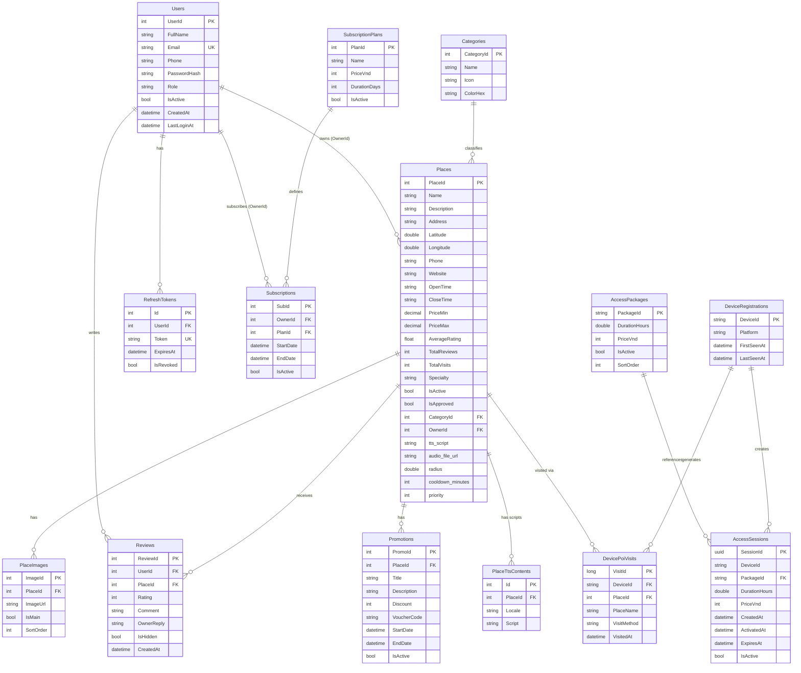
```mermaid
erDiagram
    Users {
        int UserId PK
        string FullName
        string Email UK
        string Phone
        string PasswordHash
        string Role
        bool IsActive
        datetime CreatedAt
        datetime LastLoginAt
    }

    Categories {
        int CategoryId PK
        string Name
        string Icon
        string ColorHex
    }

    Places {
        int PlaceId PK
        string Name
        string Description
        string Address
        double Latitude
        double Longitude
        string Phone
        string Website
        string OpenTime
        string CloseTime
        decimal PriceMin
        decimal PriceMax
        float AverageRating
        int TotalReviews
        int TotalVisits
        string Specialty
        bool IsActive
        bool IsApproved
        int CategoryId FK
        int OwnerId FK
        string tts_script
        string audio_file_url
        double radius
        int cooldown_minutes
        int priority
    }

    PlaceImages {
        int ImageId PK
        int PlaceId FK
        string ImageUrl
        bool IsMain
        int SortOrder
    }

    PlaceTtsContents {
        int Id PK
        int PlaceId FK
        string Locale
        string Script
    }

    Reviews {
        int ReviewId PK
        int UserId FK
        int PlaceId FK
        int Rating
        string Comment
        string OwnerReply
        bool IsHidden
        datetime CreatedAt
    }

    RefreshTokens {
        int Id PK
        int UserId FK
        string Token UK
        datetime ExpiresAt
        bool IsRevoked
    }

    Promotions {
        int PromoId PK
        int PlaceId FK
        string Title
        string Description
        int Discount
        string VoucherCode
        datetime StartDate
        datetime EndDate
        bool IsActive
    }

    SubscriptionPlans {
        int PlanId PK
        string Name
        int PriceVnd
        int DurationDays
        bool IsActive
    }

    Subscriptions {
        int SubId PK
        int OwnerId FK
        int PlanId FK
        datetime StartDate
        datetime EndDate
        bool IsActive
    }

    AccessPackages {
        string PackageId PK
        double DurationHours
        int PriceVnd
        bool IsActive
        int SortOrder
    }

    AccessSessions {
        uuid SessionId PK
        string DeviceId
        string PackageId FK
        double DurationHours
        int PriceVnd
        datetime CreatedAt
        datetime ActivatedAt
        datetime ExpiresAt
        bool IsActive
    }

    DeviceRegistrations {
        string DeviceId PK
        string Platform
        datetime FirstSeenAt
        datetime LastSeenAt
    }

    DevicePoiVisits {
        long VisitId PK
        string DeviceId FK
        int PlaceId FK
        string PlaceName
        string VisitMethod
        datetime VisitedAt
    }

    Users ||--o{ Places : "owns (OwnerId)"
    Users ||--o{ Reviews : "writes"
    Users ||--o{ RefreshTokens : "has"
    Users ||--o{ Subscriptions : "subscribes (OwnerId)"
    Categories ||--o{ Places : "classifies"
    Places ||--o{ PlaceImages : "has"
    Places ||--o{ Reviews : "receives"
    Places ||--o{ Promotions : "has"
    Places ||--o{ PlaceTtsContents : "has scripts"
    Places ||--o{ DevicePoiVisits : "visited via"
    SubscriptionPlans ||--o{ Subscriptions : "defines"
    AccessPackages ||--o{ AccessSessions : "references"
    DeviceRegistrations ||--o{ AccessSessions : "creates"
    DeviceRegistrations ||--o{ DevicePoiVisits : "generates"
```

---

### 13.2 Class Diagram — Mobile App (TourGuideAPP)


```mermaid
classDiagram
    class Place {
        +int PlaceId
        +string Name
        +string? Description
        +string? Address
        +double Latitude
        +double Longitude
        +string? Phone
        +string? Website
        +string? OpenTime
        +string? CloseTime
        +decimal? PriceMin
        +decimal? PriceMax
        +float? AverageRating
        +int? TotalReviews
        +bool IsActive
        +bool IsApproved
        +string? TtsScript
        +double? Radius
        +int? CooldownMinutes
        +int? Priority
        +DateTime? LastPlayedAt
        +string ImageUrl
        +Dictionary~string,string~ TtsContents
        +GetScriptForLocale(locale) string
        +OpenTimeDisplay string
        +RatingDisplay string
        +PriceDisplay string
    }

    class PlaceImage {
        +int ImageId
        +int PlaceId
        +string ImageUrl
        +bool IsMain
        +int SortOrder
    }

    class PlaceTtsContent {
        +int Id
        +int PlaceId
        +string Locale
        +string Script
    }

    class AccessSession {
        +string SessionId
        +string DeviceId
        +string PackageId
        +double DurationHours
        +int PriceVnd
        +DateTime? CreatedAt
        +DateTime? ActivatedAt
        +DateTime? ExpiresAt
        +bool IsActive
    }

    class AccessPackage {
        +string PackageId
        +double DurationHours
        +int PriceVnd
        +bool IsActive
        +int SortOrder
    }

    class DeviceRegistration {
        +string DeviceId
        +string? Platform
        +DateTime? FirstSeenAt
        +DateTime? LastSeenAt
    }

    class DevicePoiVisit {
        +long VisitId
        +string DeviceId
        +int PlaceId
        +string? PlaceName
        +string VisitMethod
        +DateTime? VisitedAt
    }

    class PlaceService {
        -Supabase.Client _supabase
        -List~Place~ _cachedPlaces
        +GetAllPlacesAsync() Task~List~Place~~
        +GetCachedPlaces() List~Place~
    }

    class GeofenceEngine {
        -const int DebounceMs = 2000
        -string? _pendingPlaceId
        -DateTime _pendingFirstSeenAt
        +FindNearestPOI(userLat, userLon, places) Place?
        +GetDistance(lat1, lon1, lat2, lon2) double
        -ToRad(deg) double
    }

    class NarrationService {
        -const string DefaultLocale = "vi-VN"
        -const int GpsMinGapSeconds = 60
        -CancellationTokenSource? _cts
        -bool _isSpeaking
        -DateTime _lastGpsTtsAt
        +string PreferredLocale
        +static IReadOnlyList SupportedLocales
        +bool IsSpeaking
        +SpeakAsync(text, placeLocale?) Task
        +SpeakFromGpsAsync(text) Task
        +Stop() void
    }

    class AccessSessionService {
        -const string DeviceIdKey
        -const string ExpiresAtKey
        -const string SessionIdKey
        -Supabase.Client _supabase
        -CancellationTokenSource? _pollCts
        -CancellationTokenSource? _expiryCts
        -CancellationTokenSource? _heartbeatCts
        -static List~AccessPackage~ _fallbackPackages
        +event Action? AccessExpired
        +GetDeviceId() string
        +IsAccessValid() bool
        +GetRemainingTime() TimeSpan?
        +RegisterDeviceAsync() Task
        +GetPackagesAsync() Task~List~AccessPackage~~
        +CreatePendingSessionAsync(packageId, durationHours, priceVnd) Task~string~
        +StartPollingForActivation(sessionId, onActivated) void
        +StopPolling() void
        +StartExpiryTimer() void
        +StartHeartbeatTimer() void
        +StopHeartbeat() void
        -UpdateLastSeenAsync() Task
        +ClearLocalSession() void
    }

    class LocationService {
        +Location? LastKnownLocation
        +event Action~Location~ LocationChanged
        +StartAsync() Task
        +StopAsync() Task
        +GetAddressAsync(location) Task~string~
    }

    class AuthService {
        -Supabase.Client _supabase
        +bool IsLoggedIn
        +string? CurrentUserId
        +string? CurrentUserEmail
        +LoginAsync(email, password) Task~bool~
        +RegisterAsync(email, password, fullName) Task~bool~
        +LogoutAsync() Task
    }

    class UserProfileService {
        -Supabase.Client _supabase
        -AuthService _authService
        -AccessSessionService _accessSessionService
        +GetTripHistoryAsync() Task~List~TripHistoryItem~~
        +GetNotesAsync() Task~List~PlaceNote~~
        +AddHistoryAsync(place, method) Task
        +AddHistoryByGpsAsync(place) Task
        +AddHistoryByQRAsync(place) Task
        +AddHistoryByBookingAsync(place) Task
        +AddNoteAsync(placeId, name, content) Task
        +RemoveNoteAsync(note) Task
        +ClearHistoryAsync() Task
        +ClearAllAsync() Task
        +GetCurrentUserIdAsync() Task~int?~
        -RecordDevicePoiVisitAsync(place, method) Task
    }

    class POIService {
        -PlaceService _placeService
        +GetAllPlacesAsync() Task~List~Place~~
        +GetCachedPlaces() List~Place~
    }

    class MapPage {
        -LocationService _locationService
        -PlaceService _placeService
        -GeofenceEngine _geofenceEngine
        -NarrationService _narrationService
        -AuthService _authService
        -UserProfileService _userProfileService
        -string? _lastSpokenPlaceId
        -Place? _lastSpokenPlace
        -bool _mapInfoHooked
        -bool _followUserLocation
        -bool _programmaticNav
        -bool _gpsStarted
        -Place? _selectedPlace
        +static PendingRoute
        +SetupMap() void
        +LoadPOIsAsync() Task
        +StartGPS() void
        +ShowPlaceCard(place) void
        +ShowRouteToDestinationAsync(dest) Task
        -OnMapInfo(sender, e) void
        -UpdateUserMarker(lat, lon) void
    }

    class PlaceDetailPage {
        -Place _place
        -AuthService _authService
        -LocationService _locationService
        -GeofenceEngine _geofenceEngine
        -NarrationService _narrationService
        -UserProfileService _userProfileService
        +LoadPlaceDetail() void
        +OnDirectionsClicked() void
        +OnNarrateClicked() void
        +OnCallClicked() void
    }

    class ToursPage {
        -List~Place~ _places
        +ObservableCollection~TourCard~ Tours
        +RebuildTours() void
    }

    class TourDetailPage {
        -TourCard _tour
        -LocationService _locationService
        -NarrationService _narrationService
        -UserProfileService _userProfileService
    }

    class SubscriptionPage {
        -AccessSessionService _accessService
        -List~AccessPackage~ _packages
        +LoadPackagesAsync() Task
        +OnPackageSelected(pkg) void
    }

    class PaymentQRPage {
        -AccessSessionService _accessService
        -AccessPackage _package
        -string? _sessionId
        +StartPolling() void
    }

    PlaceService --> Place : loads
    PlaceService --> PlaceImage : loads
    PlaceService --> PlaceTtsContent : loads
    POIService --> PlaceService : wraps
    GeofenceEngine ..> Place : analyzes
    NarrationService ..> Place : reads script
    AccessSessionService --> AccessSession : manages
    AccessSessionService --> AccessPackage : loads
    AccessSessionService --> DeviceRegistration : registers
    UserProfileService --> DevicePoiVisit : inserts
    UserProfileService --> AccessSessionService : gets deviceId
    MapPage --> PlaceService
    MapPage --> LocationService
    MapPage --> GeofenceEngine
    MapPage --> NarrationService
    MapPage --> UserProfileService
    MapPage --> AuthService
    PlaceDetailPage --> Place
    PlaceDetailPage --> NarrationService
    PlaceDetailPage --> LocationService
    PlaceDetailPage --> UserProfileService
    ToursPage ..> TourDetailPage : navigates
    TourDetailPage --> NarrationService
    SubscriptionPage --> AccessSessionService
    PaymentQRPage --> AccessSessionService
```

---

### 13.3 Class Diagram — Web (TourGuideAPI + TourismApp.Web)


```mermaid
classDiagram
    class AppDbContext {
        +DbSet~User~ Users
        +DbSet~Place~ Places
        +DbSet~PlaceImage~ PlaceImages
        +DbSet~Category~ Categories
        +DbSet~Review~ Reviews
        +DbSet~RefreshToken~ RefreshTokens
        +DbSet~Promotion~ Promotions
        +DbSet~SubscriptionPlan~ SubscriptionPlans
        +DbSet~Subscription~ Subscriptions
        +DbSet~DevicePoiVisit~ DevicePoiVisits
        +DbSet~AccessPackage~ AccessPackages
        +DbSet~DeviceRegistration~ DeviceRegistrations
        +DbSet~AccessSession~ AccessSessions
        +DbSet~UserTracking~ UserTracking
        +DbSet~VisitHistory~ VisitHistory
    }

    class AuthController {
        +Register(RegisterDto) Task~ActionResult~
        +Login(LoginDto) Task~ActionResult~
        +Refresh(token) Task~ActionResult~
        +Revoke() Task~ActionResult~
        +Me() Task~ActionResult~
    }

    class PlacesController {
        +GetAll(filters) Task~ActionResult~
        +GetById(id) Task~ActionResult~
        +GetNearby(dto) Task~ActionResult~
        +GetMine(search, page) Task~ActionResult~
        +Create(dto) Task~ActionResult~
        +Update(id, dto) Task~ActionResult~
        +UpdateStatus(id, status) Task~ActionResult~
        +AddImage(id, dto) Task~ActionResult~
        +DeleteImage(id, imageId) Task~ActionResult~
        +Delete(id) Task~ActionResult~
    }

    class ReviewsController {
        +GetByPlace(placeId, page) Task~ActionResult~
        +Create(dto) Task~ActionResult~
        +Reply(id, reply) Task~ActionResult~
    }

    class AdminController {
        +GetUsers(search, role) Task~ActionResult~
        +ToggleLock(id) Task~ActionResult~
        +ChangeRole(id, role) Task~ActionResult~
        +GetPlaces(pendingOnly) Task~ActionResult~
        +ApprovePlace(id) Task~ActionResult~
        +SuspendPlace(id) Task~ActionResult~
        +GetReviews(hiddenOnly) Task~ActionResult~
        +HideReview(id) Task~ActionResult~
        +GetStats() Task~ActionResult~
    }

    class AccessSessionsController {
        +GetSessions(status, page, pageSize, search) Task~ActionResult~
        +Activate(sessionId Guid) Task~ActionResult~
        +Deactivate(sessionId Guid) Task~ActionResult~
        +Delete(sessionId Guid) Task~ActionResult~
        +GetStats() Task~ActionResult~
    }

    class AccessPackagesController {
        +GetAll() Task~ActionResult~
        +Update(id, UpdatePackageDto) Task~ActionResult~
    }

    class DeviceAnalyticsController {
        +GetDeviceStats(page, pageSize, search) Task~ActionResult~
        +GetDeviceVisitHistory(deviceId, limit) Task~ActionResult~
    }

    class AdminSessionsController_MVC {
        -ApiService _api
        +Index(status, page, search) Task~IActionResult~
        +Activate(sessionId Guid, returnStatus) Task~IActionResult~
        +Cancel(sessionId Guid) Task~IActionResult~
        +Deactivate(sessionId Guid, returnStatus) Task~IActionResult~
    }

    class AdminPackagesController_MVC {
        -ApiService _api
        +Index() Task~IActionResult~
        +Update(packageId, dto) Task~IActionResult~
    }

    class AdminDevicesController_MVC {
        -ApiService _api
        +Index(page, search) Task~IActionResult~
        +Detail(deviceId) Task~IActionResult~
    }

    class ApiService {
        +GetSessionsAsync(status, page, search) Task
        +GetSessionStatsAsync() Task
        +ActivateSessionAsync(sessionId Guid) Task
        +DeactivateSessionAsync(sessionId Guid) Task
        +DeleteSessionAsync(sessionId Guid) Task
        +GetAccessPackagesAsync() Task
        +UpdateAccessPackageAsync(id, dto) Task
        +GetDeviceStatsAsync(page, search) Task
        +GetDeviceVisitsAsync(deviceId) Task
    }

    AccessSessionsController --> AppDbContext
    AccessPackagesController --> AppDbContext
    DeviceAnalyticsController --> AppDbContext
    PlacesController --> AppDbContext
    ReviewsController --> AppDbContext
    AdminController --> AppDbContext
    AuthController --> AppDbContext
    AdminSessionsController_MVC --> ApiService
    AdminPackagesController_MVC --> ApiService
    AdminDevicesController_MVC --> ApiService
    ApiService ..> AccessSessionsController : HTTP calls
    ApiService ..> AccessPackagesController : HTTP calls
    ApiService ..> DeviceAnalyticsController : HTTP calls
```

---

### 13.4 Sequence Diagrams — Mobile App

#### 13.4.1 Onboarding & Truy cập (UC1, UC2, UC11, UC12, UC13)

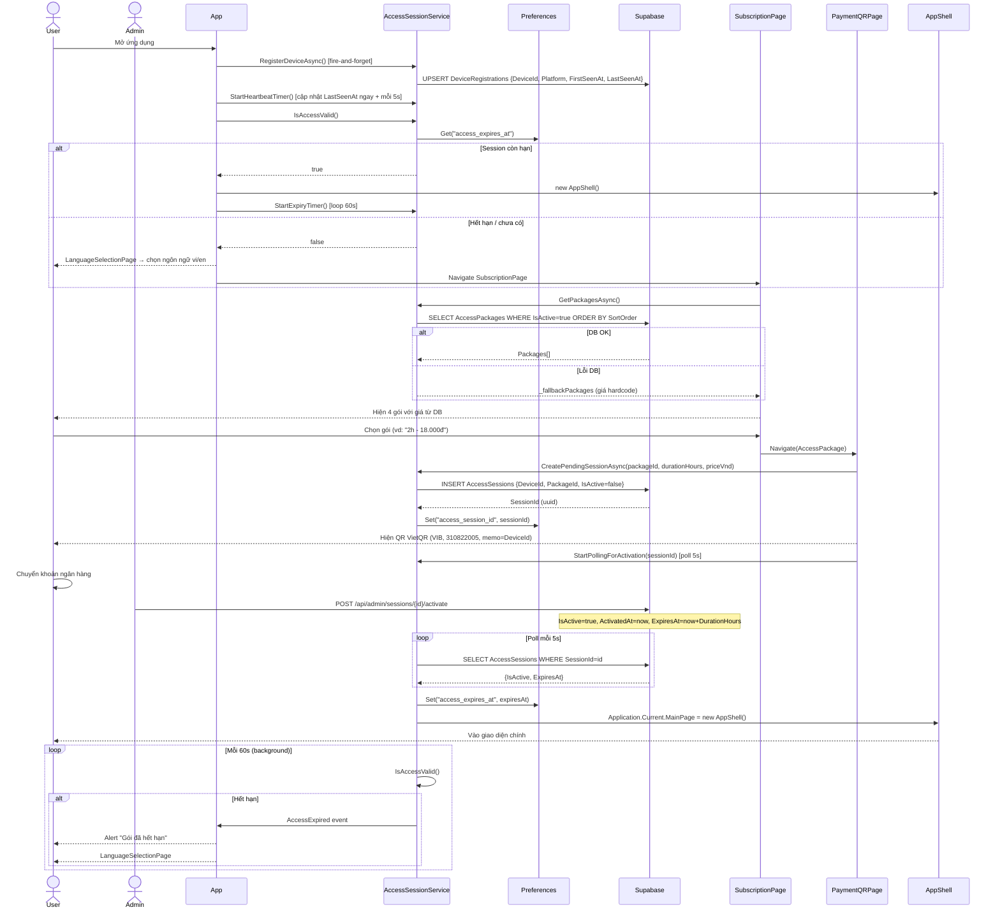
```mermaid
sequenceDiagram
    actor User
    actor Admin
    participant App
    participant ASS as AccessSessionService
    participant Prefs as Preferences
    participant Supabase
    participant SubPage as SubscriptionPage
    participant QRPage as PaymentQRPage
    participant Shell as AppShell

    User->>App: Mở ứng dụng
    App->>ASS: RegisterDeviceAsync() [fire-and-forget]
    ASS->>Supabase: UPSERT DeviceRegistrations {DeviceId, Platform, FirstSeenAt, LastSeenAt}
    App->>ASS: StartHeartbeatTimer() [cập nhật LastSeenAt ngay + mỗi 5s]

    App->>ASS: IsAccessValid()
    ASS->>Prefs: Get("access_expires_at")
    alt Session còn hạn
        ASS-->>App: true
        App->>Shell: new AppShell()
        App->>ASS: StartExpiryTimer() [loop 60s]
    else Hết hạn / chưa có
        ASS-->>App: false
        App-->>User: LanguageSelectionPage → chọn ngôn ngữ vi/en
        App->>SubPage: Navigate SubscriptionPage
    end

    SubPage->>ASS: GetPackagesAsync()
    ASS->>Supabase: SELECT AccessPackages WHERE IsActive=true ORDER BY SortOrder
    alt DB OK
        Supabase-->>ASS: Packages[]
    else Lỗi DB
        ASS-->>SubPage: _fallbackPackages (giá hardcode)
    end
    SubPage-->>User: Hiện 4 gói với giá từ DB

    User->>SubPage: Chọn gói (vd: "2h - 18.000đ")
    SubPage->>QRPage: Navigate(AccessPackage)
    QRPage->>ASS: CreatePendingSessionAsync(packageId, durationHours, priceVnd)
    ASS->>Supabase: INSERT AccessSessions {DeviceId, PackageId, IsActive=false}
    Supabase-->>ASS: SessionId (uuid)
    ASS->>Prefs: Set("access_session_id", sessionId)
    QRPage-->>User: Hiện QR VietQR (VIB, 310822005, memo=DeviceId)
    QRPage->>ASS: StartPollingForActivation(sessionId) [poll 5s]

    User->>User: Chuyển khoản ngân hàng
    Admin->>Supabase: POST /api/admin/sessions/{id}/activate
    Note over Supabase: IsActive=true, ActivatedAt=now, ExpiresAt=now+DurationHours

    loop Poll mỗi 5s
        ASS->>Supabase: SELECT AccessSessions WHERE SessionId=id
        Supabase-->>ASS: {IsActive, ExpiresAt}
    end
    ASS->>Prefs: Set("access_expires_at", expiresAt)
    ASS->>Shell: Application.Current.MainPage = new AppShell()
    Shell-->>User: Vào giao diện chính

    loop Mỗi 60s (background)
        ASS->>ASS: IsAccessValid()
        alt Hết hạn
            ASS->>App: AccessExpired event
            App-->>User: Alert "Gói đã hết hạn"
            App-->>User: LanguageSelectionPage
        end
    end
```

---

#### 13.4.2 Bản đồ & POI & Chỉ đường (UC3, UC4)

```mermaid
sequenceDiagram
    actor User
    participant MapPage
    participant PlaceService
    participant LS as LocationService
    participant Mapsui
    participant OSRM

    MapPage->>PlaceService: GetCachedPlaces()
    PlaceService-->>MapPage: places[]
    MapPage->>Mapsui: Vẽ POIsGlow + POIs layers (SkiaSharp marker đỏ)
    MapPage-->>User: Bản đồ CartoDB Voyager với marker POI

    User->>Mapsui: Tap marker POI
    Mapsui->>MapPage: OnMapInfo(feature["id"])
    MapPage->>PlaceService: GetCachedPlaces().FirstOrDefault(p.PlaceId == id)
    PlaceService-->>MapPage: Place
    MapPage-->>User: Bottom card: tên, status mở/đóng, rating, địa chỉ, tags, giờ

    User->>MapPage: Tap "Chỉ đường"
    MapPage->>LS: LastKnownLocation
    LS-->>MapPage: (userLat, userLon)
    MapPage->>OSRM: GET /route/v1/driving/{origin};{dest}?overview=full&geometries=geojson
    OSRM-->>MapPage: GeoJSON polyline
    MapPage->>Mapsui: Vẽ "Route" layer (#E94560) + "Destination" marker
    MapPage->>Mapsui: Zoom to route bounds
    MapPage->>MapPage: CancelRoutePanel.IsVisible = true
    MapPage-->>User: Đường đi hiển thị + nút Hủy

    User->>MapPage: Tap "Hủy route"
    MapPage->>Mapsui: Xóa layer "Route" + "Destination"
    MapPage->>MapPage: CancelRoutePanel.IsVisible = false
    MapPage-->>User: Bản đồ bình thường

    Note over MapPage,OSRM: Chỉ đường từ PlaceDetailPage hoặc TourDetailPage
    MapPage->>MapPage: OnAppearing → đọc PendingRoute (static)
    MapPage->>OSRM: GET /route/v1/driving/...
    OSRM-->>MapPage: Polyline
    MapPage-->>User: Route + CancelRoutePanel
```

---

#### 13.4.3 TTS tự động — Geofence (UC5, UC14, UC15)

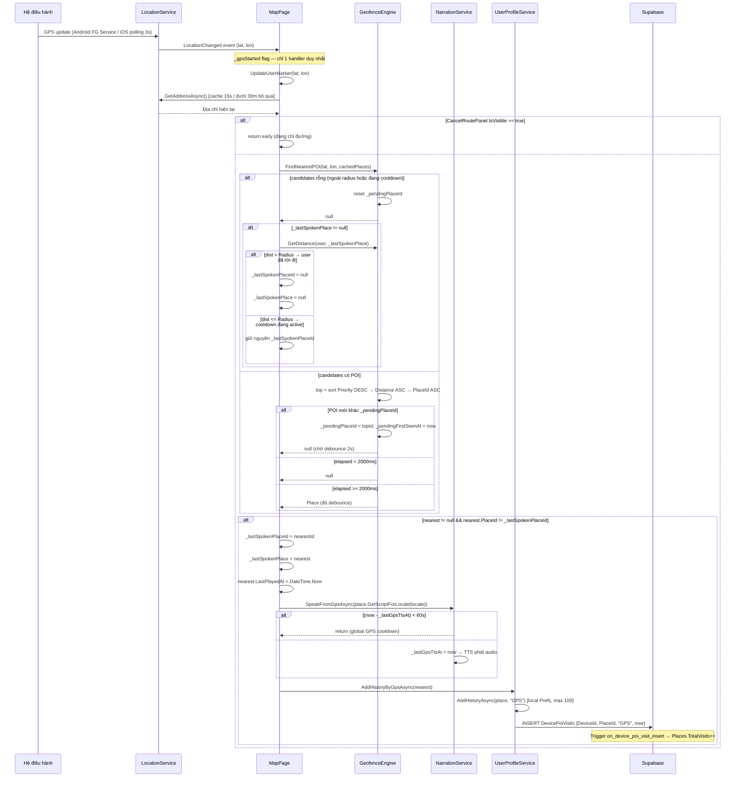
```mermaid
sequenceDiagram
    participant OS as Hệ điều hành
    participant LS as LocationService
    participant MapPage
    participant GE as GeofenceEngine
    participant NS as NarrationService
    participant UPS as UserProfileService
    participant Supabase

    OS->>LS: GPS update (Android FG Service / iOS polling 3s)
    LS->>MapPage: LocationChanged event (lat, lon)
    Note over MapPage: _gpsStarted flag — chỉ 1 handler duy nhất

    MapPage->>MapPage: UpdateUserMarker(lat, lon)
    MapPage->>LS: GetAddressAsync() [cache 15s / dưới 30m bỏ qua]
    LS-->>MapPage: Địa chỉ hiện tại

    alt CancelRoutePanel.IsVisible == true
        MapPage->>MapPage: return early (đang chỉ đường)
    else
        MapPage->>GE: FindNearestPOI(lat, lon, cachedPlaces)

        alt candidates rỗng (ngoài radius hoặc đang cooldown)
            GE->>GE: reset _pendingPlaceId
            GE-->>MapPage: null
            alt _lastSpokenPlace != null
                MapPage->>GE: GetDistance(user, _lastSpokenPlace)
                alt dist > Radius → user đã rời đi
                    MapPage->>MapPage: _lastSpokenPlaceId = null
                    MapPage->>MapPage: _lastSpokenPlace = null
                else dist <= Radius → cooldown đang active
                    MapPage->>MapPage: giữ nguyên _lastSpokenPlaceId
                end
            end
        else candidates có POI
            GE->>GE: top = sort Priority DESC → Distance ASC → PlaceId ASC
            alt POI mới khác _pendingPlaceId
                GE->>GE: _pendingPlaceId = topId, _pendingFirstSeenAt = now
                GE-->>MapPage: null (chờ debounce 2s)
            else elapsed < 2000ms
                GE-->>MapPage: null
            else elapsed >= 2000ms
                GE-->>MapPage: Place (đủ debounce)
            end
        end

        alt nearest != null && nearest.PlaceId != _lastSpokenPlaceId
            MapPage->>MapPage: _lastSpokenPlaceId = nearestId
            MapPage->>MapPage: _lastSpokenPlace = nearest
            MapPage->>MapPage: nearest.LastPlayedAt = DateTime.Now
            MapPage->>NS: SpeakFromGpsAsync(place.GetScriptForLocale(locale))
            alt (now - _lastGpsTtsAt) < 60s
                NS-->>MapPage: return (global GPS cooldown)
            else
                NS->>NS: _lastGpsTtsAt = now → TTS phát audio
            end
            MapPage->>UPS: AddHistoryByGpsAsync(nearest)
            UPS->>UPS: AddHistoryAsync(place, "GPS") [local Prefs, max 100]
            UPS->>Supabase: INSERT DevicePoiVisits {DeviceId, PlaceId, "GPS", now}
            Note over Supabase: Trigger on_device_poi_visit_insert → Places.TotalVisits++
        end
    end
```

---

#### 13.4.4 Khám phá địa điểm (UC6, UC7)

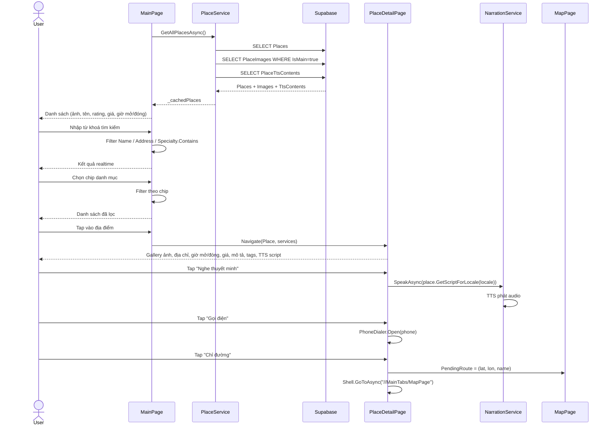
```mermaid
sequenceDiagram
    actor User
    participant MainPage
    participant PlaceService
    participant Supabase
    participant PDP as PlaceDetailPage
    participant NS as NarrationService
    participant MapPage

    MainPage->>PlaceService: GetAllPlacesAsync()
    PlaceService->>Supabase: SELECT Places
    PlaceService->>Supabase: SELECT PlaceImages WHERE IsMain=true
    PlaceService->>Supabase: SELECT PlaceTtsContents
    Supabase-->>PlaceService: Places + Images + TtsContents
    PlaceService-->>MainPage: _cachedPlaces
    MainPage-->>User: Danh sách (ảnh, tên, rating, giá, giờ mở/đóng)

    User->>MainPage: Nhập từ khoá tìm kiếm
    MainPage->>MainPage: Filter Name / Address / Specialty.Contains
    MainPage-->>User: Kết quả realtime

    User->>MainPage: Chọn chip danh mục
    MainPage->>MainPage: Filter theo chip
    MainPage-->>User: Danh sách đã lọc

    User->>MainPage: Tap vào địa điểm
    MainPage->>PDP: Navigate(Place, services)
    PDP-->>User: Gallery ảnh, địa chỉ, giờ mở/đóng, giá, mô tả, tags, TTS script

    User->>PDP: Tap "Nghe thuyết minh"
    PDP->>NS: SpeakAsync(place.GetScriptForLocale(locale))
    NS->>NS: TTS phát audio

    User->>PDP: Tap "Gọi điện"
    PDP->>PDP: PhoneDialer.Open(phone)

    User->>PDP: Tap "Chỉ đường"
    PDP->>MapPage: PendingRoute = (lat, lon, name)
    PDP->>PDP: Shell.GoToAsync("//MainTabs/MapPage")
```

---

#### 13.4.5 Tour có sẵn (UC8)

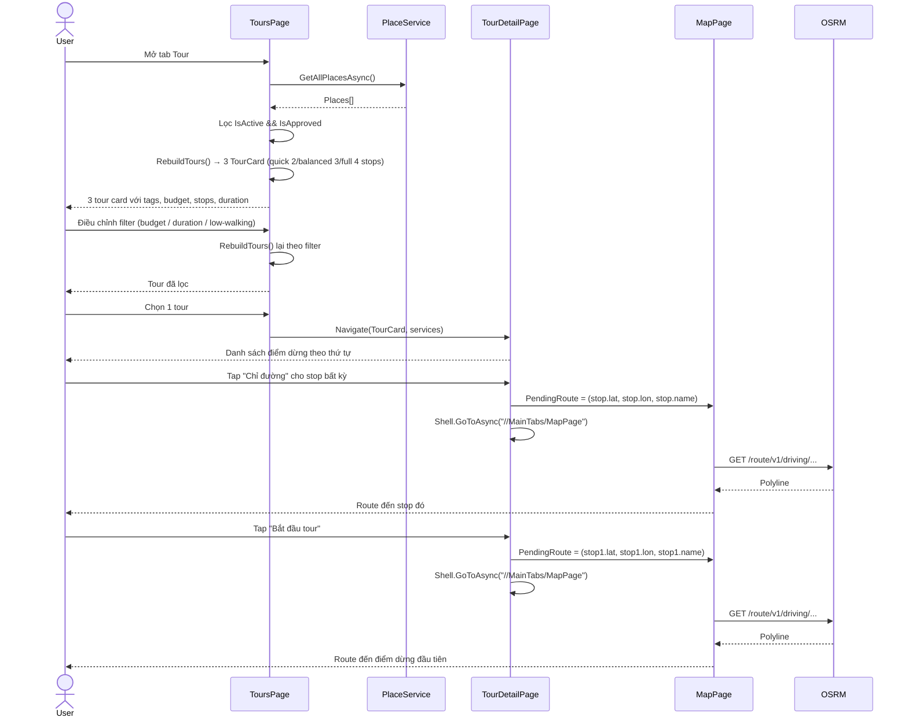
```mermaid
sequenceDiagram
    actor User
    participant ToursPage
    participant PlaceService
    participant TDP as TourDetailPage
    participant MapPage
    participant OSRM

    User->>ToursPage: Mở tab Tour
    ToursPage->>PlaceService: GetAllPlacesAsync()
    PlaceService-->>ToursPage: Places[]
    ToursPage->>ToursPage: Lọc IsActive && IsApproved
    ToursPage->>ToursPage: RebuildTours() → 3 TourCard (quick 2/balanced 3/full 4 stops)
    ToursPage-->>User: 3 tour card với tags, budget, stops, duration

    User->>ToursPage: Điều chỉnh filter (budget / duration / low-walking)
    ToursPage->>ToursPage: RebuildTours() lại theo filter
    ToursPage-->>User: Tour đã lọc

    User->>ToursPage: Chọn 1 tour
    ToursPage->>TDP: Navigate(TourCard, services)
    TDP-->>User: Danh sách điểm dừng theo thứ tự

    User->>TDP: Tap "Chỉ đường" cho stop bất kỳ
    TDP->>MapPage: PendingRoute = (stop.lat, stop.lon, stop.name)
    TDP->>TDP: Shell.GoToAsync("//MainTabs/MapPage")
    MapPage->>OSRM: GET /route/v1/driving/...
    OSRM-->>MapPage: Polyline
    MapPage-->>User: Route đến stop đó

    User->>TDP: Tap "Bắt đầu tour"
    TDP->>MapPage: PendingRoute = (stop1.lat, stop1.lon, stop1.name)
    TDP->>TDP: Shell.GoToAsync("//MainTabs/MapPage")
    MapPage->>OSRM: GET /route/v1/driving/...
    OSRM-->>MapPage: Polyline
    MapPage-->>User: Route đến điểm dừng đầu tiên
```

---

#### 13.4.6 Tài khoản Mobile (UC9, UC10)

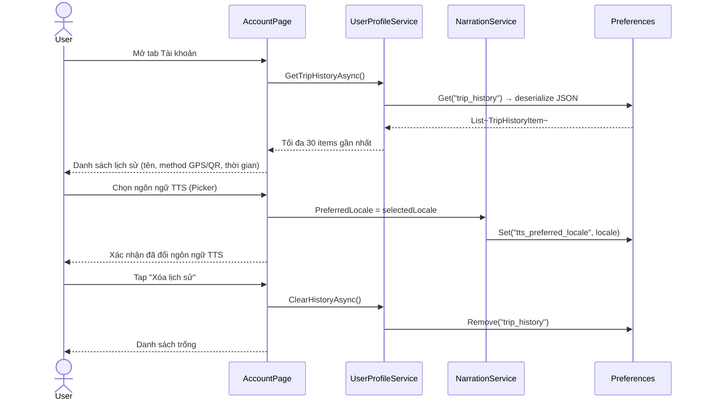
```mermaid
sequenceDiagram
    actor User
    participant AccountPage
    participant UPS as UserProfileService
    participant NS as NarrationService
    participant Prefs as Preferences

    User->>AccountPage: Mở tab Tài khoản
    AccountPage->>UPS: GetTripHistoryAsync()
    UPS->>Prefs: Get("trip_history") → deserialize JSON
    Prefs-->>UPS: List~TripHistoryItem~
    UPS-->>AccountPage: Tối đa 30 items gần nhất
    AccountPage-->>User: Danh sách lịch sử (tên, method GPS/QR, thời gian)

    User->>AccountPage: Chọn ngôn ngữ TTS (Picker)
    AccountPage->>NS: PreferredLocale = selectedLocale
    NS->>Prefs: Set("tts_preferred_locale", locale)
    AccountPage-->>User: Xác nhận đã đổi ngôn ngữ TTS

    User->>AccountPage: Tap "Xóa lịch sử"
    AccountPage->>UPS: ClearHistoryAsync()
    UPS->>Prefs: Remove("trip_history")
    AccountPage-->>User: Danh sách trống
```

---

### 13.5 Sequence Diagrams — Web

#### 13.5.1 Xác thực Web — Đăng ký & Đăng nhập (UC16)

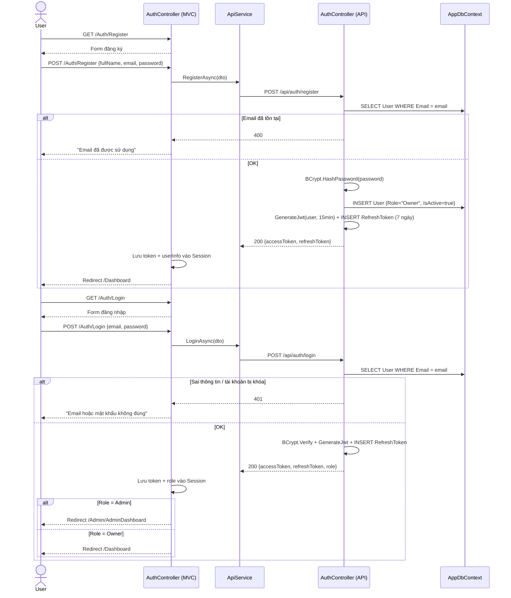
```mermaid
sequenceDiagram
    actor User
    participant AuthMVC as AuthController (MVC)
    participant API as ApiService
    participant AuthAPI as AuthController (API)
    participant DB as AppDbContext

    User->>AuthMVC: GET /Auth/Register
    AuthMVC-->>User: Form đăng ký
    User->>AuthMVC: POST /Auth/Register {fullName, email, password}
    AuthMVC->>API: RegisterAsync(dto)
    API->>AuthAPI: POST /api/auth/register
    AuthAPI->>DB: SELECT User WHERE Email = email
    alt Email đã tồn tại
        AuthAPI-->>AuthMVC: 400
        AuthMVC-->>User: "Email đã được sử dụng"
    else OK
        AuthAPI->>AuthAPI: BCrypt.HashPassword(password)
        AuthAPI->>DB: INSERT User {Role="Owner", IsActive=true}
        AuthAPI->>AuthAPI: GenerateJwt(user, 15min) + INSERT RefreshToken (7 ngày)
        AuthAPI-->>API: 200 {accessToken, refreshToken}
        AuthMVC->>AuthMVC: Lưu token + userInfo vào Session
        AuthMVC-->>User: Redirect /Dashboard
    end

    User->>AuthMVC: GET /Auth/Login
    AuthMVC-->>User: Form đăng nhập
    User->>AuthMVC: POST /Auth/Login {email, password}
    AuthMVC->>API: LoginAsync(dto)
    API->>AuthAPI: POST /api/auth/login
    AuthAPI->>DB: SELECT User WHERE Email = email
    alt Sai thông tin / tài khoản bị khóa
        AuthAPI-->>AuthMVC: 401
        AuthMVC-->>User: "Email hoặc mật khẩu không đúng"
    else OK
        AuthAPI->>AuthAPI: BCrypt.Verify + GenerateJwt + INSERT RefreshToken
        AuthAPI-->>API: 200 {accessToken, refreshToken, role}
        AuthMVC->>AuthMVC: Lưu token + role vào Session
        alt Role = Admin
            AuthMVC-->>User: Redirect /Admin/AdminDashboard
        else Role = Owner
            AuthMVC-->>User: Redirect /Dashboard
        end
    end
```

---

#### 13.5.2 Admin Dashboard Sequences — Chi tiết


##### 13.5.2.1 Xem danh sách chờ kích hoạt (Pending Payments)

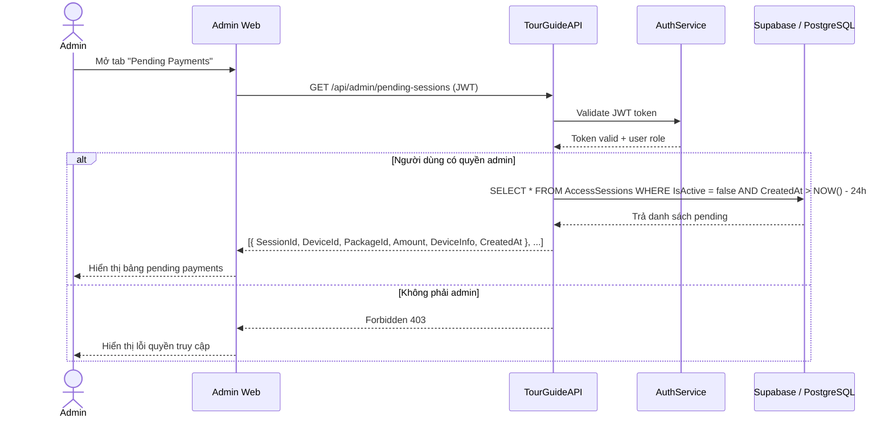
```mermaid
sequenceDiagram
    actor Admin
    participant AdminUI as Admin Web
    participant API as TourGuideAPI
    participant AuthService
    participant DB as Supabase / PostgreSQL

    Admin->>AdminUI: Mở tab "Pending Payments"
    AdminUI->>API: GET /api/admin/pending-sessions (JWT)
    API->>AuthService: Validate JWT token
    AuthService-->>API: Token valid + user role
    
    alt Người dùng có quyền admin
        API->>DB: SELECT * FROM AccessSessions WHERE IsActive = false AND CreatedAt > NOW() - 24h
        DB-->>API: Trả danh sách pending
        API-->>AdminUI: [{ SessionId, DeviceId, PackageId, Amount, DeviceInfo, CreatedAt }, ...]
        AdminUI-->>Admin: Hiển thị bảng pending payments
    else Không phải admin
        API-->>AdminUI: Forbidden 403
        AdminUI-->>Admin: Hiển thị lỗi quyền truy cập
    end
```

---

##### 13.5.2.2 Kích hoạt một session (Approve Payment)

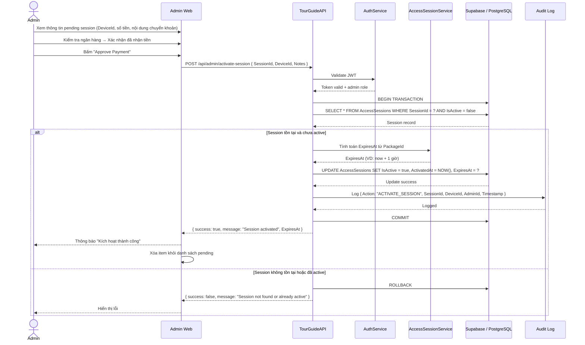
```mermaid
sequenceDiagram
    actor Admin
    participant AdminUI as Admin Web
    participant API as TourGuideAPI
    participant AuthService
    participant AccessSessionService
    participant DB as Supabase / PostgreSQL
    participant AuditLog as Audit Log

    Admin->>AdminUI: Xem thông tin pending session (DeviceId, số tiền, nội dung chuyển khoản)
    Admin->>AdminUI: Kiểm tra ngân hàng → Xác nhận đã nhận tiền
    Admin->>AdminUI: Bấm "Approve Payment"
    
    AdminUI->>API: POST /api/admin/activate-session { SessionId, DeviceId, Notes }
    API->>AuthService: Validate JWT
    AuthService-->>API: Token valid + admin role
    
    API->>DB: BEGIN TRANSACTION
    
    API->>DB: SELECT * FROM AccessSessions WHERE SessionId = ? AND IsActive = false
    DB-->>API: Session record
    
    alt Session tồn tại và chưa active
        API->>AccessSessionService: Tính toán ExpiresAt từ PackageId
        AccessSessionService-->>API: ExpiresAt (VD: now + 1 giờ)
        
        API->>DB: UPDATE AccessSessions SET IsActive = true, ActivatedAt = NOW(), ExpiresAt = ?
        DB-->>API: Update success
        
        API->>AuditLog: Log { Action: "ACTIVATE_SESSION", SessionId, DeviceId, AdminId, Timestamp }
        AuditLog-->>API: Logged
        
        API->>DB: COMMIT
        API-->>AdminUI: { success: true, message: "Session activated", ExpiresAt }
        AdminUI-->>Admin: Thông báo "Kích hoạt thành công"
        AdminUI->>AdminUI: Xóa item khỏi danh sách pending
        
    else Session không tồn tại hoặc đã active
        API->>DB: ROLLBACK
        API-->>AdminUI: { success: false, message: "Session not found or already active" }
        AdminUI-->>Admin: Hiển thị lỗi
    end
```

---

##### 13.5.2.3 Xem chi tiết device (Device Info)

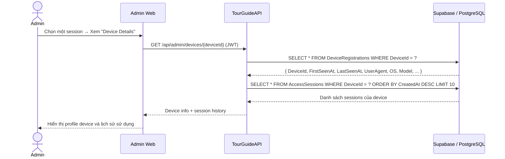
```mermaid
sequenceDiagram
    actor Admin
    participant AdminUI as Admin Web
    participant API as TourGuideAPI
    participant DB as Supabase / PostgreSQL

    Admin->>AdminUI: Chọn một session → Xem "Device Details"
    
    AdminUI->>API: GET /api/admin/devices/{deviceId} (JWT)
    API->>DB: SELECT * FROM DeviceRegistrations WHERE DeviceId = ?
    DB-->>API: { DeviceId, FirstSeenAt, LastSeenAt, UserAgent, OS, Model, ... }
    
    API->>DB: SELECT * FROM AccessSessions WHERE DeviceId = ? ORDER BY CreatedAt DESC LIMIT 10
    DB-->>API: Danh sách sessions của device
    
    API-->>AdminUI: Device info + session history
    AdminUI-->>Admin: Hiển thị profile device và lịch sử sử dụng
```

---

##### 13.5.2.4 Export báo cáo

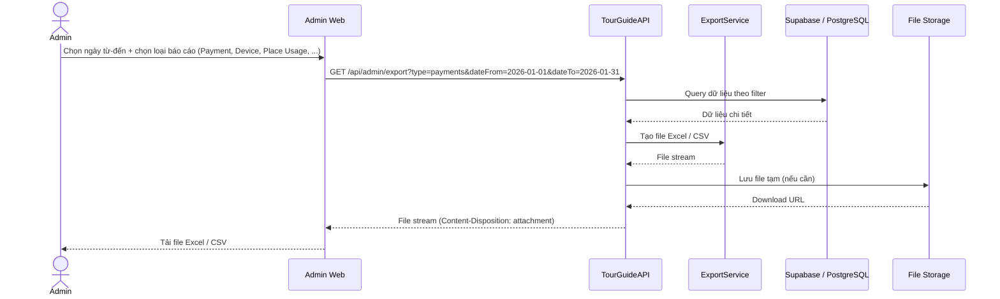
```mermaid
sequenceDiagram
    actor Admin
    participant AdminUI as Admin Web
    participant API as TourGuideAPI
    participant ExportService
    participant DB as Supabase / PostgreSQL
    participant FileService as File Storage

    Admin->>AdminUI: Chọn ngày từ-đến + chọn loại báo cáo (Payment, Device, Place Usage, ...)
    AdminUI->>API: GET /api/admin/export?type=payments&dateFrom=2026-01-01&dateTo=2026-01-31
    API->>DB: Query dữ liệu theo filter
    DB-->>API: Dữ liệu chi tiết
    API->>ExportService: Tạo file Excel / CSV
    ExportService-->>API: File stream
    API->>FileService: Lưu file tạm (nếu cần)
    FileService-->>API: Download URL
    API-->>AdminUI: File stream (Content-Disposition: attachment)
    AdminUI-->>Admin: Tải file Excel / CSV
```

---

##### 13.5.2.5 Audit Log — Xem lịch sử hành động

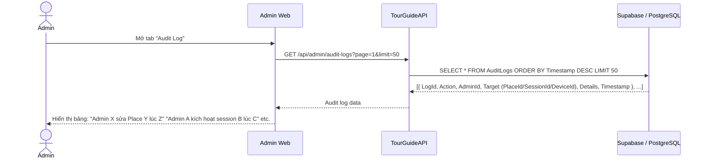
```mermaid
sequenceDiagram
    actor Admin
    participant AdminUI as Admin Web
    participant API as TourGuideAPI
    participant DB as Supabase / PostgreSQL

    Admin->>AdminUI: Mở tab "Audit Log"
    AdminUI->>API: GET /api/admin/audit-logs?page=1&limit=50
    API->>DB: SELECT * FROM AuditLogs ORDER BY Timestamp DESC LIMIT 50
    DB-->>API: [{ LogId, Action, AdminId, Target (PlaceId/SessionId/DeviceId), Details, Timestamp }, ...]
    API-->>AdminUI: Audit log data
    AdminUI-->>Admin: Hiển thị bảng: "Admin X sửa Place Y lúc Z" "Admin A kích hoạt session B lúc C" etc.
```

---

---

#### 13.5.3 Quản lý địa điểm — Owner (UC17, UC18, UC19, UC20)

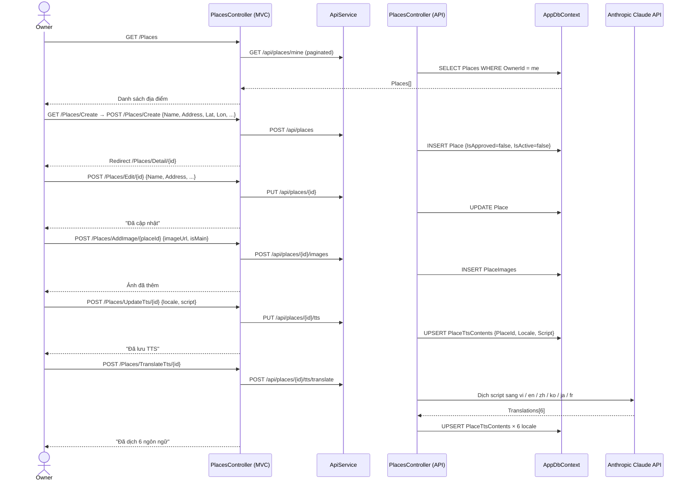
```mermaid
sequenceDiagram
    actor Owner
    participant PlacesMVC as PlacesController (MVC)
    participant API as ApiService
    participant PlacesAPI as PlacesController (API)
    participant DB as AppDbContext
    participant Claude as Anthropic Claude API

    Owner->>PlacesMVC: GET /Places
    PlacesMVC->>API: GET /api/places/mine (paginated)
    PlacesAPI->>DB: SELECT Places WHERE OwnerId = me
    DB-->>PlacesMVC: Places[]
    PlacesMVC-->>Owner: Danh sách địa điểm

    Owner->>PlacesMVC: GET /Places/Create → POST /Places/Create {Name, Address, Lat, Lon, ...}
    PlacesMVC->>API: POST /api/places
    PlacesAPI->>DB: INSERT Place {IsApproved=false, IsActive=false}
    PlacesMVC-->>Owner: Redirect /Places/Detail/{id}

    Owner->>PlacesMVC: POST /Places/Edit/{id} {Name, Address, ...}
    PlacesMVC->>API: PUT /api/places/{id}
    PlacesAPI->>DB: UPDATE Place
    PlacesMVC-->>Owner: "Đã cập nhật"

    Owner->>PlacesMVC: POST /Places/AddImage/{placeId} {imageUrl, isMain}
    PlacesMVC->>API: POST /api/places/{id}/images
    PlacesAPI->>DB: INSERT PlaceImages
    PlacesMVC-->>Owner: Ảnh đã thêm

    Owner->>PlacesMVC: POST /Places/UpdateTts/{id} {locale, script}
    PlacesMVC->>API: PUT /api/places/{id}/tts
    PlacesAPI->>DB: UPSERT PlaceTtsContents {PlaceId, Locale, Script}
    PlacesMVC-->>Owner: "Đã lưu TTS"

    Owner->>PlacesMVC: POST /Places/TranslateTts/{id}
    PlacesMVC->>API: POST /api/places/{id}/tts/translate
    PlacesAPI->>Claude: Dịch script sang vi / en / zh / ko / ja / fr
    Claude-->>PlacesAPI: Translations[6]
    PlacesAPI->>DB: UPSERT PlaceTtsContents × 6 locale
    PlacesMVC-->>Owner: "Đã dịch 6 ngôn ngữ"
```

---

#### 13.5.4 Tài khoản & Subscription — Owner (UC21, UC22)

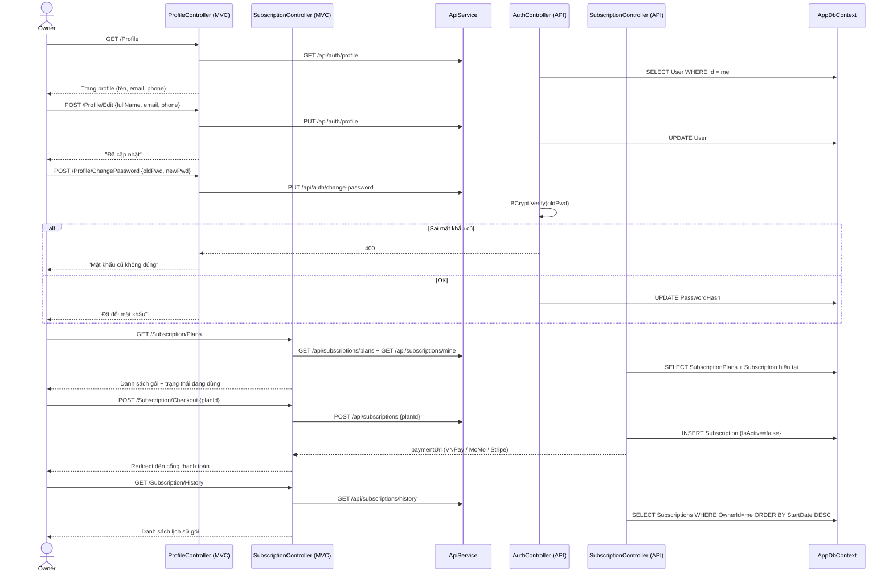
```mermaid
sequenceDiagram
    actor Owner
    participant ProfileMVC as ProfileController (MVC)
    participant SubMVC as SubscriptionController (MVC)
    participant API as ApiService
    participant AuthAPI as AuthController (API)
    participant SubAPI as SubscriptionController (API)
    participant DB as AppDbContext

    Owner->>ProfileMVC: GET /Profile
    ProfileMVC->>API: GET /api/auth/profile
    AuthAPI->>DB: SELECT User WHERE Id = me
    ProfileMVC-->>Owner: Trang profile (tên, email, phone)

    Owner->>ProfileMVC: POST /Profile/Edit {fullName, email, phone}
    ProfileMVC->>API: PUT /api/auth/profile
    AuthAPI->>DB: UPDATE User
    ProfileMVC-->>Owner: "Đã cập nhật"

    Owner->>ProfileMVC: POST /Profile/ChangePassword {oldPwd, newPwd}
    ProfileMVC->>API: PUT /api/auth/change-password
    AuthAPI->>AuthAPI: BCrypt.Verify(oldPwd)
    alt Sai mật khẩu cũ
        AuthAPI-->>ProfileMVC: 400
        ProfileMVC-->>Owner: "Mật khẩu cũ không đúng"
    else OK
        AuthAPI->>DB: UPDATE PasswordHash
        ProfileMVC-->>Owner: "Đã đổi mật khẩu"
    end

    Owner->>SubMVC: GET /Subscription/Plans
    SubMVC->>API: GET /api/subscriptions/plans + GET /api/subscriptions/mine
    SubAPI->>DB: SELECT SubscriptionPlans + Subscription hiện tại
    SubMVC-->>Owner: Danh sách gói + trạng thái đang dùng

    Owner->>SubMVC: POST /Subscription/Checkout {planId}
    SubMVC->>API: POST /api/subscriptions {planId}
    SubAPI->>DB: INSERT Subscription {IsActive=false}
    SubAPI-->>SubMVC: paymentUrl (VNPay / MoMo / Stripe)
    SubMVC-->>Owner: Redirect đến cổng thanh toán

    Owner->>SubMVC: GET /Subscription/History
    SubMVC->>API: GET /api/subscriptions/history
    SubAPI->>DB: SELECT Subscriptions WHERE OwnerId=me ORDER BY StartDate DESC
    SubMVC-->>Owner: Danh sách lịch sử gói
```

---

#### 13.5.5 Quản lý session thanh toán — Admin (UC26)

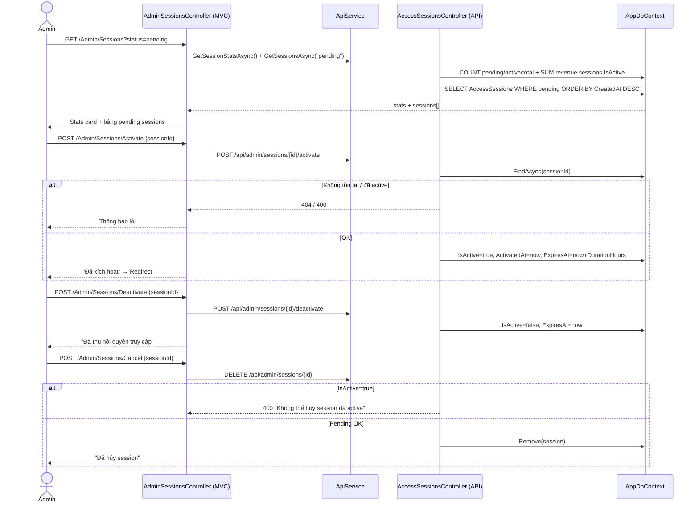
```mermaid
sequenceDiagram
    actor Admin
    participant SessionMVC as AdminSessionsController (MVC)
    participant API as ApiService
    participant SessionAPI as AccessSessionsController (API)
    participant DB as AppDbContext

    Admin->>SessionMVC: GET /Admin/Sessions?status=pending
    SessionMVC->>API: GetSessionStatsAsync() + GetSessionsAsync("pending")
    SessionAPI->>DB: COUNT pending/active/total + SUM revenue sessions IsActive
    SessionAPI->>DB: SELECT AccessSessions WHERE pending ORDER BY CreatedAt DESC
    DB-->>SessionMVC: stats + sessions[]
    SessionMVC-->>Admin: Stats card + bảng pending sessions

    Admin->>SessionMVC: POST /Admin/Sessions/Activate {sessionId}
    SessionMVC->>API: POST /api/admin/sessions/{id}/activate
    SessionAPI->>DB: FindAsync(sessionId)
    alt Không tồn tại / đã active
        SessionAPI-->>SessionMVC: 404 / 400
        SessionMVC-->>Admin: Thông báo lỗi
    else OK
        SessionAPI->>DB: IsActive=true, ActivatedAt=now, ExpiresAt=now+DurationHours
        SessionMVC-->>Admin: "Đã kích hoạt" → Redirect
    end

    Admin->>SessionMVC: POST /Admin/Sessions/Deactivate {sessionId}
    SessionMVC->>API: POST /api/admin/sessions/{id}/deactivate
    SessionAPI->>DB: IsActive=false, ExpiresAt=now
    SessionMVC-->>Admin: "Đã thu hồi quyền truy cập"

    Admin->>SessionMVC: POST /Admin/Sessions/Cancel {sessionId}
    SessionMVC->>API: DELETE /api/admin/sessions/{id}
    alt IsActive=true
        SessionAPI-->>SessionMVC: 400 "Không thể hủy session đã active"
    else Pending OK
        SessionAPI->>DB: Remove(session)
        SessionMVC-->>Admin: "Đã hủy session"
    end
```

---

#### 13.5.6 Quản lý nội dung — Admin (UC23, UC24, UC25)

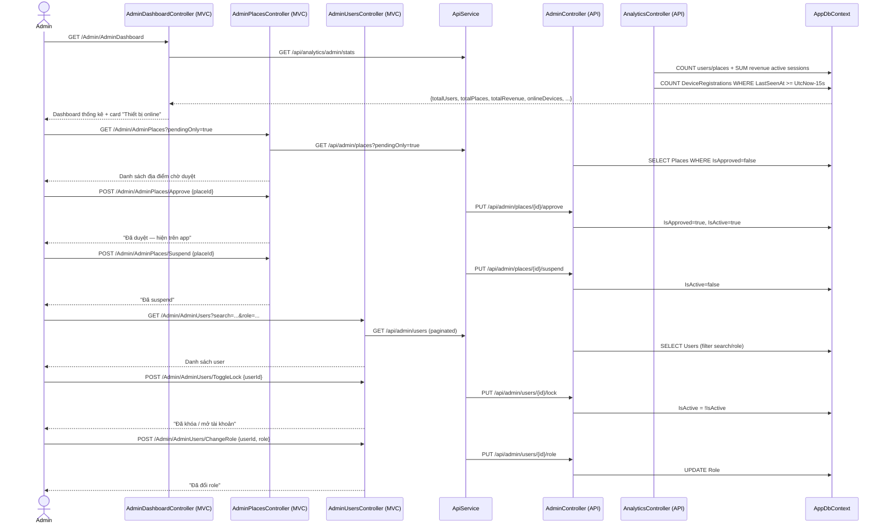
```mermaid
sequenceDiagram
    actor Admin
    participant DashMVC as AdminDashboardController (MVC)
    participant PlacesMVC as AdminPlacesController (MVC)
    participant UsersMVC as AdminUsersController (MVC)
    participant API as ApiService
    participant AdminAPI as AdminController (API)
    participant AnalyticsAPI as AnalyticsController (API)
    participant DB as AppDbContext

    Admin->>DashMVC: GET /Admin/AdminDashboard
    DashMVC->>API: GET /api/analytics/admin/stats
    AnalyticsAPI->>DB: COUNT users/places + SUM revenue active sessions
    AnalyticsAPI->>DB: COUNT DeviceRegistrations WHERE LastSeenAt >= UtcNow-15s
    DB-->>DashMVC: {totalUsers, totalPlaces, totalRevenue, onlineDevices, ...}
    DashMVC-->>Admin: Dashboard thống kê + card "Thiết bị online"

    Admin->>PlacesMVC: GET /Admin/AdminPlaces?pendingOnly=true
    PlacesMVC->>API: GET /api/admin/places?pendingOnly=true
    AdminAPI->>DB: SELECT Places WHERE IsApproved=false
    PlacesMVC-->>Admin: Danh sách địa điểm chờ duyệt

    Admin->>PlacesMVC: POST /Admin/AdminPlaces/Approve {placeId}
    API->>AdminAPI: PUT /api/admin/places/{id}/approve
    AdminAPI->>DB: IsApproved=true, IsActive=true
    PlacesMVC-->>Admin: "Đã duyệt — hiện trên app"

    Admin->>PlacesMVC: POST /Admin/AdminPlaces/Suspend {placeId}
    API->>AdminAPI: PUT /api/admin/places/{id}/suspend
    AdminAPI->>DB: IsActive=false
    PlacesMVC-->>Admin: "Đã suspend"

    Admin->>UsersMVC: GET /Admin/AdminUsers?search=...&role=...
    UsersMVC->>API: GET /api/admin/users (paginated)
    AdminAPI->>DB: SELECT Users (filter search/role)
    UsersMVC-->>Admin: Danh sách user

    Admin->>UsersMVC: POST /Admin/AdminUsers/ToggleLock {userId}
    API->>AdminAPI: PUT /api/admin/users/{id}/lock
    AdminAPI->>DB: IsActive = !IsActive
    UsersMVC-->>Admin: "Đã khóa / mở tài khoản"

    Admin->>UsersMVC: POST /Admin/AdminUsers/ChangeRole {userId, role}
    API->>AdminAPI: PUT /api/admin/users/{id}/role
    AdminAPI->>DB: UPDATE Role
    UsersMVC-->>Admin: "Đã đổi role"
```

---

#### 13.5.7 Cấu hình hệ thống — Admin (UC27, UC28, UC29)

```mermaid
sequenceDiagram
    actor Admin
    participant PkgMVC as AdminPackagesController (MVC)
    participant DevMVC as AdminDevicesController (MVC)
    participant API as ApiService
    participant PkgAPI as AccessPackagesController (API)
    participant DevAPI as DeviceAnalyticsController (API)
    participant DB as AppDbContext

    Admin->>PkgMVC: GET /Admin/AdminPackages
    PkgMVC->>API: GET /api/access-packages
    PkgAPI->>DB: SELECT AccessPackages ORDER BY SortOrder
    DB-->>PkgMVC: 4 gói
    PkgMVC-->>Admin: 4 card với form chỉnh giá / duration / IsActive

    Admin->>PkgMVC: POST /Admin/AdminPackages/Update {packageId, PriceVnd, DurationHours, ...}
    PkgMVC->>API: PUT /api/access-packages/{id}
    PkgAPI->>DB: UPDATE AccessPackage
    PkgMVC-->>Admin: "Đã cập nhật — app load giá mới khi vào SubscriptionPage"

    Admin->>DevMVC: GET /Admin/AdminDevices?search=...
    DevMVC->>API: GET /api/admin/devices
    DevAPI->>DB: SELECT DeviceRegistrations LEFT JOIN DevicePoiVisits, AccessSessions
    DevAPI->>DB: COUNT DeviceRegistrations WHERE LastSeenAt >= UtcNow-15s (onlineCount)
    DB-->>DevMVC: {total, onlineCount, items:[{DeviceId, Platform, FirstSeen, LastSeenAt, VisitCount, HasActive}]}
    DevMVC-->>Admin: Bảng thiết bị + badge Kết nối (Đang dùng nếu LastSeenAt ≤ 15s)\ncounter "X đang hoạt động" trong header\nTrang tự reload mỗi 15s

    Admin->>DevMVC: GET /Admin/AdminDevices/{deviceId}
    DevMVC->>API: GET /api/admin/devices/{deviceId}/visits
    DevAPI->>DB: SELECT DevicePoiVisits WHERE DeviceId=id ORDER BY VisitedAt DESC LIMIT 50
    DB-->>DevMVC: visits[]
    DevMVC-->>Admin: Lịch sử 50 lượt ghé POI gần nhất
```

---

### 13.6 Activity Diagrams

#### 13.6.1 Luồng khởi động app

```mermaid
flowchart TD
    A([Mở app\nApp constructor]) --> AA{IsAccessValid?}
    AA -->|Có| AB[StartExpiryTimer loop 60s]
    AA -->|Không| AC[Bỏ qua]
    AB --> B
    AC --> B
    B[RegisterDeviceAsync fire-and-forget\nUPSERT DeviceRegistrations] --> B2[StartHeartbeatTimer\ncập nhật LastSeenAt ngay + mỗi 5s]
    B2 --> C[CreateWindow\nIsAccessValid]
    C --> D{ExpiresAt tồn tại\nvà > UtcNow?}
    D -->|Không| E[LanguageSelectionPage]
    D -->|Có| F[new AppShell]
    F --> H[PlaceService.GetAllPlacesAsync\nPlaces + Images + TtsContents]
    H --> I[MapPage.SetupMap\nCartoDB Voyager tiles]
    I --> J[LoadPOIsAsync\nPOIsGlow + POIs layers]
    J --> K[StartGPS → LocationChanged handler\n_gpsStarted=true]
    K --> L([App sẵn sàng])

    E --> M[Chọn ngôn ngữ vi/en]
    M --> N[SubscriptionPage.OnAppearing\nGetPackagesAsync → DB hoặc fallback]
    N --> O[User chọn gói]
    O --> P[PaymentQRPage\nCreatePendingSessionAsync\nINSERT AccessSessions IsActive=false]
    P --> Q[Hiện QR VietQR]
    Q --> R{Poll 5s: IsActive=true?}
    R -->|Chưa| R
    R -->|Có| S[Lưu ExpiresAt Preferences]
    S --> F
```

#### 13.6.2 Luồng Geofence + TTS chi tiết

```mermaid
flowchart TD
    A([GPS LocationChanged event]) --> B[CancelRoutePanel.IsVisible?]
    B -->|Có| Z([return - đang chỉ đường])
    B -->|Không| C[GeofenceEngine.FindNearestPOI]
    C --> D{candidates rỗng?}
    D -->|Có| E[reset _pendingPlaceId\nreturn null]
    E --> F{_lastSpokenPlace != null?}
    F -->|Không| Z2([Kết thúc])
    F -->|Có| G[GetDistance user → _lastSpokenPlace]
    G --> H{dist > Radius?}
    H -->|Có| I[_lastSpokenPlaceId = null\n_lastSpokenPlace = null\nuser đã rời đi]
    H -->|Không| Z2
    I --> Z2

    D -->|Không| J{top.PlaceId == _pendingPlaceId?}
    J -->|Không| K[_pendingPlaceId = topId\n_pendingFirstSeenAt = now\nreturn null]
    K --> Z2
    J -->|Có| L{elapsed >= 2000ms?}
    L -->|Không| M[return null - chưa đủ debounce]
    M --> Z2
    L -->|Có| N[return top]
    N --> O{nearest.PlaceId == _lastSpokenPlaceId?}
    O -->|Có| Z2
    O -->|Không| P[_lastSpokenPlaceId = nearestId\n_lastSpokenPlace = nearest\nnearest.LastPlayedAt = now]
    P --> Q[SpeakFromGpsAsync - global 60s cooldown\nGetScriptForLocale locale]
    Q --> R[AddHistoryByGpsAsync\nAddHistoryAsync local\nINSERT DevicePoiVisits Supabase\nTrigger TotalVisits++]
    R --> Z2([Kết thúc])
```

#### 13.6.3 Luồng Admin kích hoạt session

```mermaid
flowchart TD
    A([Admin vào /Admin/Sessions]) --> B[Load stats + pending sessions]
    B --> C{Kiểm tra chuyển khoản?}
    C -->|Chưa nhận tiền| D[Bấm Hủy - Cancel]
    D --> E[DELETE /api/admin/sessions/id\nChỉ được xóa nếu NOT IsActive]
    E --> F([Session bị xóa khỏi DB])
    C -->|Đã nhận tiền| G[Bấm Kích hoạt - Activate]
    G --> H[POST /api/admin/sessions/id/activate]
    H --> I[IsActive=true\nActivatedAt=now\nExpiresAt=now+DurationHours]
    I --> J([App poll nhận\nvào được giao diện chính])
```

#### 13.6.4 Luồng duyệt địa điểm

```mermaid
flowchart TD
    A([Owner tạo Place]) --> B[IsApproved=false\nIsActive=false]
    B --> C[Admin GET /api/admin/places?pendingOnly=true]
    C --> D{Quyết định}
    D -->|Duyệt| E[PUT approve\nIsApproved=true\nIsActive=true]
    D -->|Từ chối| F[PUT suspend\nIsActive=false]
    E --> G[Place hiện trên app mobile\nMapPage + MainPage]
    F --> H[Place bị ẩn]
    G --> I{Owner cập nhật?}
    I -->|Có| J[PUT /api/places/id]
    J --> G
```

#### 13.6.5 Luồng đăng nhập Web MVC

```mermaid
flowchart TD
    A([Truy cập route có AdminOnly filter]) --> B{Session cookie có JWT?}
    B -->|Không| C[Redirect /Auth/Login]
    B -->|Có| D{JWT còn hạn và Role=Admin?}
    D -->|Không| E[Redirect /Auth/AccessDenied]
    D -->|Có| F[Tiếp tục request]
    C --> G[Nhập email + password]
    G --> H[POST /Auth/Login\n→ POST /api/auth/login]
    H --> I{Credentials hợp lệ?}
    I -->|Không| J[Hiện lỗi]
    J --> G
    I -->|Có| K[Lưu accessToken vào Session]
    K --> L{Role?}
    L -->|Admin| M[Redirect /Admin/Dashboard]
    L -->|Owner| N[Redirect /Dashboard]
```

---

### 13.7 BFD Bậc 1 — TourGuideAPP

```mermaid
graph LR
    ROOT["Hệ thống\nTourGuideAPP"]

    ROOT --> F1["1. Quản lý\nphiên truy cập"]
    ROOT --> F2["2. Khám phá\nđịa điểm"]
    ROOT --> F3["3. Bản đồ\nvà Định vị"]
    ROOT --> F4["4. Chỉ đường"]
    ROOT --> F5["5. Thuyết minh\ntự động"]
    ROOT --> F6["6. Quản lý Tour"]
    ROOT --> F7["7. Web Admin"]

    F1 --> F1_1["1.1 Kiểm tra phiên còn hạn\nIsAccessValid → Preferences"]
    F1 --> F1_2["1.2 Đăng ký thiết bị\nUPSERT DeviceRegistrations"]
    F1 --> F1_3["1.3 Load gói từ AccessPackages\nfallback về giá hardcode"]
    F1 --> F1_4["1.4 Tạo QR thanh toán VietQR\nVIB - 310822005"]
    F1 --> F1_5["1.5 Polling kích hoạt mỗi 5s\nchờ IsActive=true"]
    F1 --> F1_6["1.6 Timer hết hạn mỗi 60s\nAccessExpired event"]
    F1 --> F1_7["1.7 Heartbeat mỗi 5s\nLastSeenAt → Supabase\ndừng khi OnSleep"]

    F2 --> F2_1["2.1 Load Places + Images + TTS\n3 bước riêng biệt"]
    F2 --> F2_2["2.2 Tìm kiếm realtime\nName/Address/Specialty"]
    F2 --> F2_3["2.3 Lọc theo danh mục chip"]
    F2 --> F2_4["2.4 Xem chi tiết + gallery ảnh"]
    F2 --> F2_5["2.5 Gọi điện / mở website"]

    F3 --> F3_1["3.1 CartoDB Voyager tiles\n5 layers POI + User + Route"]
    F3 --> F3_2["3.2 GPS realtime\nFG Service Android / polling iOS"]
    F3 --> F3_3["3.3 Tap marker POI\nOnMapInfo → bottom card"]
    F3 --> F3_4["3.4 Reverse geocoding\ncache 15s / 30m"]

    F4 --> F4_1["4.1 OSRM /route/v1/driving\nGeoJSON overview=full"]
    F4 --> F4_2["4.2 Vẽ Route + Destination layers\n#E94560"]
    F4 --> F4_3["4.3 PendingRoute static\nPlaceDetailPage → MapPage"]
    F4 --> F4_4["4.4 CancelRoutePanel\nGPS callback early return"]

    F5 --> F5_1["5.1 GeofenceEngine.FindNearestPOI\nradius + cooldown + debounce 2s"]
    F5 --> F5_2["5.2 GetScriptForLocale\nTtsContents → TtsScript → default"]
    F5 --> F5_3["5.3 SpeakFromGpsAsync\nglobal cooldown 60s"]
    F5 --> F5_4["5.4 SpeakAsync\ntìm locale trên thiết bị"]
    F5 --> F5_5["5.5 _lastSpokenPlace\ntránh reset khi cooldown active"]
    F5 --> F5_6["5.6 INSERT DevicePoiVisits\ntrigger TotalVisits++"]

    F6 --> F6_1["6.1 RebuildTours\n3 tour từ IsActive+IsApproved places"]
    F6 --> F6_2["6.2 Filters: text/budget/duration/walking"]
    F6 --> F6_3["6.3 TourDetailPage\nPendingRoute → MapPage"]

    F7 --> F7_1["7.1 /Admin/Sessions\nstats + filter + paginate 20"]
    F7 --> F7_2["7.2 Activate / Cancel / Deactivate\n3 POST actions"]
    F7 --> F7_3["7.3 /Admin/Packages\nPUT /api/access-packages/id"]
    F7 --> F7_4["7.4 /Admin/Devices\nDeviceRegistrations LEFT JOIN visits+sessions\nbadge Online nếu LastSeenAt ≤ 15s\nauto-reload 15s\ncounter thiết bị đang hoạt động"]
    F7 --> F7_5["7.5 Detail device\n50 visits gần nhất"]
    F7 --> F7_6["7.6 Duyệt địa điểm\nIsApproved + IsActive"]
    F7 --> F7_7["7.7 Quản lý tài khoản\nlock/role"]
    F7 --> F7_8["7.8 /Admin/Dashboard\ncard Thiết bị online\nCOUNT LastSeenAt ≤ 15s"]
```

---

## Phụ lục: Thuật ngữ

| Thuật ngữ | Giải thích |
|---|---|
| **POI** | Point of Interest — địa điểm du lịch đáng chú ý |
| **Geofence** | Vùng địa lý ảo hình tròn, kích hoạt hành động khi người dùng vào trong |
| **TTS** | Text-to-Speech — đọc văn bản thành giọng nói tổng hợp |
| **Debounce** | Phải ở trong vùng liên tục 2 giây mới trigger TTS, tránh false trigger khi đi ngang |
| **Cooldown per-POI** | `place.LastPlayedAt` — thời gian chờ tối thiểu trước khi đọc lại cùng 1 POI (default 30 phút) |
| **Cooldown GPS global** | `NarrationService._lastGpsTtsAt` — 60 giây giữa bất kỳ 2 lần GPS TTS nào, dù khác POI |
| **OSRM** | Open Source Routing Machine — engine tính toán tuyến đường mã nguồn mở |
| **MAUI** | Multi-platform App UI — framework .NET phát triển app đa nền tảng |
| **Supabase** | Backend-as-a-Service, cung cấp PostgreSQL + REST API + Auth |
| **postgrest-csharp** | ORM client cho Supabase, map C# model qua `[Column]` attribute |
| **Preferences** | Key-value store cục bộ trên thiết bị (SharedPreferences Android) |
| **VietQR** | Chuẩn mã QR chuyển khoản ngân hàng tại Việt Nam |
| **Foreground Service** | Tiến trình Android chạy nền với notification thường trực |
| **DeviceId** | 10 ký tự uppercase random từ GUID, tạo lần đầu và lưu Preferences mãi mãi |
| **AccessSession** | Phiên truy cập B2C của 1 thiết bị — lưu lịch sử thanh toán + thời hạn |
| **AccessPackage** | Gói truy cập cấu hình trong DB — Admin chỉnh giá, app load động |
| **DeviceRegistration** | Record ghi nhận mỗi thiết bị: `FirstSeenAt` (lần đầu), `LastSeenAt` (heartbeat mỗi 5s khi foreground) |
| **DevicePoiVisit** | Record ghi nhận mỗi lượt GPS geofence trigger thành công |

---

**Nhóm phát triển:** Sinh viên đồ án  
**Cập nhật lần cuối:** Tháng 4, 2026  
**Phiên bản:** 2.5 — Cập nhật: heartbeat 5s online monitoring, GeofenceEngine sort PlaceId tiebreaker, OnSleep/OnResume lifecycle, web admin badge Đang dùng + auto-reload 15s, counter thiết bị online trang Devices, card Thiết bị online Dashboard
