# Product Requirements Document (PRD)
## TourGuideAPP — Ứng dụng Hướng dẫn Du lịch Thông minh TP.HCM

**Phiên bản:** 2.2  
**Ngày cập nhật:** Tháng 4, 2026  
**Trạng thái:** Đang phát triển  

---

## 1. Tổng quan

**TourGuideAPP** là ứng dụng hướng dẫn du lịch thông minh dành cho TP. Hồ Chí Minh, xây dựng trên nền tảng .NET MAUI. Ứng dụng kết hợp GPS, Geofencing và Text-to-Speech để tự động phát thuyết minh khi người dùng tiến đến gần địa điểm du lịch, mang lại trải nghiệm như có hướng dẫn viên cá nhân.

### Vấn đề cần giải quyết
- Khách du lịch không có hướng dẫn viên riêng thường bỏ lỡ thông tin thú vị về địa điểm
- Thuê hướng dẫn viên tốn kém và phụ thuộc lịch trình cố định
- Các app hiện có (Google Maps, TripAdvisor) chỉ cung cấp thông tin tĩnh, không chủ động

### Giải pháp
Tự động phát thuyết minh đúng lúc — khi người dùng đi đến gần địa điểm — không cần bấm nút, không cần đọc, chỉ cần đi và lắng nghe.

---

## 2. Đối tượng người dùng

### 2.1 Khách du lịch nội địa & quốc tế
| | Chi tiết |
|---|---|
| **Đặc điểm** | Đến TP.HCM 1–3 ngày, không quen đường, muốn trải nghiệm nhiều nhất |
| **Nhu cầu** | Biết mình đang đứng gần địa điểm gì, nghe giới thiệu ngắn gọn, tìm đường nhanh |
| **Pain point** | Phải tự tra cứu từng nơi, dễ bỏ lỡ điểm thú vị vì không biết |
| **Kỳ vọng** | App hoạt động tự động, không cần thao tác nhiều khi đang đi |

### 2.2 Sinh viên & người trẻ địa phương
| | Chi tiết |
|---|---|
| **Đặc điểm** | Sống tại TP.HCM nhưng chưa khám phá hết, thích trải nghiệm mới |
| **Nhu cầu** | Khám phá địa điểm theo chủ đề (cà phê, ẩm thực, lịch sử) |
| **Pain point** | Không biết bắt đầu từ đâu, thiếu thông tin chiều sâu về từng nơi |
| **Kỳ vọng** | Gợi ý tour theo danh mục, thông tin phong phú, dễ tìm đường |

### 2.3 Admin (Người quản trị hệ thống)
| | Chi tiết |
|---|---|
| **Đặc điểm** | Nhân viên vận hành, quản lý nội dung địa điểm và gói dịch vụ |
| **Nhu cầu** | Kích hoạt gói cho khách sau khi nhận thanh toán, cập nhật thông tin địa điểm |
| **Công cụ** | Supabase Dashboard + SQL function `activate_session()` |

---

## 3. Phạm vi tính năng (Use Case)

### Actor & Use Case

| Actor | Use Case |
|---|---|
| **Khách (User)** | Chọn & thanh toán gói sử dụng |
| | Xem bản đồ địa điểm |
| | Nghe thuyết minh tự động khi đến gần POI |
| | Xem chi tiết địa điểm |
| | Tìm kiếm & lọc địa điểm theo danh mục |
| | Xem & theo tour có sẵn |
| | Chỉ đường đến địa điểm |
| **Admin** | Kích hoạt gói sử dụng cho khách |
| | Quản lý nội dung địa điểm (qua Supabase) |
| **Hệ thống** | Tự động phát thuyết minh theo GPS |
| | Tự động khóa app khi hết hạn gói |
| | Polling xác nhận thanh toán |

---

## 4. Kiến trúc hệ thống

### Mobile Application
- **Framework:** .NET MAUI 10.0
- **Target chính:** Android (API 21+), iOS (15+)
- **Pattern:** Layered Architecture + Code-behind (không dùng MVVM)
- **Dependency Injection:** Microsoft.Extensions.DependencyInjection — Services là Singleton, Pages là Transient

### Backend & Database
- **Database:** PostgreSQL qua Supabase (không có backend riêng — app gọi trực tiếp REST API)
- **Client:** postgrest-csharp — map C# model sang Supabase table qua `[Column]` attribute
- **Local storage:** MAUI Preferences — lưu session token, DeviceId, settings

### Thư viện bên thứ ba
| Thư viện | Phiên bản | Mục đích |
|---|---|---|
| Mapsui | 5.x | Bản đồ tương tác (CartoDB Voyager tiles) |
| BruTile | - | Tile source provider cho Mapsui |
| OSRM API | - | Tính toán & vẽ tuyến đường |
| MAUI TextToSpeech | built-in | Text-to-Speech đa ngôn ngữ |
| SkiaSharp | - | Render marker POI tùy chỉnh |
| postgrest-csharp | - | ORM giao tiếp Supabase |

---

## 5. Tính năng chi tiết

### 5.1 Kiểm soát truy cập theo gói thời gian
**Mục tiêu:** Monetize app — người dùng phải thanh toán trước khi sử dụng

**Luồng hoạt động:**
```
Mở app → Kiểm tra Preferences (còn session hợp lệ không?)
  ├── Còn hạn → Vào app bình thường, khởi động timer
  └── Hết hạn / chưa có → Hiện SubscriptionPage

SubscriptionPage → Chọn gói → PaymentQRPage
  → Hiện QR VietQR (chuyển khoản ngân hàng)
  → App polling Supabase mỗi 5 giây
  → Admin kích hoạt → app nhận ExpiresAt → lưu Preferences → vào app

Timer background (mỗi 60 giây):
  → Kiểm tra DateTime.UtcNow < ExpiresAt
  → Hết hạn → Alert → về SubscriptionPage
```

**Gói sử dụng:**
| Gói | Thời lượng | Giá |
|---|---|---|
| Cơ bản | 1 tiếng | 10.000đ |
| Phổ biến | 2 tiếng | 18.000đ |
| Ngày | 1 ngày (24h) | 50.000đ |
| Dài ngày | 3 ngày (72h) | 120.000đ |

**Bảng DB:** `AccessSessions` | **Services:** `AccessSessionService` | **Views:** `SubscriptionPage`, `PaymentQRPage`

---

### 5.2 GPS & Định vị thời gian thực
**Mục tiêu:** Theo dõi vị trí người dùng liên tục, chính xác, kể cả khi tắt màn hình

**Luồng hoạt động:**
- **Android:** Foreground Service chạy nền — nhận vị trí từ platform → bắn event `LocationChanged`
- **iOS:** Polling `Geolocation.GetLocationAsync()` mỗi 3 giây
- Reverse geocoding hiển thị tên đường hiện tại (cache 15 giây, không gọi lại nếu dưới 30m)

**Services:** `LocationService`, `LocationForegroundService` (Android)

---

### 5.3 Geofence & Thuyết minh tự động (TTS)
**Mục tiêu:** Tự động phát thuyết minh khi người dùng tiến đến gần địa điểm — tính năng cốt lõi

**Thuật toán:**
```
GPS update → GeofenceEngine.FindNearestPOI()
  → Lọc POI có TtsScript, trong bán kính, chưa hết cooldown
  → Sắp xếp: Priority cao trước, cùng Priority → gần hơn trước
  → Debounce 2 giây (phải ở trong vùng liên tục)
  → Trả về POI ưu tiên nhất

MapPage nhận POI → kiểm tra _lastSpokenPlaceId (tránh đọc lại)
  → NarrationService.SpeakAsync(TtsScript, TtsLocale)
  → Cập nhật LastPlayedAt → bắt đầu cooldown
```

**Cấu hình per-place (trong DB):**
| Tham số | Mặc định | Mô tả |
|---|---|---|
| radius | 50m | Bán kính phát hiện |
| cooldown_minutes | 10 phút | Thời gian chờ trước khi đọc lại |
| priority | 1 | Độ ưu tiên khi nhiều POI trong vùng |
| tts_locale | vi-VN | Ngôn ngữ đọc (vi-VN, en-US, zh-CN...) |

**Services:** `GeofenceEngine`, `NarrationService`

---

### 5.4 Bản đồ tương tác
**Mục tiêu:** Hiển thị toàn bộ địa điểm trên bản đồ, hỗ trợ chỉ đường

**Tính năng:**
- Render POI markers 2 lớp (SkiaSharp): glow đỏ mờ + chấm đặc có viền trắng
- Marker người dùng: glow xanh mờ + chấm xanh có viền trắng
- Tap marker → bottom card nổi lên (Google Maps style): tên, rating, khoảng cách, 4 nút hành động
- Nút hành động: **Chỉ đường** / **Thuyết minh** / **Gọi điện** / **Chi tiết**
- Chỉ đường: gọi OSRM API → vẽ polyline lên bản đồ → hiện panel hủy route
- Auto-follow GPS (flag `_followUserLocation`) — tự tắt khi user kéo map

**Views:** `MapPage` | **External API:** OSRM (`router.project-osrm.org`)

---

### 5.5 Danh sách địa điểm nổi bật
**Mục tiêu:** Duyệt và tìm kiếm địa điểm theo danh mục, không cần mở bản đồ

**Tính năng:**
- Hiển thị card: ảnh đại diện, tên, rating sao, khoảng giá, giờ mở cửa
- Tìm kiếm realtime theo: tên, địa chỉ, mô tả, đặc sản
- Lọc nhanh theo danh mục: Tất cả / Cà phê / Cơm / Nhậu / Trà sữa
- Dữ liệu được cache in-memory sau lần load đầu (không gọi Supabase lại khi chuyển tab)

**Views:** `MainPage` | **Services:** `PlaceService`

---

### 5.6 Chi tiết địa điểm
**Mục tiêu:** Xem đầy đủ thông tin một địa điểm, thực hiện hành động nhanh

**Tính năng:**
- Gallery ảnh cuộn ngang (từ bảng `PlaceImages`)
- Hiển thị: địa chỉ, giờ mở/đóng, trạng thái mở-đóng thời gian thực, giá, số điện thoại, website
- Nút **Chỉ đường**: set `MapPage.PendingRoute` → chuyển sang tab Bản đồ → tự động tính route
- Nút **Gọi điện**: mở dialer với số điện thoại địa điểm
- Nút **Thuyết minh**: phát TTS ngay lập tức

**Views:** `PlaceDetailPage`

---

### 5.7 Tour có sẵn
**Mục tiêu:** Gợi ý lộ trình tour theo chủ đề, người dùng theo từng điểm dừng

**Tính năng:**
- Danh sách tour: tên, mô tả, số điểm dừng
- Chi tiết tour: danh sách điểm dừng theo thứ tự với tên và mô tả ngắn
- Tap điểm dừng → xem PlaceDetailPage
- Khi di chuyển thực tế: geofence tự đọc thuyết minh tại từng điểm (không cần thao tác thêm)

**Views:** `ToursPage`, `TourDetailPage` | **Services:** `POIService`

---

## 6. Cấu trúc dữ liệu

### Bảng `Places`
| Cột | Kiểu | Ghi chú |
|---|---|---|
| PlaceId | int | Khóa chính |
| Name | text | Tên địa điểm |
| Description | text | Mô tả |
| Address | text | Địa chỉ |
| Latitude / Longitude | float | Tọa độ GPS |
| Phone | text | Số điện thoại |
| OpenTime / CloseTime | text | Định dạng HH:mm |
| PriceMin / PriceMax | decimal | VND |
| AverageRating | float | 0.0 – 5.0 |
| TotalReviews | int | Số lượt đánh giá |
| Specialty | text | Tags, phân cách dấu phẩy |
| IsActive / IsApproved | bool | Chỉ hiện khi cả hai = true |
| tts_script | text | Nội dung thuyết minh TTS |
| tts_locale | text | Ngôn ngữ TTS (mặc định vi-VN) |
| radius | float | Bán kính geofence (m) |
| cooldown_minutes | int | Cooldown giữa 2 lần đọc |
| priority | int | Độ ưu tiên geofence |

### Bảng `PlaceImages`
| Cột | Kiểu | Ghi chú |
|---|---|---|
| ImageId | int | Khóa chính |
| PlaceId | int | FK → Places |
| ImageUrl | text | URL ảnh |
| IsMain | bool | Ảnh đại diện chính |
| SortOrder | int | Thứ tự hiển thị |

### Bảng `AccessSessions`
| Cột | Kiểu | Ghi chú |
|---|---|---|
| SessionId | UUID | Khóa chính (auto gen) |
| DeviceId | text | Mã thiết bị 10 ký tự |
| PackageId | text | 1h / 2h / 1day / 3day |
| DurationHours | numeric | Thời lượng (giờ) |
| PriceVnd | int | Giá thanh toán |
| CreatedAt | timestamptz | Thời điểm tạo session |
| ActivatedAt | timestamptz | Thời điểm admin kích hoạt |
| ExpiresAt | timestamptz | Thời điểm hết hạn |
| IsActive | bool | Đã kích hoạt chưa |

---

## 7. Kịch bản sử dụng (User Journeys)

### Kịch bản 1: Lần đầu dùng app — đăng ký gói
```
1. Mở app → hiện trang chọn gói (không thể bỏ qua)
2. Chọn "2 Tiếng - 18.000đ"
3. Hiện QR chuyển khoản VietQR + Mã thiết bị (VD: A3F8B2C1D4)
4. Mở app ngân hàng → quét QR → điền mã thiết bị vào nội dung CK
5. Chuyển khoản 18.000đ
6. Admin thấy tiền → vào Supabase → chạy: SELECT activate_session('A3F8B2C1D4')
7. App phát hiện IsActive = true → lưu ExpiresAt → mở app chính
8. Sau 2 tiếng → hiện alert "Hết hạn" → về trang chọn gói gia hạn
```

### Kịch bản 2: Khám phá bản đồ & chỉ đường
```
1. Vào tab Bản đồ → thấy các marker đỏ (POI) và marker xanh (vị trí mình)
2. Tap marker "Nhà thờ Đức Bà" → hiện bottom card
3. Bấm "Chỉ đường" → OSRM tính route → vẽ đường trên bản đồ
4. Bấm "Chi tiết" → PlaceDetailPage với gallery ảnh và thông tin đầy đủ
5. Từ PlaceDetailPage bấm "Chỉ đường" → tự chuyển sang MapPage và route
```

### Kịch bản 3: Thuyết minh tự động khi đi bộ
```
1. Bật GPS → đi bộ trên đường Đồng Khởi
2. Đi qua Nhà hát Lớn (trong bán kính 50m)
3. Đứng 2 giây → app tự đọc: "Chào mừng bạn đến Nhà hát Thành phố..."
4. Đi tiếp → vào bán kính Bưu điện Trung tâm
5. App đọc thuyết minh Bưu điện (Nhà hát đang trong cooldown 10 phút)
```

### Kịch bản 4: Tìm quán cà phê gần đây
```
1. Vào tab Nổi bật → bấm chip "Cà phê"
2. Danh sách lọc còn toàn quán cà phê
3. Gõ "Bệt" → tìm thấy "Cà Phê Bệt Nguyễn Huệ"
4. Tap card → xem ảnh, giờ mở cửa, giá, địa chỉ
5. Bấm "Chỉ đường" → navigate về MapPage, tự route đến quán
```

### Kịch bản 5: Theo tour Quận 1 - Di tích lịch sử
```
1. Vào tab Tour → chọn "Tour Di tích Quận 1"
2. Xem 5 điểm dừng theo thứ tự: Dinh Thống Nhất → Nhà thờ Đức Bà → ...
3. Bấm điểm dừng 1 → xem chi tiết, bấm "Chỉ đường"
4. Di chuyển thực tế → đến gần Dinh Thống Nhất → app tự đọc thuyết minh
5. Tiếp tục đến điểm dừng tiếp theo
```

---

## 8. Yêu cầu phi chức năng

### 8.1 Hiệu năng
| Tiêu chí | Yêu cầu |
|---|---|
| Khởi động app | < 3 giây |
| Load danh sách Places lần đầu | < 2 giây |
| Geofence trigger từ lúc vào vùng | < 5 giây |
| Polling xác nhận thanh toán | Mỗi 5 giây |
| Timer kiểm tra hết hạn | Mỗi 60 giây |
| Cache Places in-memory | Không load lại khi chuyển tab |

### 8.2 Độ tin cậy
- GPS foreground service không bị Android kill khi chạy nền
- Polling tự retry khi mất mạng (try/catch + delay)
- Session lưu local Preferences — không mất khi tắt/mở lại app
- Supabase timeout: app hiện thông báo lỗi thay vì crash

### 8.3 Bảo mật
- Supabase Anon Key nhúng trong build (giới hạn bởi RLS trên Supabase)
- DeviceId là GUID ngẫu nhiên — không liên kết thông tin cá nhân
- Không lưu thông tin thanh toán trong app
- Session expiry check phía client (độ trễ tối đa 60 giây)

### 8.4 Khả năng sử dụng
- Giao diện Dark Gold theme — đọc tốt ngoài trời
- Toàn bộ thao tác chính thực hiện được bằng 1 tay
- Không yêu cầu tạo tài khoản — dùng ngay sau thanh toán
- TTS tự động — không cần bấm gì khi đang đi bộ

---

## 9. Thiết kế giao diện

### Bảng màu (Dark Gold Theme)
| Tên | Hex | Dùng cho |
|---|---|---|
| Background | `#0F0E0D` | Nền trang |
| Surface | `#1A1410` | Card, header, panel |
| Surface2 | `#26201A` | Icon bg, chip, button phụ |
| Border | `#2A2018` | Viền card |
| Primary text | `#F0E6D3` | Tiêu đề, tên địa điểm |
| Secondary text | `#5A4A3A` | Mô tả, subtitle |
| Gold accent | `#C8A96E` | Nút chính, label, sao rating |
| Red accent | `#E94560` | Marker POI, trạng thái đóng cửa |
| Blue | `#1E90FF` | Marker vị trí người dùng |
| Green | `#4CAF50` | Trạng thái đang mở cửa |

### Nguyên tắc thiết kế
- **Location-First:** Mọi thao tác đều có thể bắt đầu từ bản đồ
- **Tự động hóa tối đa:** Geofence + TTS không cần bấm nút
- **Thông tin tối giản:** Chỉ hiển thị những gì cần thiết tại thời điểm đó
- **Một tay:** Tất cả nút hành động trong tầm với ngón cái

---

## 10. Rủi ro & Giải pháp

| Rủi ro | Khả năng | Mức ảnh hưởng | Giải pháp |
|---|---|---|---|
| GPS không chính xác trong tòa nhà / ngõ hẻm | Cao | Trung bình | Cho phép cấu hình bán kính per-place, debounce 2 giây giảm false trigger |
| TTS tiếng Việt chất lượng thấp trên một số máy | Trung bình | Thấp | Hướng dẫn user bật Google Neural TTS trong cài đặt |
| Android kill foreground service khi pin yếu | Trung bình | Cao | Request quyền `FOREGROUND_SERVICE`, hiển thị notification thường trực |
| Mất kết nối khi polling kích hoạt session | Cao | Cao | Retry tự động mỗi 5 giây, hiện trạng thái "Đang kết nối lại..." |
| User chỉnh giờ máy để kéo dài session | Thấp | Trung bình | Chấp nhận ở phiên bản hiện tại, sửa bằng server time ở giai đoạn sau |
| Người dùng không muốn trả phí vì có Google Maps miễn phí | Cao | Cao | Nhấn mạnh tính năng TTS tự động — Google Maps không có |
| Supabase free tier giới hạn 500MB storage | Thấp | Thấp | Ảnh địa điểm lưu URL ngoài (Google Photos, CDN), không lưu file trực tiếp |

---

## 11. Đối thủ cạnh tranh

| Ứng dụng | Điểm mạnh | Thiếu gì so với TourGuideAPP |
|---|---|---|
| Google Maps | Bản đồ chính xác, routing toàn cầu | Không có thuyết minh, không tự động |
| TripAdvisor | Review và rating phong phú | Không có GPS geofence, không tự trigger |
| Klook / GetYourGuide | Đặt tour chuyên nghiệp | Không có app hướng dẫn realtime |
| Izi.travel | App audio tour | Phải bấm thủ công, UX phức tạp |

**Lợi thế cạnh tranh của TourGuideAPP:**
- **Tự động 100%** — geofence trigger TTS, không cần bấm nút
- **Không cần tài khoản** — thanh toán xong dùng ngay
- **Gói linh hoạt** — từ 1 tiếng đến 3 ngày, phù hợp nhiều nhu cầu
- **Địa phương hóa** — nội dung tập trung TP.HCM, chi tiết hơn app toàn cầu

---

## 12. Hằng số kỹ thuật (Key Constants)

| Hằng số | Giá trị | Vị trí trong code |
|---|---|---|
| Geofence Radius | 50m (mặc định, per-place) | `GeofenceEngine.cs` |
| Geofence Cooldown | 10 phút | `GeofenceEngine.cs` |
| Geofence Debounce | 2 giây | `GeofenceEngine.cs` |
| Geofence Priority | 1 (mặc định) | `Places.Priority` |
| Polling kích hoạt | 5 giây | `AccessSessionService.cs` |
| Timer hết hạn | 60 giây | `AccessSessionService.cs` |
| Reverse geocode cache | 20 giây | `MainPage.cs` |
| OSRM Endpoint | `router.project-osrm.org` | `MapPage.xaml.cs` |
| Map Center | 10.7615, 106.7033 (TP.HCM) | `MapPage.xaml.cs` |
| Map Tile | CartoDB Voyager | `MapPage.xaml.cs` |
| TTS Locale mặc định | `vi-VN` | `NarrationService.cs` |
| TTS Locales hỗ trợ | vi-VN, en-US, zh-CN, ko-KR, ja-JP, fr-FR, th-TH | `NarrationService.cs` |
| Supabase Region | ap-southeast-1 (Singapore) | `MauiProgram.cs` |
| Session DeviceId | GUID 10 ký tự | `AccessSessionService.cs` |
| Gói ngắn nhất | 1 tiếng — 10.000đ | `SubscriptionPage.xaml` |
| Gói dài nhất | 3 ngày — 120.000đ | `SubscriptionPage.xaml` |
| Bank VietQR | MB Bank | `Constants.cs` |

---

## 13. Lộ trình phát triển

### Giai đoạn 1 — MVP (Q2 2026) ✅ Hoàn thành
- ✅ Kiểm soát truy cập theo gói thời gian (VietQR + polling)
- ✅ GPS Foreground Service (Android) + định vị realtime
- ✅ Geofence + TTS tự động (debounce, cooldown, priority)
- ✅ Bản đồ Mapsui CartoDB Voyager + marker POI tùy chỉnh SkiaSharp
- ✅ Chỉ đường OSRM + polyline
- ✅ Danh sách địa điểm + tìm kiếm/lọc theo danh mục
- ✅ Chi tiết địa điểm + gallery ảnh
- ✅ Tour có sẵn + chi tiết điểm dừng
- ✅ TTS đa ngôn ngữ 7 ngôn ngữ (bảng PlaceTtsContents)

### Giai đoạn 2 — Dữ liệu thật & Admin (Q3 2026)
- [ ] Script enrich dữ liệu từ Google Places API (ảnh, rating, giờ mở cửa thật)
- [ ] Giao diện admin web kích hoạt session (thay vì SQL thủ công)
- [ ] Nội dung TTS cho tất cả địa điểm, đủ 7 ngôn ngữ
- [ ] Hỗ trợ audio file MP3 thật thay vì TTS tổng hợp

### Giai đoạn 3 — Bảo mật & Offline (Q4 2026)

**Bảo mật:**
- [ ] Xác thực session bằng server time (chống chỉnh giờ máy)
- [ ] Rate limiting trên Supabase RLS
- [ ] API key rotation cho Supabase Anon Key

**Offline:**
- [ ] Cache map tiles Mapsui khi còn mạng để dùng offline
- [ ] Cache Places in-memory persist khi tắt app (local JSON)
- [ ] Background sync khi có mạng trở lại

**Tính năng mở rộng:**
- [ ] Hệ thống đánh giá địa điểm (1–5 sao) tích hợp web
- [ ] Tối ưu pin: giảm tần suất GPS khi không di chuyển
- [ ] Mở rộng khu vực: Quận 1, Quận 7, Thủ Đức
- [ ] Push notification khi gần POI mới chưa từng ghé

---

## 14. UML Diagrams

### 13.1 ER Diagram — Toàn bộ Database

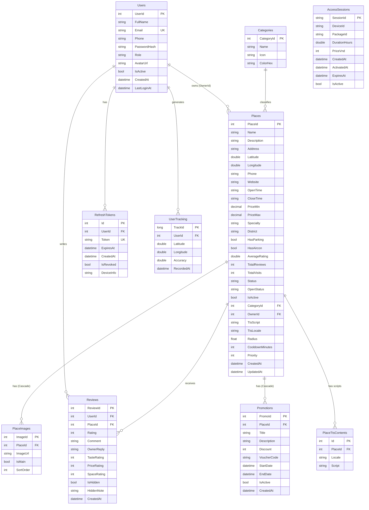
```mermaid
erDiagram
    Users {
        int UserId PK
        string FullName
        string Email UK
        string Phone
        string PasswordHash
        string Role
        string AvatarUrl
        bool IsActive
        datetime CreatedAt
        datetime LastLoginAt
    }

    Categories {
        int CategoryId PK
        string Name
        string Icon
        string ColorHex
    }

    Places {
        int PlaceId PK
        string Name
        string Description
        string Address
        double Latitude
        double Longitude
        string Phone
        string Website
        string OpenTime
        string CloseTime
        decimal PriceMin
        decimal PriceMax
        string Specialty
        string District
        bool HasParking
        bool HasAircon
        double AverageRating
        int TotalReviews
        int TotalVisits
        string Status
        string OpenStatus
        bool IsActive
        int CategoryId FK
        int OwnerId FK
        string TtsScript
        string TtsLocale
        float Radius
        int CooldownMinutes
        int Priority
        datetime CreatedAt
        datetime UpdatedAt
    }

    PlaceImages {
        int ImageId PK
        int PlaceId FK
        string ImageUrl
        bool IsMain
        int SortOrder
    }

    Reviews {
        int ReviewId PK
        int UserId FK
        int PlaceId FK
        int Rating
        string Comment
        string OwnerReply
        int TasteRating
        int PriceRating
        int SpaceRating
        bool IsHidden
        string HiddenNote
        datetime CreatedAt
    }

    RefreshTokens {
        int Id PK
        int UserId FK
        string Token UK
        datetime ExpiresAt
        datetime CreatedAt
        bool IsRevoked
        string DeviceInfo
    }

    PlaceTtsContents {
        int Id PK
        int PlaceId FK
        string Locale
        string Script
    }

    Promotions {
        int PromoId PK
        int PlaceId FK
        string Title
        string Description
        int Discount
        string VoucherCode
        datetime StartDate
        datetime EndDate
        bool IsActive
        datetime CreatedAt
    }

    UserTracking {
        long TrackId PK
        int UserId FK
        double Latitude
        double Longitude
        double Accuracy
        datetime RecordedAt
    }

    AccessSessions {
        string SessionId PK
        string DeviceId
        string PackageId
        double DurationHours
        int PriceVnd
        datetime CreatedAt
        datetime ActivatedAt
        datetime ExpiresAt
        bool IsActive
    }

    Users ||--o{ Places : "owns (OwnerId)"
    Users ||--o{ Reviews : "writes"
    Users ||--o{ RefreshTokens : "has"
    Users ||--o{ UserTracking : "generates"
    Categories ||--o{ Places : "classifies"
    Places ||--o{ PlaceImages : "has (Cascade)"
    Places ||--o{ Reviews : "receives"
    Places ||--o{ Promotions : "has (Cascade)"
    Places ||--o{ PlaceTtsContents : "has scripts"
```

---

### 13.2 Class Diagram — Mobile App (TourGuideAPP)

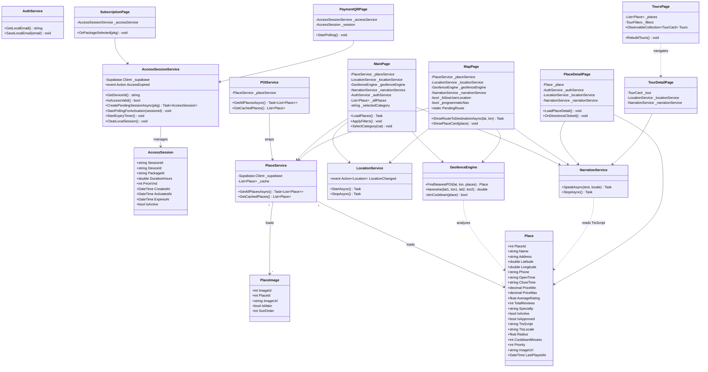
```mermaid
classDiagram
    class Place {
        +int PlaceId
        +string Name
        +string Address
        +double Latitude
        +double Longitude
        +string Phone
        +string OpenTime
        +string CloseTime
        +decimal PriceMin
        +decimal PriceMax
        +float AverageRating
        +int TotalReviews
        +string Specialty
        +bool IsActive
        +bool IsApproved
        +string TtsScript
        +string TtsLocale
        +float Radius
        +int CooldownMinutes
        +int Priority
        +string ImageUrl
        +DateTime LastPlayedAt
    }

    class PlaceImage {
        +int ImageId
        +int PlaceId
        +string ImageUrl
        +bool IsMain
        +int SortOrder
    }

    class AccessSession {
        +string SessionId
        +string DeviceId
        +string PackageId
        +double DurationHours
        +int PriceVnd
        +DateTime CreatedAt
        +DateTime ActivatedAt
        +DateTime ExpiresAt
        +bool IsActive
    }

    class PlaceService {
        -Supabase.Client _supabase
        -List~Place~ _cache
        +GetAllPlacesAsync() Task~List~Place~~
        +GetCachedPlaces() List~Place~
    }

    class LocationService {
        +event Action~Location~ LocationChanged
        +StartAsync() Task
        +StopAsync() Task
    }

    class GeofenceEngine {
        +FindNearestPOI(lat, lon, places) Place
        -Haversine(lat1, lon1, lat2, lon2) double
        -IsInCooldown(place) bool
    }

    class NarrationService {
        +SpeakAsync(text, locale) Task
        +StopAsync() Task
    }

    class AccessSessionService {
        -Supabase.Client _supabase
        +GetDeviceId() string
        +IsAccessValid() bool
        +CreatePendingSessionAsync(pkg) Task~AccessSession~
        +StartPollingForActivation(sessionId) void
        +StartExpiryTimer() void
        +ClearLocalSession() void
        +event Action AccessExpired
    }

    class AuthService {
        +GetLocalEmail() string
        +SaveLocalEmail(email) void
    }

    class POIService {
        -PlaceService _placeService
        +GetAllPlacesAsync() Task~List~Place~~
        +GetCachedPlaces() List~Place~
    }

    class MainPage {
        -PlaceService _placeService
        -LocationService _locationService
        -GeofenceEngine _geofenceEngine
        -NarrationService _narrationService
        -AuthService _authService
        -List~Place~ _allPlaces
        -string _selectedCategory
        +LoadPlaces() Task
        +ApplyFilters() void
        +SelectCategory(cat) void
    }

    class MapPage {
        -PlaceService _placeService
        -LocationService _locationService
        -GeofenceEngine _geofenceEngine
        -NarrationService _narrationService
        -bool _followUserLocation
        -bool _programmaticNav
        +static PendingRoute
        +ShowRouteToDestinationAsync(lat, lon) Task
        +ShowPlaceCard(place) void
    }

    class PlaceDetailPage {
        -Place _place
        -AuthService _authService
        -LocationService _locationService
        -NarrationService _narrationService
        +LoadPlaceDetail() void
        +OnDirectionsClicked() void
    }

    class ToursPage {
        -List~Place~ _places
        -TourFilters _filters
        +ObservableCollection~TourCard~ Tours
        +RebuildTours() void
    }

    class TourDetailPage {
        -TourCard _tour
        -LocationService _locationService
        -NarrationService _narrationService
    }

    class SubscriptionPage {
        -AccessSessionService _accessService
        +OnPackageSelected(pkg) void
    }

    class PaymentQRPage {
        -AccessSessionService _accessService
        -AccessSession _session
        +StartPolling() void
    }

    PlaceService "1" --> "*" Place : loads
    PlaceService "1" --> "*" PlaceImage : loads
    POIService --> PlaceService : wraps
    GeofenceEngine ..> Place : analyzes
    NarrationService ..> Place : reads TtsScript
    AccessSessionService --> AccessSession : manages
    MainPage --> PlaceService
    MainPage --> LocationService
    MainPage --> GeofenceEngine
    MainPage --> NarrationService
    MapPage --> PlaceService
    MapPage --> LocationService
    MapPage --> GeofenceEngine
    MapPage --> NarrationService
    PlaceDetailPage --> NarrationService
    PlaceDetailPage --> Place
    ToursPage ..> TourDetailPage : navigates
    TourDetailPage --> NarrationService
    SubscriptionPage --> AccessSessionService
    PaymentQRPage --> AccessSessionService
```

---

### 13.3 Class Diagram — Web API (TourGuideAPI)

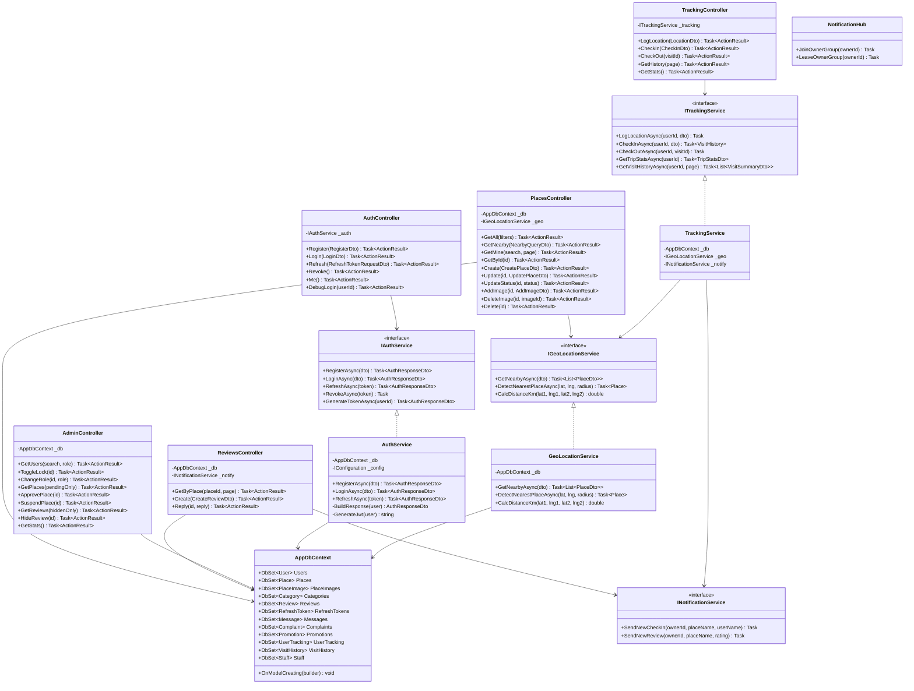
```mermaid
classDiagram
    class AuthController {
        -IAuthService _auth
        +Register(RegisterDto) Task~ActionResult~
        +Login(LoginDto) Task~ActionResult~
        +Refresh(RefreshTokenRequestDto) Task~ActionResult~
        +Revoke() Task~ActionResult~
        +Me() Task~ActionResult~
        +DebugLogin(userId) Task~ActionResult~
    }

    class PlacesController {
        -AppDbContext _db
        -IGeoLocationService _geo
        +GetAll(filters) Task~ActionResult~
        +GetNearby(NearbyQueryDto) Task~ActionResult~
        +GetMine(search, page) Task~ActionResult~
        +GetById(id) Task~ActionResult~
        +Create(CreatePlaceDto) Task~ActionResult~
        +Update(id, UpdatePlaceDto) Task~ActionResult~
        +UpdateStatus(id, status) Task~ActionResult~
        +AddImage(id, AddImageDto) Task~ActionResult~
        +DeleteImage(id, imageId) Task~ActionResult~
        +Delete(id) Task~ActionResult~
    }

    class ReviewsController {
        -AppDbContext _db
        -INotificationService _notify
        +GetByPlace(placeId, page) Task~ActionResult~
        +Create(CreateReviewDto) Task~ActionResult~
        +Reply(id, reply) Task~ActionResult~
    }

    class TrackingController {
        -ITrackingService _tracking
        +LogLocation(LocationDto) Task~ActionResult~
        +CheckIn(CheckInDto) Task~ActionResult~
        +CheckOut(visitId) Task~ActionResult~
        +GetHistory(page) Task~ActionResult~
        +GetStats() Task~ActionResult~
    }

    class AdminController {
        -AppDbContext _db
        +GetUsers(search, role) Task~ActionResult~
        +ToggleLock(id) Task~ActionResult~
        +ChangeRole(id, role) Task~ActionResult~
        +GetPlaces(pendingOnly) Task~ActionResult~
        +ApprovePlace(id) Task~ActionResult~
        +SuspendPlace(id) Task~ActionResult~
        +GetReviews(hiddenOnly) Task~ActionResult~
        +HideReview(id) Task~ActionResult~
        +GetStats() Task~ActionResult~
    }

    class IAuthService {
        <<interface>>
        +RegisterAsync(dto) Task~AuthResponseDto~
        +LoginAsync(dto) Task~AuthResponseDto~
        +RefreshAsync(token) Task~AuthResponseDto~
        +RevokeAsync(token) Task
        +GenerateTokenAsync(userId) Task~AuthResponseDto~
    }

    class AuthService {
        -AppDbContext _db
        -IConfiguration _config
        +RegisterAsync(dto) Task~AuthResponseDto~
        +LoginAsync(dto) Task~AuthResponseDto~
        +RefreshAsync(token) Task~AuthResponseDto~
        -BuildResponse(user) AuthResponseDto
        -GenerateJwt(user) string
    }

    class IGeoLocationService {
        <<interface>>
        +GetNearbyAsync(dto) Task~List~PlaceDto~~
        +DetectNearestPlaceAsync(lat, lng, radius) Task~Place~
        +CalcDistanceKm(lat1, lng1, lat2, lng2) double
    }

    class GeoLocationService {
        -AppDbContext _db
        +GetNearbyAsync(dto) Task~List~PlaceDto~~
        +DetectNearestPlaceAsync(lat, lng, radius) Task~Place~
        +CalcDistanceKm(lat1, lng1, lat2, lng2) double
    }

    class ITrackingService {
        <<interface>>
        +LogLocationAsync(userId, dto) Task
        +CheckInAsync(userId, dto) Task~VisitHistory~
        +CheckOutAsync(userId, visitId) Task
        +GetTripStatsAsync(userId) Task~TripStatsDto~
        +GetVisitHistoryAsync(userId, page) Task~List~VisitSummaryDto~~
    }

    class TrackingService {
        -AppDbContext _db
        -IGeoLocationService _geo
        -INotificationService _notify
    }

    class INotificationService {
        <<interface>>
        +SendNewCheckIn(ownerId, placeName, userName) Task
        +SendNewReview(ownerId, placeName, rating) Task
    }

    class NotificationHub {
        +JoinOwnerGroup(ownerId) Task
        +LeaveOwnerGroup(ownerId) Task
    }

    class AppDbContext {
        +DbSet~User~ Users
        +DbSet~Place~ Places
        +DbSet~PlaceImage~ PlaceImages
        +DbSet~Category~ Categories
        +DbSet~Review~ Reviews
        +DbSet~RefreshToken~ RefreshTokens
        +DbSet~Message~ Messages
        +DbSet~Complaint~ Complaints
        +DbSet~Promotion~ Promotions
        +DbSet~UserTracking~ UserTracking
        +DbSet~VisitHistory~ VisitHistory
        +DbSet~Staff~ Staff
        +OnModelCreating(builder) void
    }

    AuthController --> IAuthService
    PlacesController --> AppDbContext
    PlacesController --> IGeoLocationService
    ReviewsController --> AppDbContext
    ReviewsController --> INotificationService
    TrackingController --> ITrackingService
    AdminController --> AppDbContext
    IAuthService <|.. AuthService
    IGeoLocationService <|.. GeoLocationService
    ITrackingService <|.. TrackingService
    TrackingService --> IGeoLocationService
    TrackingService --> INotificationService
    AuthService --> AppDbContext
    GeoLocationService --> AppDbContext
```

---

### 13.4 Sequence Diagrams — Mobile App

#### 13.4.1 Mở app và kiểm tra session

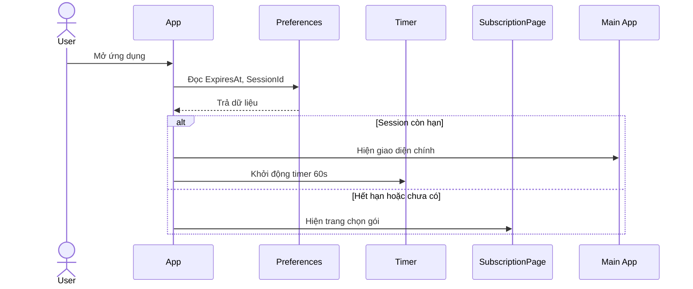
```mermaid
sequenceDiagram
    actor User
    participant App
    participant Preferences
    participant Timer
    participant SubscriptionPage
    participant AppShell as Main App

    User->>App: Mở ứng dụng
    App->>Preferences: Đọc ExpiresAt, SessionId
    Preferences-->>App: Trả dữ liệu

    alt Session còn hạn
        App->>AppShell: Hiện giao diện chính
        App->>Timer: Khởi động timer 60s
    else Hết hạn hoặc chưa có
        App->>SubscriptionPage: Hiện trang chọn gói
    end
```

#### 13.4.2 Chọn gói và tạo session

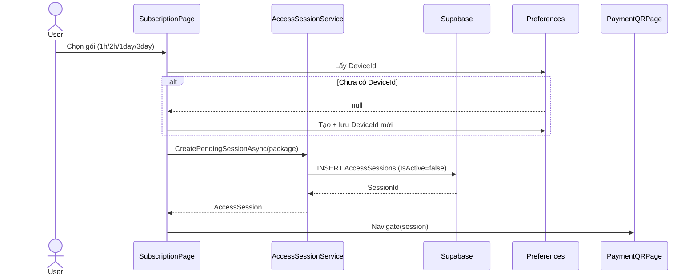
```mermaid
sequenceDiagram
    actor User
    participant SubscriptionPage
    participant AccessSessionService
    participant Supabase
    participant Preferences
    participant PaymentQRPage

    User->>SubscriptionPage: Chọn gói (1h/2h/1day/3day)
    SubscriptionPage->>Preferences: Lấy DeviceId
    alt Chưa có DeviceId
        Preferences-->>SubscriptionPage: null
        SubscriptionPage->>Preferences: Tạo + lưu DeviceId mới
    end
    SubscriptionPage->>AccessSessionService: CreatePendingSessionAsync(package)
    AccessSessionService->>Supabase: INSERT AccessSessions (IsActive=false)
    Supabase-->>AccessSessionService: SessionId
    AccessSessionService-->>SubscriptionPage: AccessSession
    SubscriptionPage->>PaymentQRPage: Navigate(session)
```

#### 13.4.3 Polling kích hoạt và vào app

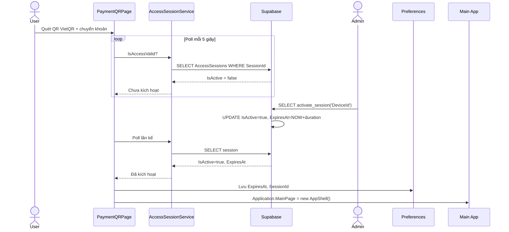
```mermaid
sequenceDiagram
    actor User
    participant PaymentQRPage
    participant AccessSessionService
    participant Supabase
    actor Admin
    participant Preferences
    participant AppShell as Main App

    User->>PaymentQRPage: Quét QR VietQR + chuyển khoản
    loop Poll mỗi 5 giây
        PaymentQRPage->>AccessSessionService: IsAccessValid?
        AccessSessionService->>Supabase: SELECT AccessSessions WHERE SessionId
        Supabase-->>AccessSessionService: IsActive = false
        AccessSessionService-->>PaymentQRPage: Chưa kích hoạt
    end

    Admin->>Supabase: SELECT activate_session('DeviceId')
    Supabase->>Supabase: UPDATE IsActive=true, ExpiresAt=NOW+duration

    PaymentQRPage->>AccessSessionService: Poll lần kế
    AccessSessionService->>Supabase: SELECT session
    Supabase-->>AccessSessionService: IsActive=true, ExpiresAt
    AccessSessionService-->>PaymentQRPage: Đã kích hoạt
    PaymentQRPage->>Preferences: Lưu ExpiresAt, SessionId
    PaymentQRPage->>AppShell: Application.MainPage = new AppShell()
```

#### 13.4.4 Timer hết hạn gói

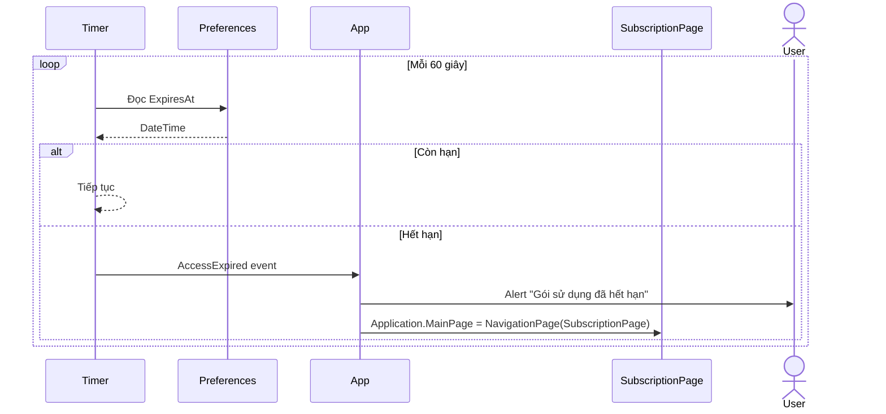
```mermaid
sequenceDiagram
    participant Timer
    participant Preferences
    participant App
    participant SubscriptionPage
    actor User

    loop Mỗi 60 giây
        Timer->>Preferences: Đọc ExpiresAt
        Preferences-->>Timer: DateTime
        alt Còn hạn
            Timer-->>Timer: Tiếp tục
        else Hết hạn
            Timer->>App: AccessExpired event
            App->>User: Alert "Gói sử dụng đã hết hạn"
            App->>SubscriptionPage: Application.MainPage = NavigationPage(SubscriptionPage)
        end
    end
```

#### 13.4.5 Tải Places và cache

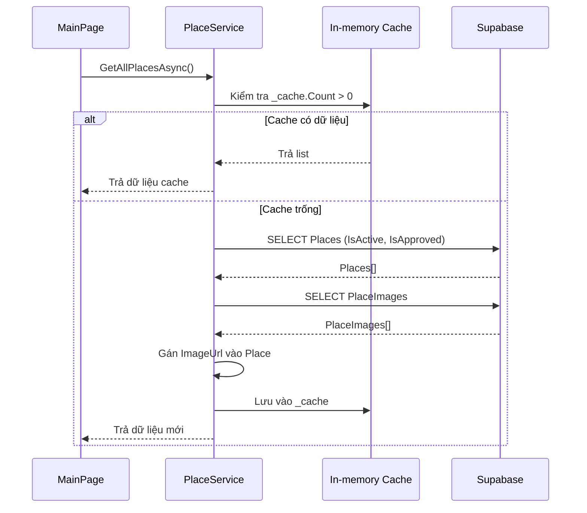
```mermaid
sequenceDiagram
    participant MainPage
    participant PlaceService
    participant Cache as In-memory Cache
    participant Supabase

    MainPage->>PlaceService: GetAllPlacesAsync()
    PlaceService->>Cache: Kiểm tra _cache.Count > 0

    alt Cache có dữ liệu
        Cache-->>PlaceService: Trả list
        PlaceService-->>MainPage: Trả dữ liệu cache
    else Cache trống
        PlaceService->>Supabase: SELECT Places (IsActive, IsApproved)
        Supabase-->>PlaceService: Places[]
        PlaceService->>Supabase: SELECT PlaceImages
        Supabase-->>PlaceService: PlaceImages[]
        PlaceService->>PlaceService: Gán ImageUrl vào Place
        PlaceService->>Cache: Lưu vào _cache
        PlaceService-->>MainPage: Trả dữ liệu mới
    end
```

#### 13.4.6 Bản đồ — hiển thị và tap marker

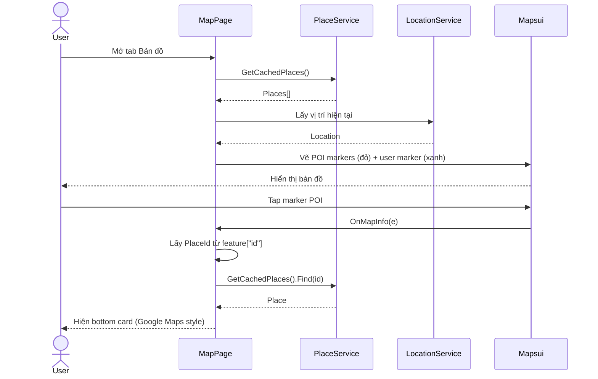
```mermaid
sequenceDiagram
    actor User
    participant MapPage
    participant PlaceService
    participant LocationService
    participant Mapsui

    User->>MapPage: Mở tab Bản đồ
    MapPage->>PlaceService: GetCachedPlaces()
    PlaceService-->>MapPage: Places[]
    MapPage->>LocationService: Lấy vị trí hiện tại
    LocationService-->>MapPage: Location
    MapPage->>Mapsui: Vẽ POI markers (đỏ) + user marker (xanh)
    Mapsui-->>User: Hiển thị bản đồ

    User->>Mapsui: Tap marker POI
    Mapsui->>MapPage: OnMapInfo(e)
    MapPage->>MapPage: Lấy PlaceId từ feature["id"]
    MapPage->>PlaceService: GetCachedPlaces().Find(id)
    PlaceService-->>MapPage: Place
    MapPage-->>User: Hiện bottom card (Google Maps style)
```

#### 13.4.7 Chỉ đường OSRM

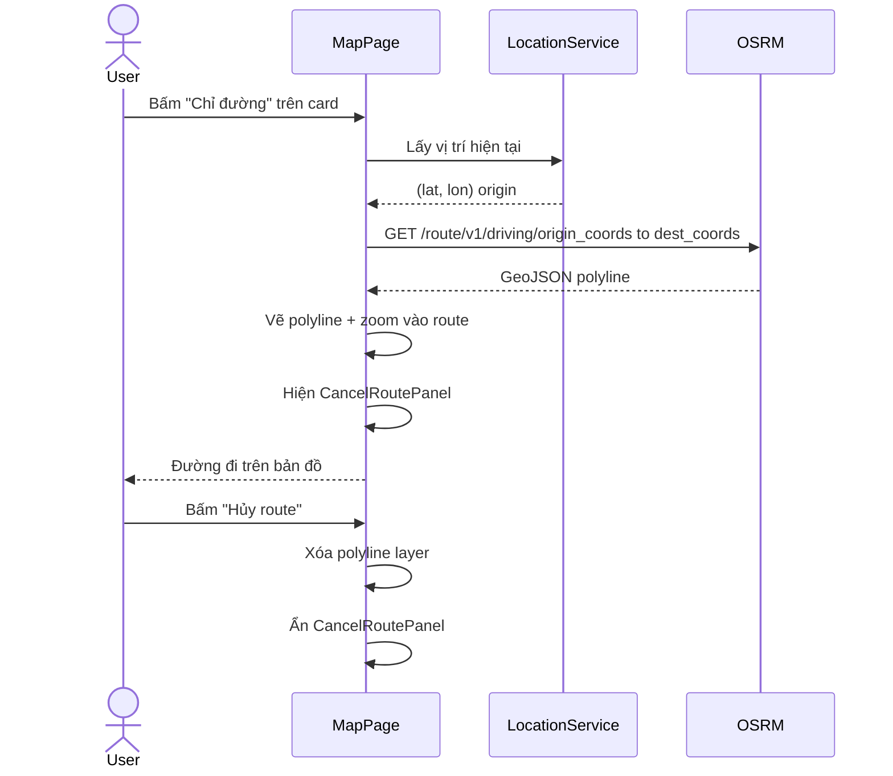
```mermaid
sequenceDiagram
    actor User
    participant MapPage
    participant LocationService
    participant OSRM

    User->>MapPage: Bấm "Chỉ đường" trên card
    MapPage->>LocationService: Lấy vị trí hiện tại
    LocationService-->>MapPage: (lat, lon) origin
    MapPage->>OSRM: GET /route/v1/driving/origin_coords to dest_coords
    OSRM-->>MapPage: GeoJSON polyline
    MapPage->>MapPage: Vẽ polyline + zoom vào route
    MapPage->>MapPage: Hiện CancelRoutePanel
    MapPage-->>User: Đường đi trên bản đồ

    User->>MapPage: Bấm "Hủy route"
    MapPage->>MapPage: Xóa polyline layer
    MapPage->>MapPage: Ẩn CancelRoutePanel
```

#### 13.4.8 Chỉ đường từ PlaceDetailPage

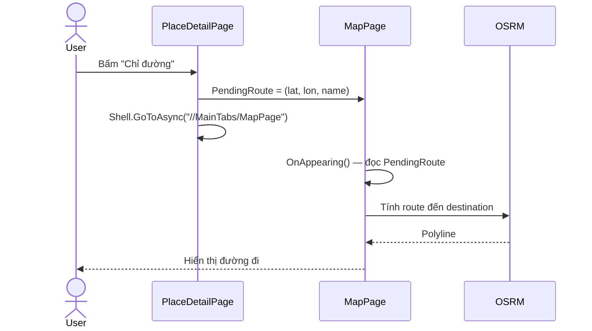
```mermaid
sequenceDiagram
    actor User
    participant PlaceDetailPage
    participant MapPage
    participant OSRM

    User->>PlaceDetailPage: Bấm "Chỉ đường"
    PlaceDetailPage->>MapPage: PendingRoute = (lat, lon, name)
    PlaceDetailPage->>PlaceDetailPage: Shell.GoToAsync("//MainTabs/MapPage")
    MapPage->>MapPage: OnAppearing() — đọc PendingRoute
    MapPage->>OSRM: Tính route đến destination
    OSRM-->>MapPage: Polyline
    MapPage-->>User: Hiển thị đường đi
```

#### 13.4.9 GPS + Geofence + TTS tự động

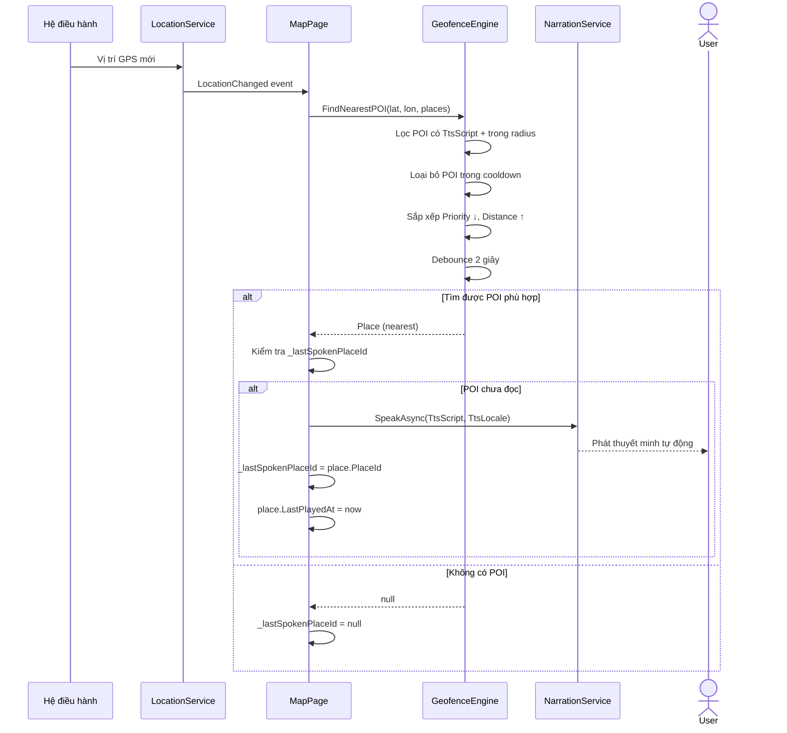
```mermaid
sequenceDiagram
    participant OS as Hệ điều hành
    participant LocationService
    participant MapPage
    participant GeofenceEngine
    participant NarrationService
    actor User

    OS->>LocationService: Vị trí GPS mới
    LocationService->>MapPage: LocationChanged event
    MapPage->>GeofenceEngine: FindNearestPOI(lat, lon, places)
    GeofenceEngine->>GeofenceEngine: Lọc POI có TtsScript + trong radius
    GeofenceEngine->>GeofenceEngine: Loại bỏ POI trong cooldown
    GeofenceEngine->>GeofenceEngine: Sắp xếp Priority ↓, Distance ↑
    GeofenceEngine->>GeofenceEngine: Debounce 2 giây

    alt Tìm được POI phù hợp
        GeofenceEngine-->>MapPage: Place (nearest)
        MapPage->>MapPage: Kiểm tra _lastSpokenPlaceId
        alt POI chưa đọc
            MapPage->>NarrationService: SpeakAsync(TtsScript, TtsLocale)
            NarrationService-->>User: Phát thuyết minh tự động
            MapPage->>MapPage: _lastSpokenPlaceId = place.PlaceId
            MapPage->>MapPage: place.LastPlayedAt = now
        end
    else Không có POI
        GeofenceEngine-->>MapPage: null
        MapPage->>MapPage: _lastSpokenPlaceId = null
    end
```

#### 13.4.10 Tour — duyệt và theo tour

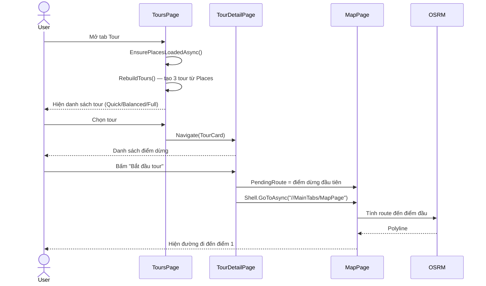
```mermaid
sequenceDiagram
    actor User
    participant ToursPage
    participant TourDetailPage
    participant MapPage
    participant OSRM

    User->>ToursPage: Mở tab Tour
    ToursPage->>ToursPage: EnsurePlacesLoadedAsync()
    ToursPage->>ToursPage: RebuildTours() — tạo 3 tour từ Places
    ToursPage-->>User: Hiện danh sách tour (Quick/Balanced/Full)

    User->>ToursPage: Chọn tour
    ToursPage->>TourDetailPage: Navigate(TourCard)
    TourDetailPage-->>User: Danh sách điểm dừng

    User->>TourDetailPage: Bấm "Bắt đầu tour"
    TourDetailPage->>MapPage: PendingRoute = điểm dừng đầu tiên
    TourDetailPage->>MapPage: Shell.GoToAsync("//MainTabs/MapPage")
    MapPage->>OSRM: Tính route đến điểm đầu
    OSRM-->>MapPage: Polyline
    MapPage-->>User: Hiện đường đi đến điểm 1
```

---

### 13.5 Sequence Diagrams — Web API

#### 13.5.1 Đăng ký và đăng nhập

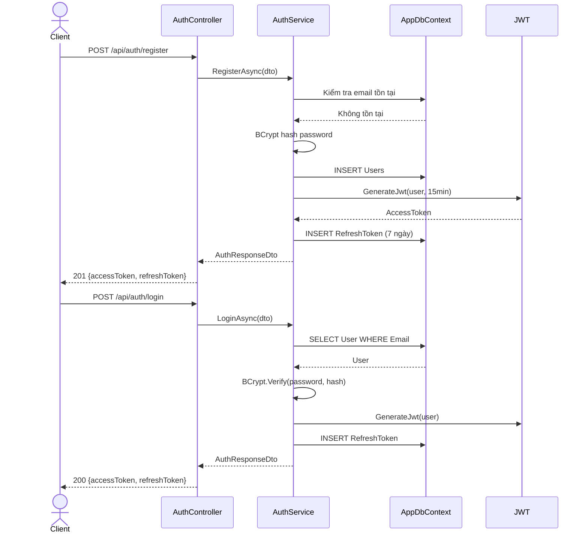
```mermaid
sequenceDiagram
    actor Client
    participant AuthController
    participant AuthService
    participant AppDbContext
    participant JWT

    Client->>AuthController: POST /api/auth/register
    AuthController->>AuthService: RegisterAsync(dto)
    AuthService->>AppDbContext: Kiểm tra email tồn tại
    AppDbContext-->>AuthService: Không tồn tại
    AuthService->>AuthService: BCrypt hash password
    AuthService->>AppDbContext: INSERT Users
    AuthService->>JWT: GenerateJwt(user, 15min)
    JWT-->>AuthService: AccessToken
    AuthService->>AppDbContext: INSERT RefreshToken (7 ngày)
    AuthService-->>AuthController: AuthResponseDto
    AuthController-->>Client: 201 {accessToken, refreshToken}

    Client->>AuthController: POST /api/auth/login
    AuthController->>AuthService: LoginAsync(dto)
    AuthService->>AppDbContext: SELECT User WHERE Email
    AppDbContext-->>AuthService: User
    AuthService->>AuthService: BCrypt.Verify(password, hash)
    AuthService->>JWT: GenerateJwt(user)
    AuthService->>AppDbContext: INSERT RefreshToken
    AuthService-->>AuthController: AuthResponseDto
    AuthController-->>Client: 200 {accessToken, refreshToken}
```

#### 13.5.2 Refresh token và rotation

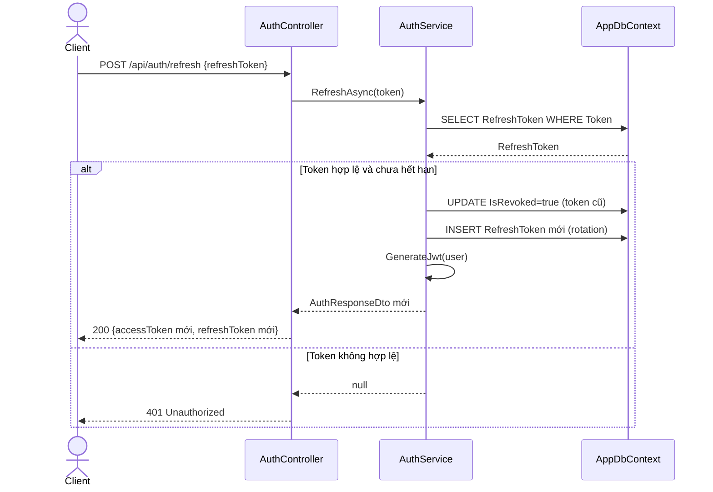
```mermaid
sequenceDiagram
    actor Client
    participant AuthController
    participant AuthService
    participant AppDbContext

    Client->>AuthController: POST /api/auth/refresh {refreshToken}
    AuthController->>AuthService: RefreshAsync(token)
    AuthService->>AppDbContext: SELECT RefreshToken WHERE Token
    AppDbContext-->>AuthService: RefreshToken

    alt Token hợp lệ và chưa hết hạn
        AuthService->>AppDbContext: UPDATE IsRevoked=true (token cũ)
        AuthService->>AppDbContext: INSERT RefreshToken mới (rotation)
        AuthService->>AuthService: GenerateJwt(user)
        AuthService-->>AuthController: AuthResponseDto mới
        AuthController-->>Client: 200 {accessToken mới, refreshToken mới}
    else Token không hợp lệ
        AuthService-->>AuthController: null
        AuthController-->>Client: 401 Unauthorized
    end
```

#### 13.5.3 Tạo và duyệt địa điểm

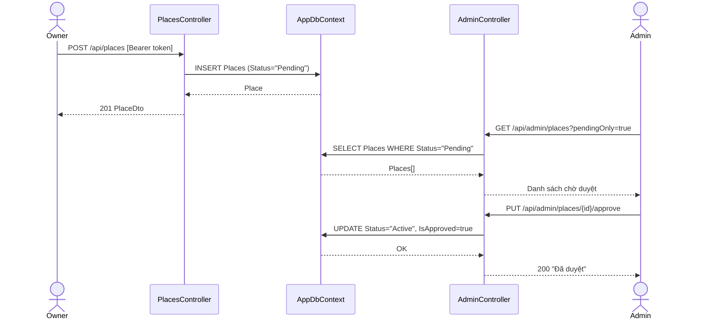
```mermaid
sequenceDiagram
    actor Owner
    participant PlacesController
    participant AppDbContext
    participant AdminController
    actor Admin

    Owner->>PlacesController: POST /api/places [Bearer token]
    PlacesController->>AppDbContext: INSERT Places (Status="Pending")
    AppDbContext-->>PlacesController: Place
    PlacesController-->>Owner: 201 PlaceDto

    Admin->>AdminController: GET /api/admin/places?pendingOnly=true
    AdminController->>AppDbContext: SELECT Places WHERE Status="Pending"
    AppDbContext-->>AdminController: Places[]
    AdminController-->>Admin: Danh sách chờ duyệt

    Admin->>AdminController: PUT /api/admin/places/{id}/approve
    AdminController->>AppDbContext: UPDATE Status="Active", IsApproved=true
    AppDbContext-->>AdminController: OK
    AdminController-->>Admin: 200 "Đã duyệt"
```

#### 13.5.4 Viết review và thông báo SignalR

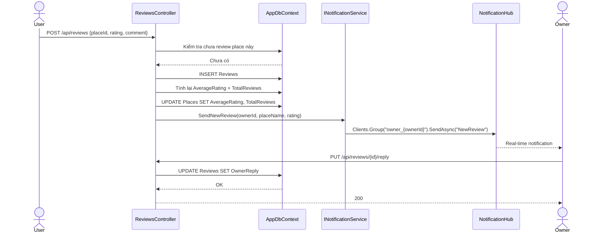
```mermaid
sequenceDiagram
    actor User
    participant ReviewsController
    participant AppDbContext
    participant INotificationService
    participant NotificationHub
    actor Owner

    User->>ReviewsController: POST /api/reviews {placeId, rating, comment}
    ReviewsController->>AppDbContext: Kiểm tra chưa review place này
    AppDbContext-->>ReviewsController: Chưa có
    ReviewsController->>AppDbContext: INSERT Reviews
    ReviewsController->>AppDbContext: Tính lại AverageRating + TotalReviews
    ReviewsController->>AppDbContext: UPDATE Places SET AverageRating, TotalReviews
    ReviewsController->>INotificationService: SendNewReview(ownerId, placeName, rating)
    INotificationService->>NotificationHub: Clients.Group("owner_{ownerId}").SendAsync("NewReview")
    NotificationHub-->>Owner: Real-time notification

    Owner->>ReviewsController: PUT /api/reviews/{id}/reply
    ReviewsController->>AppDbContext: UPDATE Reviews SET OwnerReply
    AppDbContext-->>ReviewsController: OK
    ReviewsController-->>Owner: 200
```

#### 13.5.5 Theo dõi vị trí và auto check-in

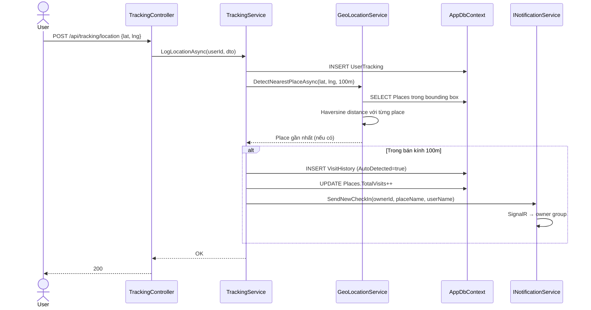
```mermaid
sequenceDiagram
    actor User
    participant TrackingController
    participant TrackingService
    participant GeoLocationService
    participant AppDbContext
    participant INotificationService

    User->>TrackingController: POST /api/tracking/location {lat, lng}
    TrackingController->>TrackingService: LogLocationAsync(userId, dto)
    TrackingService->>AppDbContext: INSERT UserTracking
    TrackingService->>GeoLocationService: DetectNearestPlaceAsync(lat, lng, 100m)
    GeoLocationService->>AppDbContext: SELECT Places trong bounding box
    GeoLocationService->>GeoLocationService: Haversine distance với từng place
    GeoLocationService-->>TrackingService: Place gần nhất (nếu có)

    alt Trong bán kính 100m
        TrackingService->>AppDbContext: INSERT VisitHistory (AutoDetected=true)
        TrackingService->>AppDbContext: UPDATE Places.TotalVisits++
        TrackingService->>INotificationService: SendNewCheckIn(ownerId, placeName, userName)
        INotificationService->>INotificationService: SignalR → owner group
    end

    TrackingService-->>TrackingController: OK
    TrackingController-->>User: 200
```

#### 13.5.6 Khiếu nại và xử lý

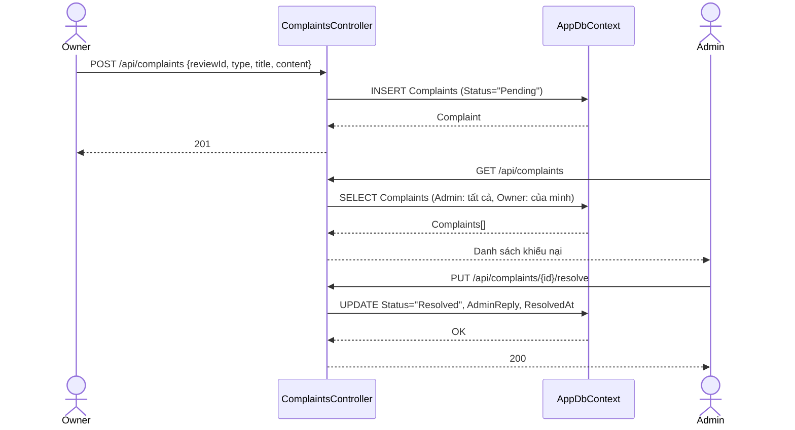
```mermaid
sequenceDiagram
    actor Owner
    participant ComplaintsController
    participant AppDbContext
    actor Admin

    Owner->>ComplaintsController: POST /api/complaints {reviewId, type, title, content}
    ComplaintsController->>AppDbContext: INSERT Complaints (Status="Pending")
    AppDbContext-->>ComplaintsController: Complaint
    ComplaintsController-->>Owner: 201

    Admin->>ComplaintsController: GET /api/complaints
    ComplaintsController->>AppDbContext: SELECT Complaints (Admin: tất cả, Owner: của mình)
    AppDbContext-->>ComplaintsController: Complaints[]
    ComplaintsController-->>Admin: Danh sách khiếu nại

    Admin->>ComplaintsController: PUT /api/complaints/{id}/resolve
    ComplaintsController->>AppDbContext: UPDATE Status="Resolved", AdminReply, ResolvedAt
    AppDbContext-->>ComplaintsController: OK
    ComplaintsController-->>Admin: 200
```

---

### 13.6 Activity Diagrams

#### 13.6.1 Luồng khởi động app

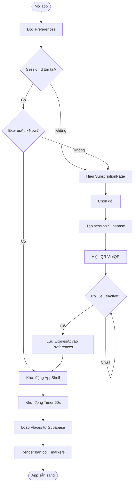
```mermaid
flowchart TD
    A([Mở app]) --> B[Đọc Preferences]
    B --> C{SessionId tồn tại?}
    C -->|Không| D[Hiện SubscriptionPage]
    C -->|Có| E{ExpiresAt > Now?}
    E -->|Không| D
    E -->|Có| F[Khởi động AppShell]
    F --> G[Khởi động Timer 60s]
    G --> H[Load Places từ Supabase]
    H --> I[Render bản đồ + markers]
    I --> J([App sẵn sàng])

    D --> K[Chọn gói]
    K --> L[Tạo session Supabase]
    L --> M[Hiện QR VietQR]
    M --> N{Poll 5s: IsActive?}
    N -->|Chưa| N
    N -->|Có| O[Lưu ExpiresAt vào Preferences]
    O --> F
```

#### 13.6.2 Luồng Geofence + TTS

```mermaid
flowchart TD
    A([GPS update]) --> B[LocationService.LocationChanged]
    B --> C[GeofenceEngine.FindNearestPOI]
    C --> D{Có POI trong radius?}
    D -->|Không| E[_lastSpokenPlaceId = null]
    E --> Z([Kết thúc])
    D -->|Có| F{POI trong cooldown?}
    F -->|Có| G[Bỏ qua POI này]
    G --> D
    F -->|Không| H[Sắp xếp theo Priority + Distance]
    H --> I{POI == _lastSpokenPlaceId?}
    I -->|Có| Z
    I -->|Không| J[Debounce 2 giây]
    J --> K[NarrationService.SpeakAsync]
    K --> L[Cập nhật _lastSpokenPlaceId]
    L --> M[Cập nhật LastPlayedAt]
    M --> Z
```

#### 13.6.3 Luồng thanh toán và kích hoạt

```mermaid
flowchart TD
    A([User mở app lần đầu]) --> B[SubscriptionPage]
    B --> C[Chọn gói thời gian]
    C --> D[Tạo AccessSession - IsActive=false]
    D --> E[Hiện QR VietQR + DeviceId]
    E --> F[User chuyển khoản ngân hàng]
    F --> G[App polling Supabase mỗi 5s]
    G --> H{Admin thấy tiền}
    H -->|Chưa| G
    H -->|Có| I[Admin: activate_session DeviceId]
    I --> J[Supabase: IsActive=true, ExpiresAt=Now+duration]
    J --> K[App poll nhận IsActive=true]
    K --> L[Lưu ExpiresAt vào Preferences]
    L --> M[Application.MainPage = AppShell]
    M --> N([Dùng app bình thường])
    N --> O{Timer 60s kiểm tra}
    O -->|Còn hạn| O
    O -->|Hết hạn| P[Alert hết hạn]
    P --> B
```

#### 13.6.4 Luồng duyệt địa điểm (Web)

```mermaid
flowchart TD
    A([Owner tạo Place]) --> B[Status = Pending]
    B --> C[Admin vào /admin/places]
    C --> D[Xem danh sách chờ duyệt]
    D --> E{Quyết định}
    E -->|Duyệt| F[PUT /approve → Status=Active]
    E -->|Từ chối| G[PUT /suspend → Status=Suspended]
    F --> H[Place hiện trên app mobile]
    G --> I[Place bị ẩn]
    H --> J{Owner cập nhật?}
    J -->|Có| K[PUT /api/places/id]
    K --> H
```

#### 13.6.5 Luồng đăng nhập Web MVC

```mermaid
flowchart TD
    A([Truy cập trang có Auth]) --> B{Session có token?}
    B -->|Không| C[Redirect /Auth/Login]
    B -->|Có| D{Role đủ quyền?}
    D -->|Không| E[Redirect /Auth/AccessDenied]
    D -->|Có| F[Tiếp tục request]
    C --> G[Nhập email + password]
    G --> H[POST /Auth/Login]
    H --> I{Credentials hợp lệ?}
    I -->|Không| J[Hiện lỗi]
    J --> G
    I -->|Có| K[Lưu token vào Session]
    K --> L{Role?}
    L -->|Admin| M[Redirect /Admin]
    L -->|Owner| N[Redirect /Dashboard]
    L -->|User| O[Redirect /Dashboard]
```

---

**Tổng:** 1 ER + 2 Class + 16 Sequence + 5 Activity = **24 diagrams**

---

### 13.7 BFD Bậc 1 — TourGuideAPP

> **BFD (Biểu đồ phân rã chức năng)** — thể hiện toàn bộ chức năng hệ thống phân theo cấp bậc.

```mermaid
graph LR
    ROOT["Hệ thống\nTourGuideAPP"]

    ROOT --> F1["1. Quản lý\nphiên truy cập"]
    ROOT --> F2["2. Khám phá\nđịa điểm"]
    ROOT --> F3["3. Bản đồ\nvà Định vị"]
    ROOT --> F4["4. Chỉ đường"]
    ROOT --> F5["5. Thuyết minh\ntự động"]
    ROOT --> F6["6. Quản lý Tour"]

    F1 --> F1_1["1.1 Kiểm tra phiên còn hạn"]
    F1 --> F1_2["1.2 Chọn gói truy cập"]
    F1 --> F1_3["1.3 Tạo QR thanh toán VietQR"]
    F1 --> F1_4["1.4 Kích hoạt phiên sau thanh toán"]
    F1 --> F1_5["1.5 Thông báo hết hạn phiên"]

    F2 --> F2_1["2.1 Tải danh sách địa điểm"]
    F2 --> F2_2["2.2 Tìm kiếm theo tên"]
    F2 --> F2_3["2.3 Lọc theo loại / khu vực"]
    F2 --> F2_4["2.4 Xem chi tiết địa điểm"]
    F2 --> F2_5["2.5 Gọi điện và mở website"]

    F3 --> F3_1["3.1 Hiển thị bản đồ OSM"]
    F3 --> F3_2["3.2 Theo dõi vị trí GPS"]
    F3 --> F3_3["3.3 Hiển thị marker POI"]
    F3 --> F3_4["3.4 Tap marker xem thẻ thông tin"]
    F3 --> F3_5["3.5 Tìm kiếm trên bản đồ"]

    F4 --> F4_1["4.1 Tính tuyến đường qua OSRM"]
    F4 --> F4_2["4.2 Vẽ tuyến lên bản đồ"]
    F4 --> F4_3["4.3 Hiển thị khoảng cách và ETA"]
    F4 --> F4_4["4.4 Huỷ chỉ đường"]

    F5 --> F5_1["5.1 Phát hiện POI gần vị trí"]
    F5 --> F5_2["5.2 Lấy script TTS theo ngôn ngữ"]
    F5 --> F5_3["5.3 Đọc thuyết minh bằng giọng nói"]
    F5 --> F5_4["5.4 Chọn ngôn ngữ thuyết minh"]
    F5 --> F5_5["5.5 Cooldown tránh đọc lại"]

    F6 --> F6_1["6.1 Xem danh sách tour gợi ý"]
    F6 --> F6_2["6.2 Xem chi tiết tour và điểm dừng"]
    F6 --> F6_3["6.3 Chỉ đường theo tour"]
    F6 --> F6_4["6.4 Thuyết minh từng điểm dừng"]
```

---

**Tổng:** 1 ER + 2 Class + 16 Sequence + 5 Activity + 1 BFD = **25 diagrams**

---

## Phụ lục: Thuật ngữ

| Thuật ngữ | Giải thích |
|---|---|
| **POI** | Point of Interest — địa điểm du lịch đáng chú ý |
| **Geofence** | Vùng địa lý ảo hình tròn, kích hoạt hành động khi người dùng vào trong |
| **TTS** | Text-to-Speech — đọc văn bản thành giọng nói tổng hợp |
| **OSRM** | Open Source Routing Machine — engine tính toán tuyến đường mã nguồn mở |
| **Debounce** | Kỹ thuật trì hoãn xử lý để tránh trigger liên tục khi điều kiện dao động |
| **Cooldown** | Khoảng thời gian chờ tối thiểu giữa 2 lần kích hoạt cùng một sự kiện |
| **MAUI** | Multi-platform App UI — framework .NET phát triển app đa nền tảng |
| **Supabase** | Backend-as-a-Service mã nguồn mở, cung cấp PostgreSQL + REST API |
| **Preferences** | Bộ nhớ key-value cục bộ trên thiết bị (SharedPreferences trên Android) |
| **VietQR** | Chuẩn mã QR chuyển khoản ngân hàng tại Việt Nam |
| **Foreground Service** | Tiến trình Android chạy nền với notification thường trực, không bị hệ thống kill |

---

**Nhóm phát triển:** Sinh viên đồ án  
**Cập nhật lần cuối:** Tháng 4, 2026  
**Phiên bản:** 2.2 — Xóa QR Scan, Favorites, Wishlist, History, Notes; cập nhật thư viện bản đồ CartoDB Voyager
