# Sequence Diagrams - TourGuideAPP

## 1. Mở app và kiểm tra session

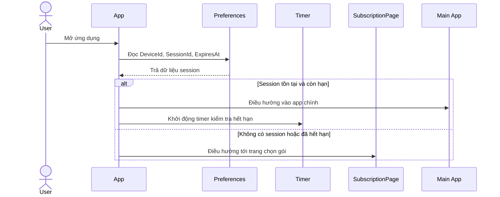

## 2. Chọn gói và tạo session chờ thanh toán

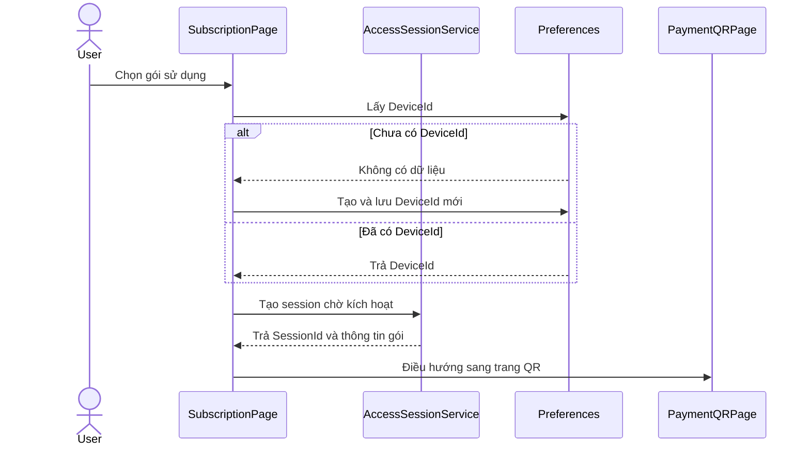

## 3. Thanh toán QR và polling kích hoạt

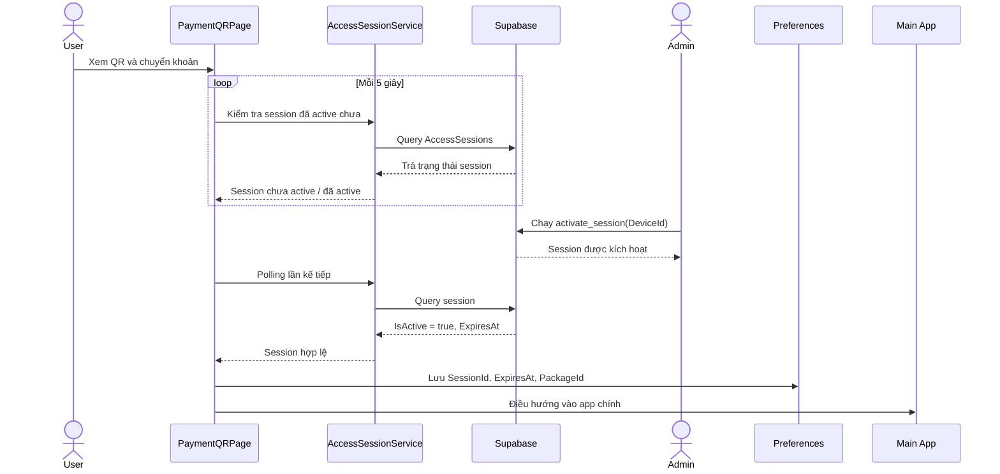

## 4. Timer kiểm tra hết hạn gói

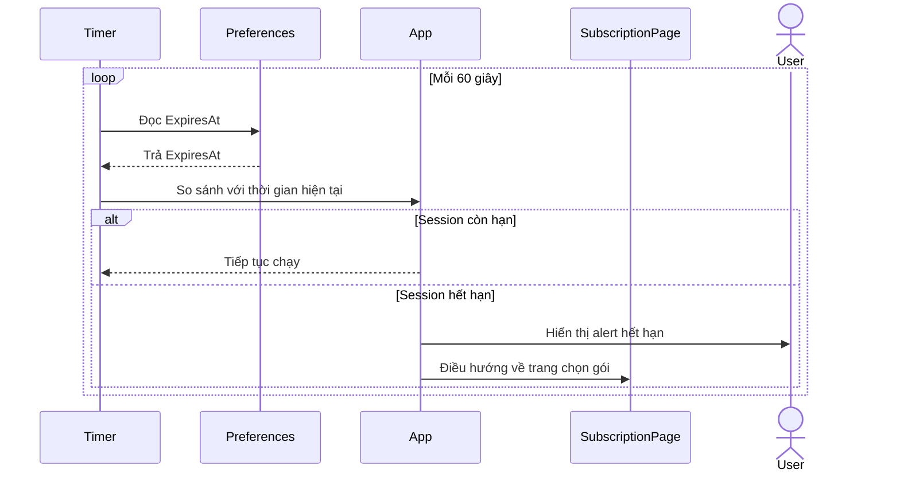

## 5. Tải danh sách Places và cache

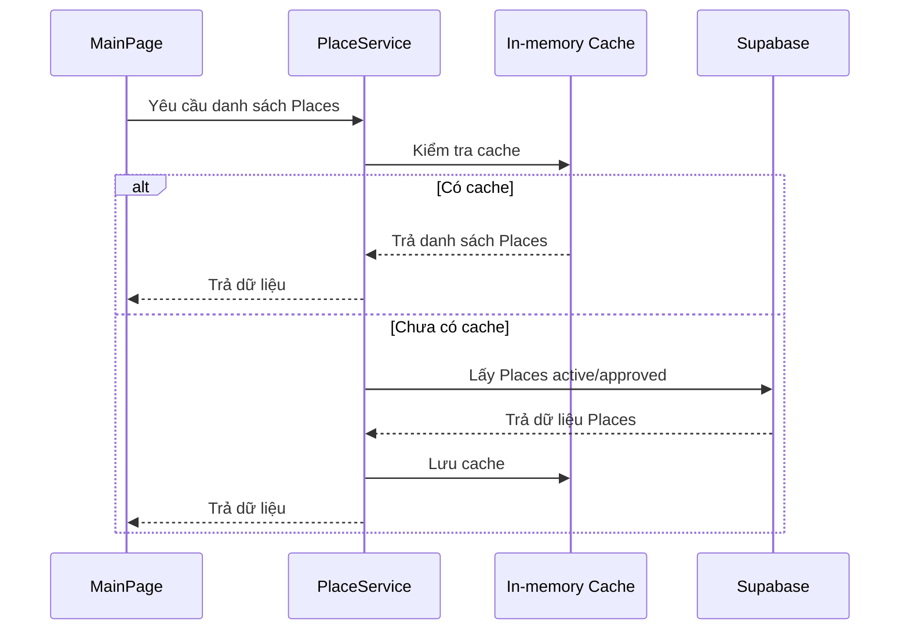

## 6. Tìm kiếm và lọc địa điểm

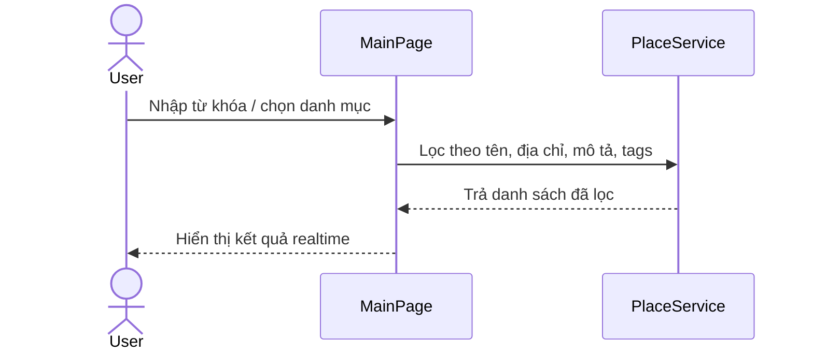

## 7. Mở chi tiết địa điểm

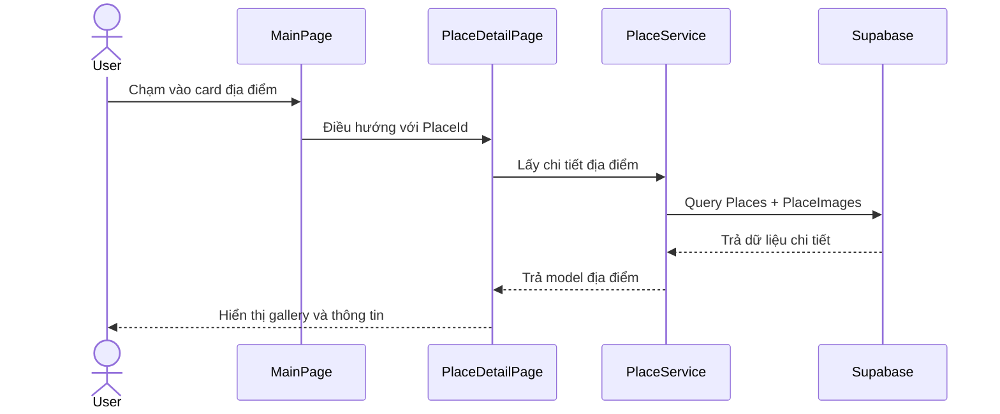

## 8. Hiển thị bản đồ và marker

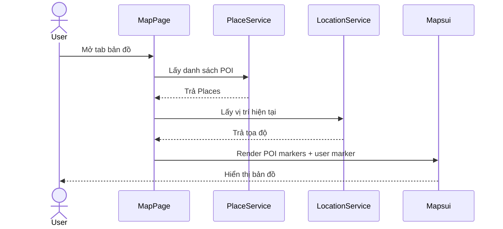

## 9. Chạm marker và mở bottom card

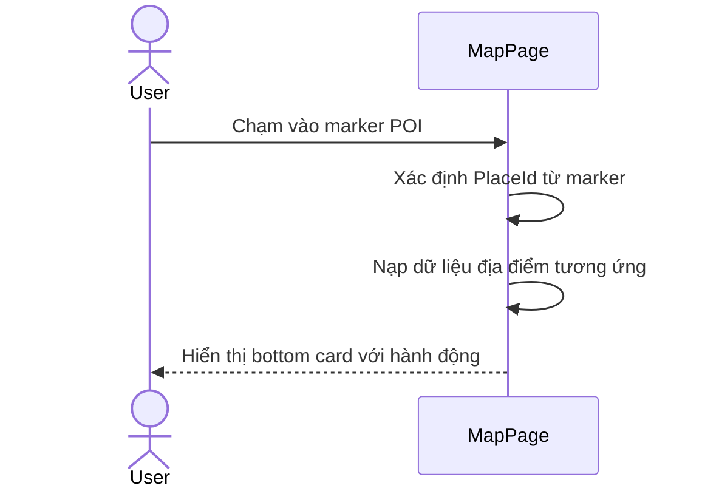

## 10. Chỉ đường từ bản đồ

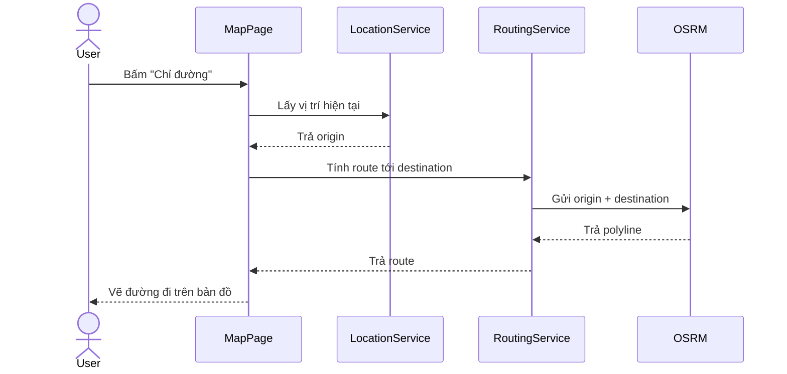

## 11. Chỉ đường từ PlaceDetailPage

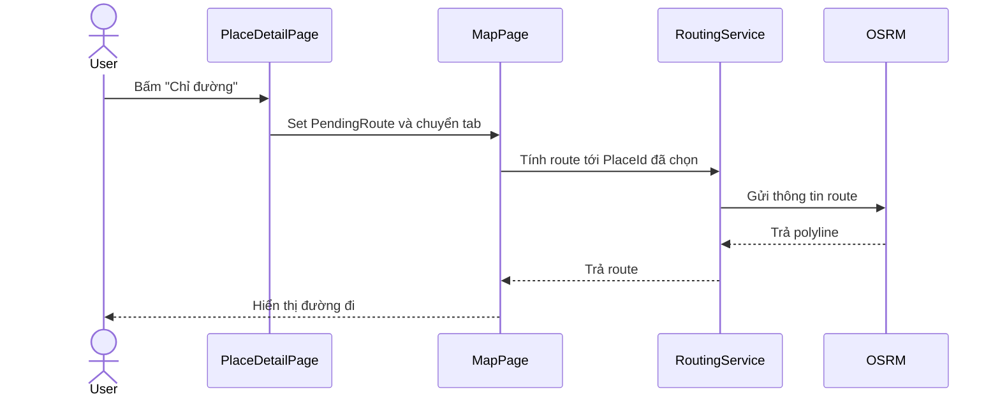

## 12. Phát thuyết minh thủ công

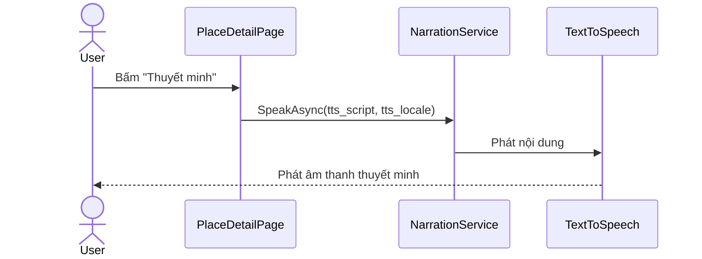

## 13. GPS realtime và geofence tự động

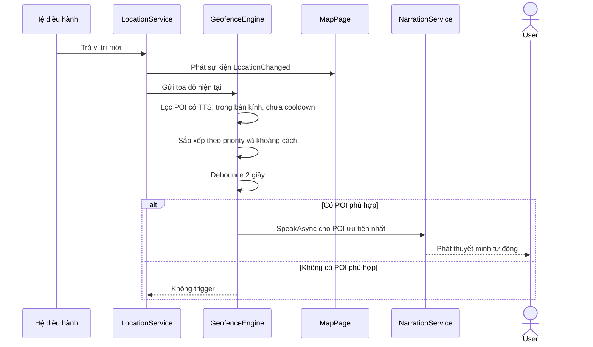

## 14. Tránh đọc lặp lại cùng một POI

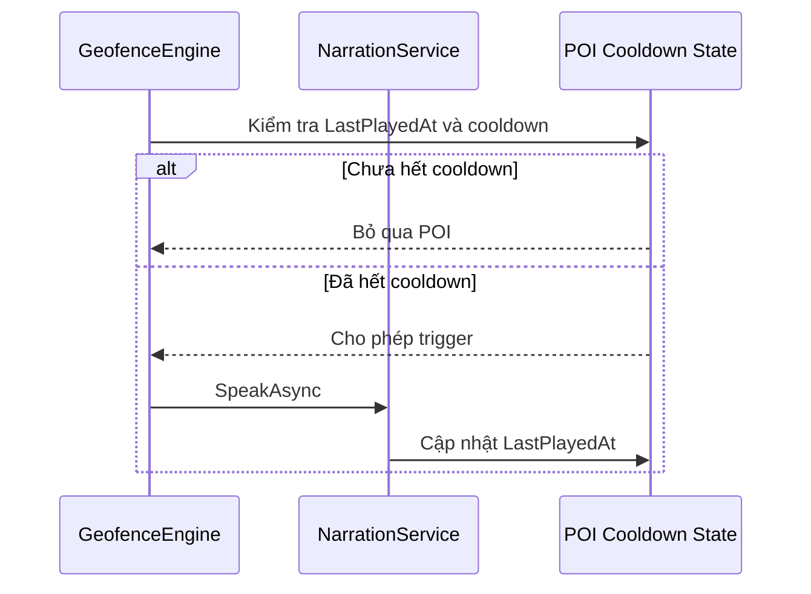

## 15. Quét QR để mở PlaceDetail

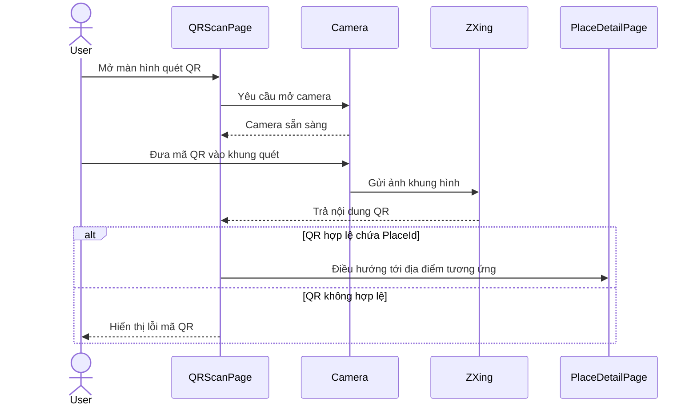

## 16. Xem tour và mở điểm dừng

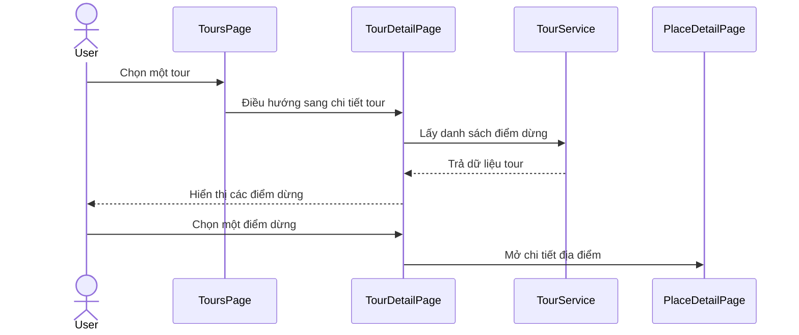

## 17. Admin kích hoạt session

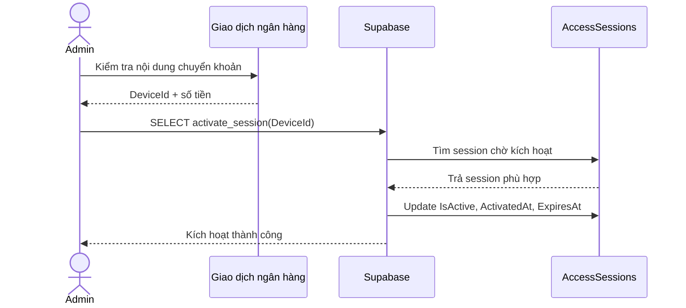

## 18. Mất mạng trong khi dùng app

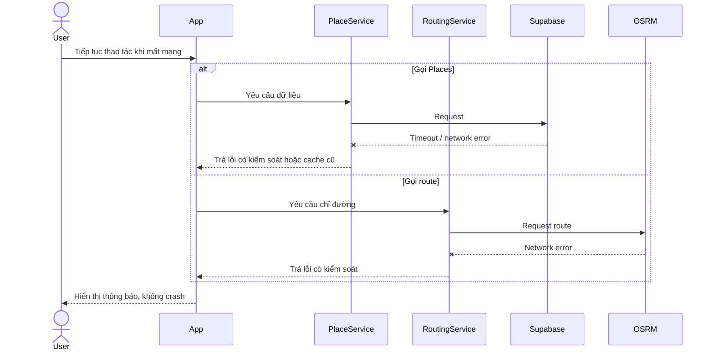

## 19. Từ chối quyền vị trí

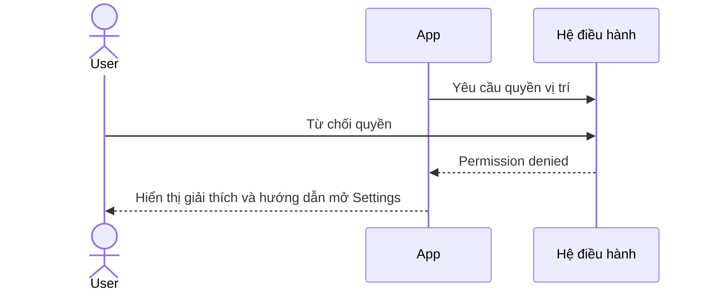

## Gợi ý dùng cho báo cáo

- Nếu báo cáo cần ngắn gọn, nên chọn 8 biểu đồ chính:
  - Mở app kiểm tra session
  - Thanh toán QR và polling
  - Tải Places và cache
  - Bản đồ và marker
  - Chỉ đường OSRM
  - Geofence tự động phát TTS
  - Quét QR
  - Admin kích hoạt session
- Nếu bạn cần, tôi có thể chuyển tiếp file này thành:
  - bản PlantUML
  - bản rút gọn đúng chuẩn UML cho báo cáo
  - hoặc bản có numbering actor/boundary/control/entity
