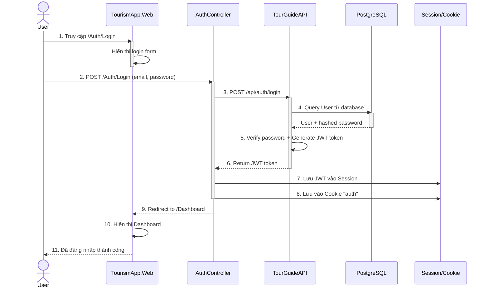
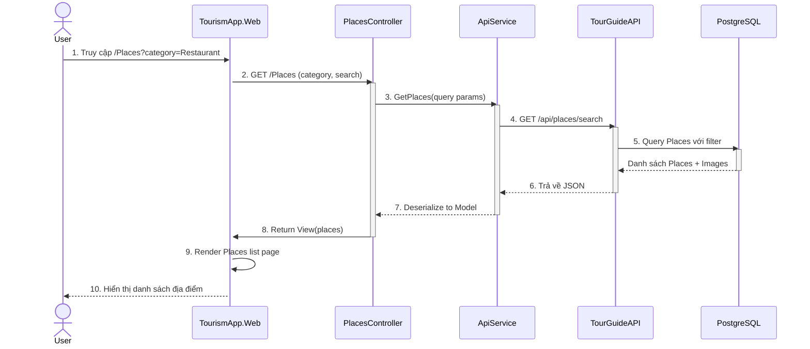
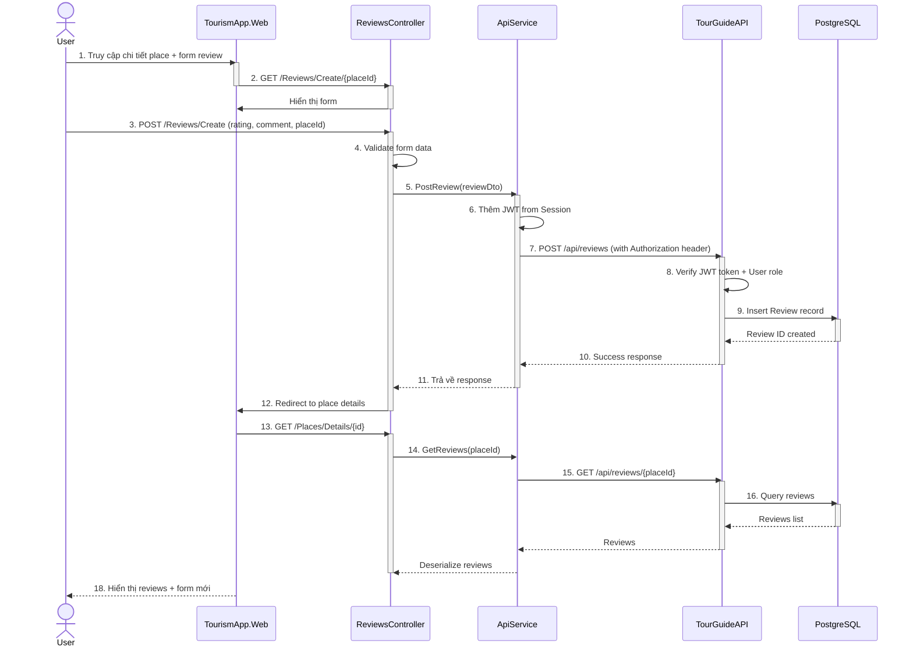
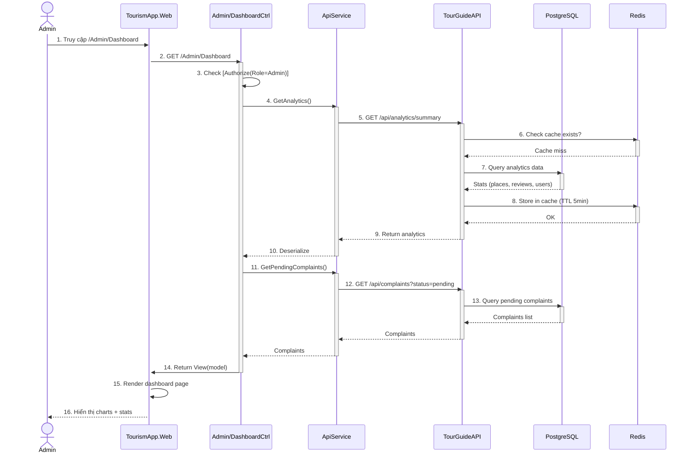
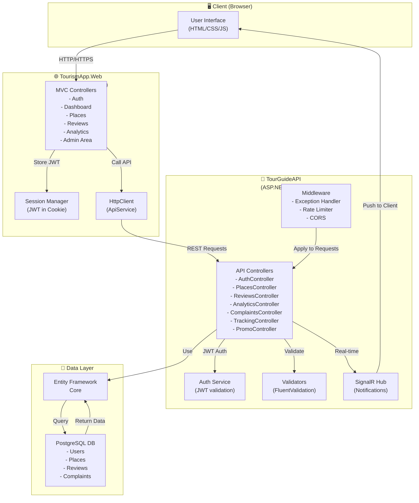
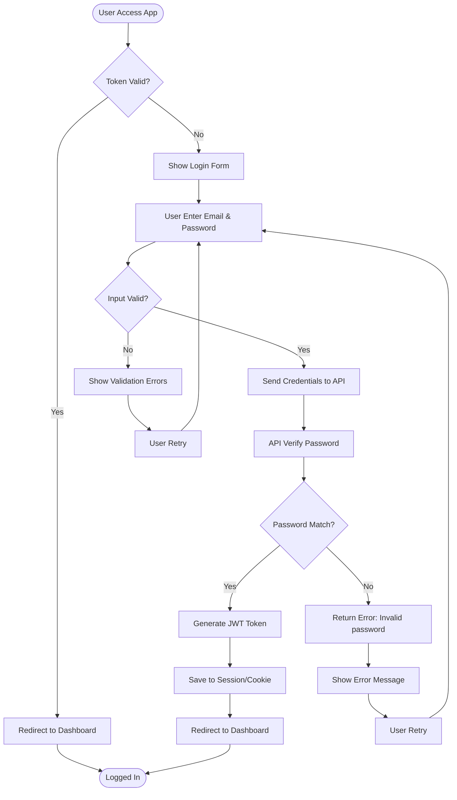
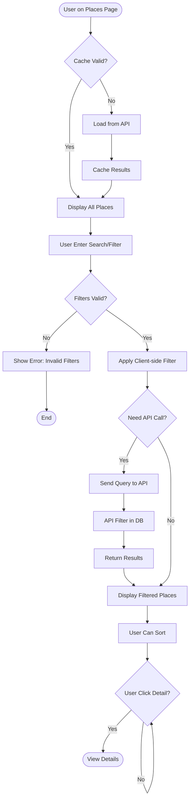
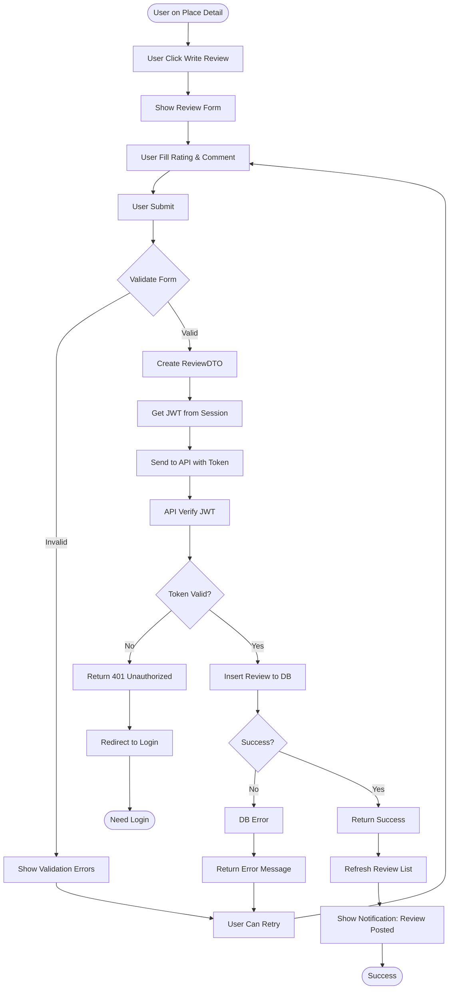
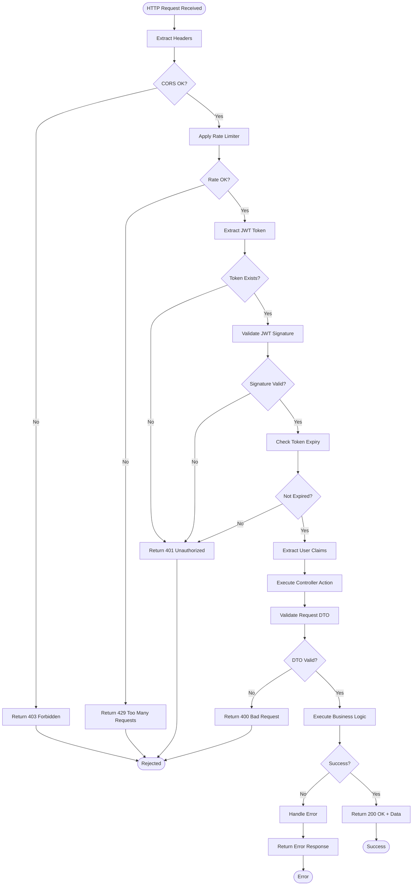
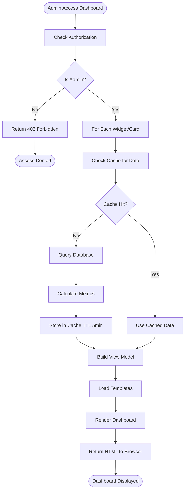

# 📊 TourGuideAPP Web - Sơ đồ Sequence & Activity

---

## 🔷 SEQUENCE DIAGRAMS

### 1️⃣ Authentication & Login Flow



---

### 2️⃣ View Places with Filtering



---

### 3️⃣ Submit & View Reviews



---

### 4️⃣ Admin Dashboard Navigation



---

### 5️⃣ Overall Web Architecture



---

## 🔶 ACTIVITY DIAGRAMS

### 6️⃣ Activity - User Authentication Flow



---

### 7️⃣ Activity - Search & Filter Places



---

### 8️⃣ Activity - Submit Review Process



---

### 9️⃣ Activity - API Request Processing Pipeline



---

### 🔟 Activity - Admin Dashboard Data Loading



---

## 📝 Ghi chú quan trọng

### Frontend (TourismApp.Web)
- **MVC Framework** — Render HTML views
- **Session Management** — Lưu JWT token trong session/cookie
- **HttpClient** — Gọi TourGuideAPI qua ApiService
- **Areas** — Admin routes tách riêng qua **Areas/Admin**

### Backend (TourGuideAPI)
- **JWT Authentication** — Verify token từ requests
- **FluentValidation** — Validate input DTOs
- **Rate Limiting** — Giới hạn API calls
- **CORS** — Cho phép cross-origin requests từ web
- **SignalR Hub** — Notifications real-time (`/hubs/notifications`)

### Key Flows
1. **Login** → JWT generated → Stored in session cookie
2. **API Calls** → JWT từ session → Sent in Authorization header
3. **Admin Area** → Require `[Authorize(Roles = "Admin")]` attribute
4. **Real-time** → SignalR pushes notifications khi có events

---

## 📂 File Structure
```
TourGuideWeb/
├── TourGuideAPI/           (Backend REST API)
│   ├── Controllers/
│   ├── Services/
│   ├── Data/
│   └── Program.cs          (DI, JWT config, SignalR)
└── TourismApp.Web/         (Frontend MVC)
    ├── Controllers/        (Auth, Dashboard, Places, etc.)
    ├── Areas/Admin/        (Admin-only routes & views)
    ├── Services/
    │   └── ApiService.cs   (HttpClient wrapper)
    └── Program.cs          (MVC, Session, Auth config)
```

---

✅ **Bây giờ bạn đã có:**
- 5 sơ đồ **Sequence** (tương tác từng bước)
- 5 sơ đồ **Activity** (luồng quy trình với quyết định)
- Kiến trúc tổng thể
- Ghi chú quan trọng

🎯 Sử dụng [Mermaid Live Editor](https://mermaid.live) để xem trực tiếp!
